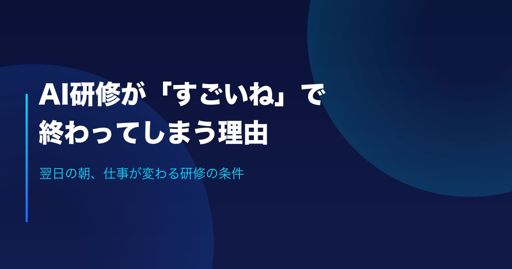

<!-- theme: AI研修・社員リスキリング(新設ページの告知を兼ねた実用記事) / UTMルール適用第1号 -->
# AI研修が「すごいね」で終わってしまう理由

「社員向けにAIのセミナーをやったんだけど、結局なにも変わらなくてね」

経営者の方から、この話を本当によく聞きます。講師は上手だった。内容も面白かった。社員の感想も良かった。それなのに、翌週の仕事のやり方は1ミリも変わっていない。

今日は、なぜそうなるのかと、どうすれば変わるのかを書きます。

---

## 「すごいね」は、褒め言葉ではない

研修後のアンケートに「AIのすごさが分かりました」と書かれていたら、実は黄色信号です。

「すごい」は、他人事の言葉だからです。自分の道具になったものに、人は「すごい」とは言いません。「便利」「もう手放せない」と言います。スマホを毎日使っている人が「スマホってすごいですね」と言わないのと同じです。

つまり研修の目標は、AIを「すごいもの」から「自分の道具」に変えることです。ここを設計しないまま一般論の講義をすると、感心だけさせて終わります。

## 数字で見ても、課題は「人」に移っている

中小企業基盤整備機構の実態調査(2026年3月公表)によると、中小企業のAI導入率は20.4%。検討中を合わせると約4割が前向きです。そして導入を進めるために必要な支援として「従業員向けの教育・研修」を挙げた企業は67.7%にのぼりました。

道具はもう手の届くところにある。足りないのは、自分の仕事のどこで使うかへの「翻訳」です。

## 変わる研修の条件は、たった2つ

私たちが研修を組むとき、外さないと決めているのは次の2つです。

**1. 教材を「その会社の実業務」にする**

例題でメールの書き方を練習しても、自分の仕事には戻ってきません。事前に業務をヒアリングして、実際に昨日書いたメール、実際に作っている見積書、実際に受けている問い合わせを教材にします。全員が「自分の仕事がひとつAI化された状態」で研修室を出る。これが定着の起点です。

**2. 研修後に1〜3ヶ月の伴走をつける**

研修直後は誰でも使えます。忙しくなったときに元へ戻るのが問題なので、質問対応と社内ルールづくりまで含めて設計します。

裏を返せば、研修を外注するときはこの2つを確認するだけで、失敗の大半は避けられます。「演習は自社の実業務ですか？」「研修後のフォローは含まれますか？」と聞いてみてください。

## 私たち自身が、毎日AIで仕事をしています

手前味噌ですが、私たちAIdollargameは営業文も経理も記事づくりも、日々の業務をAIで回している会社です。だから研修では、教科書ではなく「実際にやっている使い方」をそのままお見せできます。

このたび、AI研修・社員リスキリングの専用ページを公開しました。経営層向け・全社員向け・部署別ワーク・定着フォローの4プログラムの中身を載せています。

▼AI研修・社員リスキリング(内容はこちら)
https://aidollargame.com/ai-training.html?utm_source=note&utm_medium=referral&utm_campaign=2026-07-11

▼もっと詳しく: AI研修の内容・進め方・選び方の解説記事
https://aidollargame.com/articles/ai-training-guide-2026.html?utm_source=note&utm_medium=referral&utm_campaign=2026-07-11

あなたの会社で、社員がいちばん時間を取られている仕事は何でしょうか。それが、最初にAI化する候補です。

---

出典: 中小企業基盤整備機構「中小企業のAI等の利活用に係る実態調査」(2026年3月公表)
https://www.smrj.go.jp/research_case/questionnaire/fbrion0000002pjw-att/202603_AI_point.pdf
