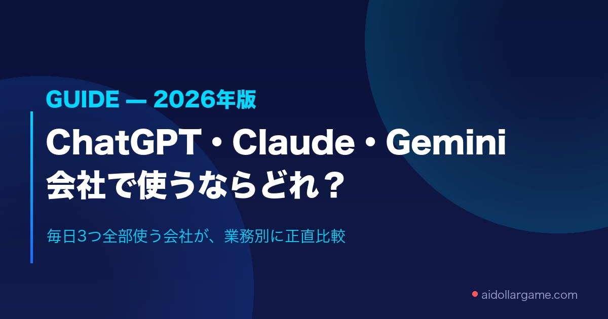

<!-- theme: ChatGPT・Claude・Gemini比較(世間が知りたい情報系・本業への導線) / UTM適用 -->
# ChatGPT・Claude・Gemini、会社で使うならどれ？——3つ全部使ってる会社が正直に答えます

「うちの会社、AI入れたいんだけど、ChatGPTとClaudeとGemini、どれがいいの？」

いちばんよく聞かれる質問です。結論から言います。**どれも優秀で、普段の仕事ならどれを選んでも十分役に立ちます。** そのうえで、私たちが3つ全部を毎日の業務で使っている立場から、選び方を正直にお伝えします。

---

## 料金でいちばん効くのは「すでに何を使っているか」

個人で試すぶんには、ChatGPTもClaudeも有料版は月20ドル前後(約3,000円台)で大差ありません。会社選びで効くのは、実は**すでに使っている道具**です。

ここで見逃せないのが**Gemini(Google)**。2025年1月以降、GeminiはGoogle Workspace(Gmailやドキュメント)の各プランに標準で組み込まれました。つまり**会社でGmailを使っているなら、追加のお金なしでAIが使える**ということ。中小企業にはかなり大きい話です。

## ざっくりの性格の違い

- **ChatGPT** … 一番有名で情報が多い万能選手。自分専用のミニAI(GPTs)も作れる。とりあえず1つなら無難
- **Claude** … 丁寧な文章づくりと、長い資料の読み込み・要約、コードに強い。提案書・報告書・議事録づくり向き(このnoteも業務もうちはClaudeで回してます)
- **Gemini** … Gmail・ドキュメントの"中"でそのまま使える。Google Workspaceを使ってる会社は追加費用ゼロで始められる

## あなたの会社はどれから？

- すでにGoogle Workspaceを使っている → まず**Gemini**(追加費用ゼロ)
- 文章づくり・長文資料・コードが中心 → **Claude**
- 情報が一番多いのがいい・GPTsを作りたい → **ChatGPT**

いちばん確実なのは、**3つとも無料版があるので、自社の実際の仕事を1つ、同じ指示で3つ全部に投げて見比べる**こと。「先週書いたお知らせメールを、丁寧な言葉で書き直して」でOKです。

## でも、本当に効くのはその先

最後に大事なこと。**どのAIを選ぶかより、「自社のどの業務に、どう組み込むか」のほうが成果を左右します。** 同じChatGPTでも、使い方を設計した会社と契約しただけの会社では、効果がまるで違う。ツール比較で消耗するより、自社のどの"聞かれごと"や"手間"をAIに預けるかを決めるほうが先です。

▼記事本編(料金表・出典リンクつき)
https://aidollargame.com/articles/ai-hikaku-2026.html?utm_source=note&utm_medium=referral&utm_campaign=2026-07-14

▼「最初の1業務」を見つける無料の3分診断
https://aidollargame.com/shindan.html?utm_source=note&utm_medium=referral&utm_campaign=2026-07-14

あなたの会社で、いちばんよくある仕事はなんですか。それが最初に試す候補です。

---

出典（各社公式・料金は変動するため最新は公式で確認）: ChatGPT https://chatgpt.com/pricing ／ Claude https://claude.com/pricing ／ Google Workspace https://workspace.google.co.jp/pricing
