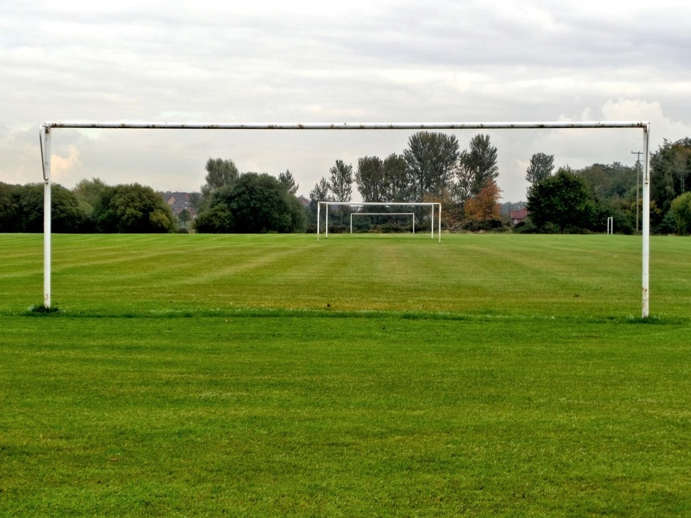

<!-- theme: W杯2026 優勝国予想・総決算コラム(準決勝を前に) / 番外(予想シリーズ最終回) -->
# 【W杯2026・優勝予想 総決算】本命は◎スペイン——落ちていった強者たちが教えてくれたこと

毎日、勝手に優勝国を占ってきました。その予想シリーズも、いよいよ準決勝の直前。今日で一区切りです。

開幕前、私はこう書いていました。「スペイン15%、フランス15%、イングランド11%、アルゼンチンとブラジルが9%」。団子でした。

それが1か月経って、残ったのは4カ国。**フランス①・アルゼンチン②・スペイン③・イングランド④**——なんと、大会前のFIFAランキング上位4カ国が、そっくりそのままベスト4に残りました。これは史上初のことです。

順当に見えます。でも、ここへ来るまでに、実力者が次々と落ちていきました。今日はその「落ちていった者たち」の話から始めさせてください。

---

## 落ちていった者たちが、教えてくれたこと

- **ブラジル**：ラウンド16でノルウェーに1-2。ボールは支配していました。なのに、直線的な速攻の前に沈みました。「強そう」と「勝つ」は、別物でした。
- **日本**：ラウンド32でブラジルに1-2。3大会連続で決勝トーナメントへ進んだのは立派です。ただ、悲願の初ベスト8には、今回も届きませんでした。
- **ポルトガル**：ラウンド16でスペインに0-1。ロナウドにとって最後の大会が、静かに幕を閉じました。
- **モロッコ・ノルウェー**：オランダを、ブラジルを倒した伏兵たち。歓喜を届けてくれましたが、準々決勝で力尽きました。

どの敗退にも、理由がありました。そしてその理由は、私がこの1か月、繰り返し使ってきた「見方」と、きれいに重なります。

---

## 一本に通った線——「握る」だけでは勝てない

**① 制圧は、勝率ではない。**
ボールを持つ時間が長くても、勝てるとは限らない。ブラジルの敗退が、その一番の証明でした。強そうに見えるチームと、勝ち残るチームは違う。

**② 「個」に頼る設計は、相関リスクを抱える。**
スター選手ひとりに攻撃を預けると、相手にそこを消された瞬間、長所がまとめて沈みます。今なお優勝候補の一角・フランスが抱える弱点は、ここだと読んでいます。

**③ 握るだけでなく、獲るべき1点を獲る。**
勝ち残ったのは、支配しながらも現実的に得点し、守るところを守れたチームでした。ここまで無敗を守り、失点も最少クラス——**スペイン**が本命の核は、まさにこの現実主義です。

もちろん、サッカーにPKや延長のカオスはつきもの。この不確定要素だけは、どの国にも平等に残っています。そこは正直に、頭に入れておきます。

---

## 予想表（開幕前 → 準決勝前）

| 印 | 国 | 確率の変遷 | 推す根拠 |
|---|---|---|---|
| **◎本命** | スペイン | 15% → **28%** | 無敗・堅守。握って、なお獲れる現実主義 |
| **○対抗** | アルゼンチン | 9% → **27%** | 勝ち切る勝負強さ。ここまで完成度を上げてきた |
| **▲単穴** | フランス | 15% → **24%** | 個の総和は最強クラス。ただし個を消された時が怖い |
| **△連下** | イングランド | 11% → **21%** | 総合力は本物。あと一歩、決め手を欠く場面が残る |

ブラジル（9%）、モロッコ（2〜3%）らは、ここで0%。敗退です。数字は、願望ではなく、勝ち上がりの現実に合わせて動かしました。

---

## 断り書き——私情とAIは、分ける

正直に書きます。私は、メッシのファンです。心情的には、アルゼンチンに勝ってほしい。あの背番号10を、もう一度てっぺんで見たい。

でも、それとこれは別です。**「好き」と「勝敗予想」を混ぜたら、予想はただの願望になります。**

予想は、事実と確率で組む。心情は、応援席に置いておく。この線引きだけは、崩さないつもりです。

だから、心情を差し引いても——いや、差し引いたからこそ、こう言い切れます。

---

## 結論

**優勝は、◎スペイン。**

握るだけでは勝てないと、この1か月が教えてくれました。握って、なお獲れる。守るところを守れる。その現実主義が、いちばんてっぺんに近い。それが、私の行き着いた結論です。

（※この記事は準決勝を前にした時点の予想です。進行中の試合の経過には触れていません。)

---

*余談ですが——「好き嫌い」と「データの読み」を分ける、というのは、私たちがふだんAIと仕事をするときに大事にしている姿勢そのものでもあります。楽ではなく、楽しく。答え合わせは、この夏の終わりに。*

- サイト：https://aidollargame.com/

---

#ワールドカップ2026 #優勝予想 #スペイン代表 #サッカーコラム #データで読む
