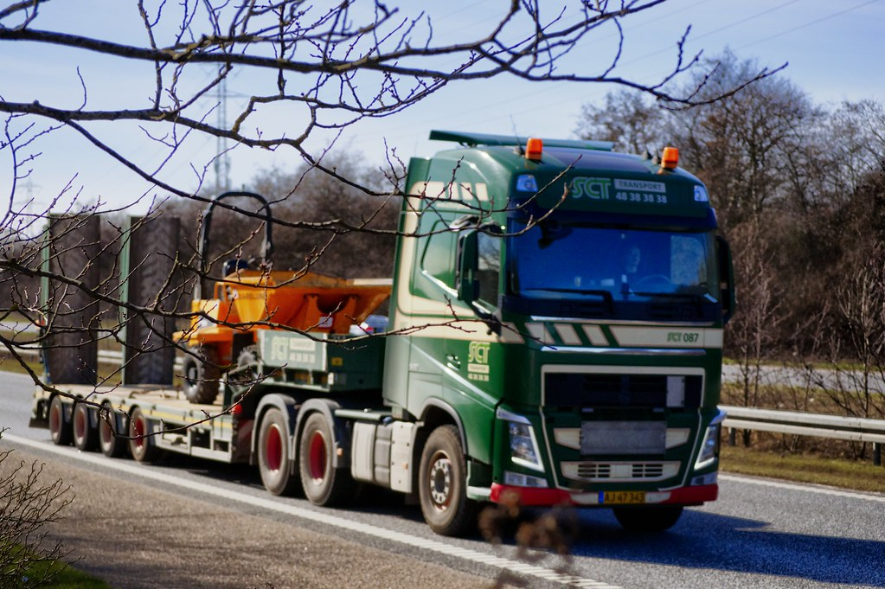

<!-- theme: 自社で取った一次データの実測レポート（中古トラック15,145台の値札） -->

# 中古トラック15,145台の値札を一晩で集めたら、半分の車に値段が書いていなかった

昨日の夜、中古トラックの在庫情報を扱う3つのサイトから、公開されている在庫15,145台分のデータを集めました。自社ツールを作るための下ごしらえだったのですが、集め終わってから中身を数えてみたら、想像していたより面白い数字が出てきました。

この記事は、その実測の記録です。他社の研究の紹介ではなく、自分たちで取ったデータの話なので、限界も含めて全部書きます。

読み終わると、「自分の業界の相場も、たぶん誰も測っていない」ということと、それを測るのに何が必要かが分かります。

---

## 集めたもの

2026年8月5日の夜、中古トラックの在庫を掲載している3つのサイトから、公開されている在庫情報を取得しました。合計15,145台です。

各サイトの利用規約とrobots.txtを事前に確認し、クロールを禁じているサイトは対象から外しています。取得したのはメーカー、車種、ボディの形、年式、走行距離、積載量、所在都道府県、価格。個別の車両を晒す意図はないので、以下はすべて集計した数字だけを出します。

正規化には少し手間がかかりました。和暦と西暦、「千km」と「km」、キログラムとトン、同じボディなのに呼び方が違うもの。これを1つの形にそろえるまでが仕事の8割です。

---

## 分かったこと1：値段が書いてあるのは、48.6%だけ

まず、これが一番効きました。

15,145台のうち、価格が表示されていたのは7,368台。48.6%です。残りの過半数は「応談」「要問い合わせ」で、値段が書かれていません。1つのサイトは、そもそも全車両が問い合わせ制でした。

つまり中古トラックの市場は、半分以上の商品に値札がついていない状態で回っています。

買う側から見ると、電話をかけるまで予算に合うかどうか分かりません。売る側から見ると、自分のトラックが今いくらなのか、比べる相手がそもそも見えません。

---

## 分かったこと2：条件をそろえても、2割は2倍以上ひらく

次に、値段が書いてある車だけで、同じ条件の車がいくらで並んでいるかを調べました。

対象は、価格と走行距離と年式がそろっている7,194台（明らかな入力ミスと思われる高額データ29台は除外しています。1台1億円ちょうどが3台ありました）。

メーカー、車種、ボディの形、年式が同じ車が5台以上あるグループを394組つくって、その中の最高値と最安値の比を出しました。

- 倍率の中央値は2.14倍
- 57.6%のグループで、最高値が最安値の2倍以上
- 18.3%のグループでは、3倍以上

ただし、これは走行距離を無視した比較です。走っている車が安いのは当たり前なので、走行距離を5万km幅までそろえて、もう一度同じ計算をしました。

- 倍率の中央値は1.59倍まで下がる
- それでも21.0%のグループでは、最高値が最安値の2倍以上
- 5.1%のグループでは、3倍以上

走行距離の効き方も出ました。同じ車種・同じ年式のグループ183組で見ると、走行1万kmあたりの価格差は中央値でマイナス4.8万円。89.1%のグループで、走るほど安いという当たり前の関係が確認できました。

まとめると、値段のばらつきの多くは走行距離で説明できる。それでも、年式も走行距離もほぼ同じ車が、2倍の値段で並んでいる場面が2割ある、ということです。

ここは正直に書いておきます。今回そろえられなかった条件がまだあります。装備の違い、修復歴、車検の残り、整備の状態。これらは価格を大きく動かします。だから2倍の差がそのまま「高すぎる」を意味するわけではありません。

言えるのは、公開されている情報だけでは、その2倍の理由が買う側に見えないということです。

---

## 分かったこと3：値札の3割は「キリのいい数字＋税」だった

これは数えていて思わず声が出ました。

価格の頻出値を並べると、上位が198万円、495万円、220万円、330万円、297万円と続きます。全部、税抜きのキリのいい数字を1.1倍した数字です。198万円は180万円＋税、495万円は450万円＋税。

数えたところ、価格表示のある7,368台のうち30.5%が、10万円単位の税抜き価格をそのまま税込み表示した数字でした。税込みで10万円単位のキリ番になっているものを足すと38.5%。

4台に1台以上が、キリのいい数字で値付けされているわけです。

相場を精密に計算して端数まで出している、という値付けではありません。感覚と経験で「180万かな」と決めた数字が、そのまま並んでいる。値札が半分しかない市場で、残り半分も感覚で決まっている、ということになります。

---

## これは中古トラックの話ではない

ここまで読んで「トラック業界は遅れているな」と思った方がいたら、たぶん逆です。

値段が公開されていない、条件をそろえた比較ができない、値付けが経験と勘で決まっている。この3つがそろっている業界のほうが、世の中には多いはずです。産業機械、工具、飲食店の居抜き物件、地方の不動産、業務用の中古設備。心当たりがある方は多いと思います。

そして重要なのは、今回私たちがやったのは推論でも予測でもないということです。公開されている情報を集めて、単位をそろえて、同じ条件の車を並べただけ。AIがやったのは頭のいいことではなく、人間がやると数か月かかる単純作業です。

自分の業界で試すなら、順番はこうなります。

1. 公開情報がどこにあるかを数える。同業のサイト、業界団体の公表資料、官公庁のオープンデータ。まず「そもそも公開されているか」を確認します。
2. 集める前に、利用規約とrobots.txtを読む。禁じているサイトは外す。ここを飛ばすと、後で全部無駄になります。
3. 100件でいいので手で集めて、そろえてみる。ばらつきが見えたら、その先は自動化する価値があります。見えなければ、そこで止めればいい。

ちなみに今回、実際にかかった時間は一晩です。19時に取り始めて、23時過ぎに15,145台を取り終わりました。途中で1回詰まりましたが、原因はAIの賢さとは何の関係もない通信待ちの設定で、最初の実装では1台あたり十数秒かかっていました。並列で取りに行く形に書き直したら一気に終わりました。この手の作業でつまずくのは、たいていそういうところです。

---

## まとめ

- 中古トラックの在庫15,145台のうち、値段が表示されているのは48.6%だけだった
- 同じ年式・同じ走行距離帯にそろえても、21.0%のグループで最高値が最安値の2倍以上あった
- 値札の30.5%は「10万円単位の税抜き価格×1.1」で、感覚で決まった数字がそのまま並んでいた
- ただし装備・修復歴・車検残はそろえられていないので、差の理由まではこのデータでは分からない

値段が見えない市場では、売る側も買う側も、自分の判断が正しいのか確かめようがありません。その状態を変えるのに必要なのは、賢いAIではなく、そろえて並べる手間でした。

私たちは「楽（らく）になる」ことをゴールにしていません。数か月かかる単純作業を一晩に変えたぶん、その先の「で、この差は何なのか」を考える時間に使う。そこまで含めて一緒に考えるのが、私たちの仕事だと思っています。

---

## データについて

- 出典：中古トラック在庫サイト3社の公開在庫情報（2026年8月5日時点の取得分、計15,145台）。各サイトの利用規約およびrobots.txtでクロール可否を事前確認し、禁じているサイトは対象外としています
- 集計対象：価格・年式・走行距離がそろっている7,194台（3,000万円以上の29台は入力値の疑いがあるため除外）
- 限界：価格を表示していない車両は分析に含まれていないため、市場全体の姿とはずれる可能性があります。装備・修復歴・車検残など価格を左右する条件はそろえられていません。同一車両が複数サイトに掲載されている重複も完全には除去できていません。1時点のスナップショットです
- 記事中の数値はすべて自社で取得したデータを自社で集計したものです

写真: Openverse（パブリックドメイン）

---

## 私たちについて

株式会社AIdollargameは、「楽じゃなく、楽しいを考える」をテーマに、AIプロダクトを自社開発しているAI会社です。

- AI導入支援・コンサルティング（https://aidollargame.com/ai-consulting.html）
- AIエージェント（https://aidollargame.com/line-ai-agent.html）：問い合わせ・予約対応を24時間自動化
- AIside（https://aidollargame.com/aiside.html）：経営者の"もう一人の自分"になる付き人AI
- AIwill／社長クローンAI（https://aidollargame.com/human-clone-ai.html）：経営者の判断軸をAIに学習させる

「うちの仕事でAIに何ができる？」は、無料のAI活用度診断（https://aidollargame.com/shindan.html）から。

- 🔗 公式サイト：https://aidollargame.com/
- 📩 ご相談：nosuke@aidollargame.com

このnoteでは、AI活用のリアルや時事の読み解きを、過程まで含めて正直に発信しています。フォローしてもらえると嬉しいです。

---

ハッシュタグ案：#データ分析 #中小企業 #中古トラック #価格の話 #AI活用

サムネ文言案：
1. 15,145台。半分に値札がなかった。
2. 値札の3割は「キリのいい数字＋税」
