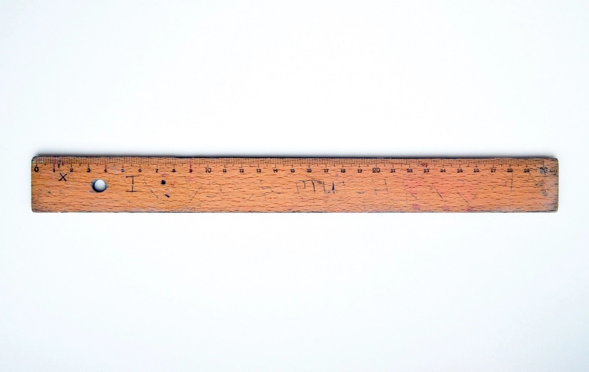

<!-- theme: 研究・実験結果レーン(NBER WP34836 米英独豪6,000社調査＋WP35123レビュー／導入率の数字が10倍ぶれる話と「効果なし」の中身) / 研究レーン(3-0) -->
# AIを使っている会社は69%。なのに9割の経営者が「うちは何も変わっていない」と答えた

この記事は、「AIを入れたほうがいいのは分かるけれど、実際どれくらい効果が出ているのか」を知りたい経営者や現場責任者に向けて書きました。読み終わるころには、世に出回る「AI導入率◯%」という数字をどう読めばいいか、そして自分の会社では何を見ておけばいいかが決まるはずです。

今回、米国・英国・ドイツ・オーストラリアの約6,000社の経営幹部に聞いた大規模調査の原文を読みました。中で一番驚いたのは、導入率でも将来予測でもなく、「経営者自身がAIに使っている時間」の数字でした。

---

## まず、「AI導入率」の数字は3%から88%まである

同じ「企業のAI導入率」でも、調査によって数字がまるで違います。今回読んだ論文が整理していた推計を並べると、こうなります。

- 3%（米国の2019年調査。労働者ベースだと13%）
- 5%（米国センサス局のBTOS、2024年2月時点）
- 9%（英国の経営調査、2023年時点）
- 18%（同じBTOSの2025年12月時点）
- 49%（英国の経営者団体調査、2025年）
- 69%（今回の4か国調査、2025年11月から2026年1月）
- 88%（コンサル会社の2025年調査。1つでも業務でAIを使っていれば該当）

10倍以上ひらいています。数字が違うのは、どれかが嘘だからではありません。聞いている相手（経営者か、担当者か、労働者か）と、「使っている」の定義（1回でも触ったか、業務に組み込んだか）が違うからです。

だから「他社はもう◯%が導入しています」という営業トークは、それ自体では判断材料になりません。私も自社の資料を作るときは、必ず「誰に何を聞いた数字か」まで書くようにしています。

---

## 使っている会社の9割が「影響はなかった」と答えている

今回の調査の本題はここからです。69%の企業がAIを使っている。では効果は出たのか。

過去3年について、雇用に影響がなかったと答えた経営幹部が90%超。労働生産性（従業員一人あたりの売上）に影響がなかったと答えたのが89%。平均すると、この3年でAIが生産性を押し上げた分は約0.29%でした。ほぼ誤差です。

ところが同じ人たちが、今後3年については生産性が1.4%上がると答えています。米国は2.3%、英国は1.9%、ドイツとオーストラリアは0.9%。雇用は0.7%減ると見ています。

面白いのは、同じ質問を従業員にすると答えがずれることです。従業員は今後3年で雇用が0.5%増えると答えました。経営者は減ると思い、働く側は増えると思っている。この認識のずれは、社内でAIの話をするときに効いてきます。

---

## 経営者がAIに使っている時間は、週1.5時間

「効果がなかった」の理由が見えたのが、次の数字でした。

回答した経営幹部（多くはCEOやCFO）のうち、3分の2以上が毎週AIを使っています。ただし平均使用時間は週1.5時間。最も多い回答は「週1時間まで」で41%、週1から5時間が24%、週5時間を超える人は7%だけです。国別では米国が1.7時間、オーストラリアが1.5時間、英国とドイツが1.4時間でした。

週1.5時間は、1営業日あたり18分です。18分で会社の生産性が変わったら、そのほうが不思議だと私は思いました。

「AIを導入した」と「AIを使っている」の間には、これだけの距離があります。

---

## 効果が出ている報告もある。ただし、出ている場所が違う

片側だけ並べるのはフェアではないので、逆の結果も見ておきます。

同じNBERから2026年4月に出たレビュー論文が、この点をまとめていました。顧客対応、文章作成、製品開発といったタスク単位の実験では、AIを渡すと作業時間が縮む、成果が上がるという結果が繰り返し確認されています。にもかかわらず、企業全体や産業全体の生産性統計には、まだはっきり出てこない。

このレビューが挙げていた説明のひとつが、Jカーブです。米国の製造業を対象にした研究では、AIを入れた直後は収益性がいったん下がり、あとから効果が出る形が確認されています。覚え直しと作り直しのコストが先に来るからです。

もうひとつ、複数のデータで一貫していたのが企業規模です。大きい会社ほどAIに投資している。今回の4か国調査でも、規模が大きく、生産性が高く、賃金水準の高い会社ほど導入率が高く、社歴の長い会社と役員の年齢が高い会社は低いという結果でした。

つまり「まだ効果が出ていない」の中身は、少なくとも三つに分かれます。使う時間が薄いだけの会社、まだJカーブの底にいる会社、そして本当に相性が悪かった会社。この三つを一緒くたにして「AIは効かない」と結論するのは、早いです。

---

## 中小企業が明日からできること

読んだ内容を、うちのような小さい会社の話に翻訳します。

1. 会社の導入率ではなく、自分の週の使用時間を数える。まず1週間、AIに触れた時間を記録してみてください。週1.5時間より少ないなら、効果が出ていないのは当たり前です。判断材料はまだ揃っていません。

2. 1つの業務だけ、前と後の所要時間を測る。見積書の作成、問い合わせへの返信、議事録の清書。どれか1つで構いません。導入前に何分かかっていたかを測っておかないと、後から効果は「なかった」に丸められます。全社の生産性は測れなくても、1業務の分数なら測れます。

3. 最初の数か月は下がる前提で置く。Jカーブがある以上、初月から楽になる想定で予算と期限を組むと、底で撤退することになります。

---

## まとめ

- 「AI導入率」は調査によって3%から88%までひらく。誰に何を聞いた数字かを確認する
- 4か国約6,000社の調査では69%が導入済み。しかし89%が「生産性に影響なし」と回答
- その裏で、経営幹部の平均使用時間は週1.5時間（1日あたり18分）
- タスク単位の実験では時間短縮が確認されている。企業全体の数字に出るまでには時間差がある
- 自社で見るべきは全社の生産性ではなく、1業務の前後の分数

数字が動くのを待つのではなく、まず自分の1週間の使用時間と、1業務の分数を測る。ここからだと思います。

AIで作業が楽になるのは入口にすぎません。空いた時間で何をするかを決めていないと、浮いた18分はそのまま別の作業に吸われます。うちが一緒に考えたいのは、その先のほうです。

---

## 私たちについて

株式会社AIdollargameは、「楽じゃなく、楽しいを考える」をテーマに、AIプロダクトを自社開発しているAI会社です。

▼AI導入支援・コンサルティング
https://aidollargame.com/ai-consulting.html?utm_source=note&utm_medium=referral&utm_campaign=2026-08-07

▼AIエージェント：問い合わせ・予約対応を24時間自動化
https://aidollargame.com/line-ai-agent.html?utm_source=note&utm_medium=referral&utm_campaign=2026-08-07

▼AIside：経営者の"もう一人の自分"になる付き人AI
https://aidollargame.com/aiside.html?utm_source=note&utm_medium=referral&utm_campaign=2026-08-07

▼AIwill／社長クローンAI：経営者の判断軸をAIに学習させる
https://aidollargame.com/human-clone-ai.html?utm_source=note&utm_medium=referral&utm_campaign=2026-08-07

「うちの仕事でAIに何ができる？」は、無料のAI活用度診断から。
https://aidollargame.com/shindan.html?utm_source=note&utm_medium=referral&utm_campaign=2026-08-07

🔗 公式サイト
https://aidollargame.com/?utm_source=note&utm_medium=referral&utm_campaign=2026-08-07

📩 ご相談：nosuke@aidollargame.com

このnoteでは、AI活用のリアルや時事の読み解きを、過程まで含めて正直に発信しています。フォローしてもらえると嬉しいです。

---

出典

Yotzov, Barrero, Bloom ほか「Firm Data on AI」（NBER Working Paper 34836、2026年2月／同年3月改訂。米英独豪の約6,000社の経営幹部を対象、調査実施は2025年11月から2026年1月。査読前のワーキングペーパー）
https://www.nber.org/papers/w34836

Babina「Understanding Firms' AI Efforts and Their Economic Impact」（NBER Working Paper 35123、2026年4月／査読前のレビュー論文。タスク単位の実験と企業全体の統計のずれ、Jカーブ、企業規模との関係はこの整理による）
https://www.nber.org/papers/w35123

導入率3%から88%の各推計は、上記34836の文献整理に記載されたもの（米国Annual Business Survey 2019、米国センサス局BTOS、英国Management and Expectations Survey、英国Institute of Directors調査、マッキンゼー2025年調査）

米国センサス局 Business Trends and Outlook Survey（BTOSの最新値）
https://www.census.gov/hfp/btos/data

---

ハッシュタグ案：#AI導入 #中小企業 #生産性 #経営 #DX

サムネ文言案：
1. 導入率69%、でも9割が「変わっていない」
2. 経営者のAI使用時間は週1.5時間だった
