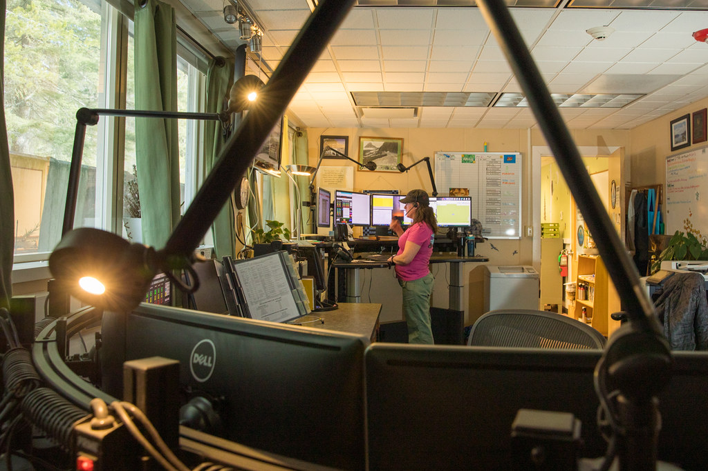

<!-- theme: 研究・実験結果レーン(アリババ×Taobaoのランダム化実験2本／AIを下書き役にした場合と対応役にした場合で顧客評価が逆になる) / 研究レーン(3-0) -->

# AIに任せた問い合わせは64.6%速くなり、顧客の評価は0.858点下がった｜同じ会社の実験2本を読む

問い合わせ対応にAIを入れるかどうか迷っている方に向けた記事です。

結論から書くと、「AIに下書きさせる」のと「AIに対応させて人が見張る」のとでは、顧客の評価が逆方向に動きました。アリババの同じ現場で、同じ研究チームが2回ランダム化実験をやっていて、そこがきれいに分かれています。

私たちも問い合わせ対応のAIを売っている会社です。都合のいい数字だけ拾うと嘘になるので、上がった数字と下がった数字を両方並べます。

---

## 実験1：AIを「下書き役」にしたら、速さと満足度は上がった

1本目は、Taobaoのアフターサービス(返金・交換・配送遅延など)のチャット対応の実験です。

- 期間：2023年12月26日から2024年2月19日までの8週間(前半4週は全員AIなし)
- 規模：担当者5,940人(AIあり2,895人／なし3,045人)、チャット約256万件、顧客評価約39万件
- AIの役割：チャットの冒頭だけ、問題の切り分けと解決案の下書きを出す。担当者はそれを採用しても、直しても、無視してもよい

AIを使える状態にしただけで、こう動きました。

- 問題の切り分けにかかる時間：8.2%短縮(3.2秒)
- チャット全体の所要時間：1.1%短縮(5.7秒)
- 不満(5点満点で1〜2点)の割合：0.35から0.012ポイント低下(3.4%の改善)
- 平均評価：3.46から0.042点上昇
- 3日以内の再問い合わせ：ほぼゼロで、統計的な差なし

実際に使ったぶんだけで見ると効果は約4倍で、切り分け時間は32.3%短縮、評価は0.184点上昇。それでも再問い合わせだけは動きません。

著者の説明はこうです。社内の対応規程は実験中に変えていないので、AIは「見立て」と「伝え方」をよくするが、担当者に許された解決手段そのものは増やさない。だから体験は良くなるのに、解決したかどうかは変わらない。AIを入れても返金の権限が同じなら解決率は動かない、ということです。

---

## 誰に渡すかで結果が逆。苦手な人は伸び、上手い人は下がった

平均の裏に、もっと大事な差がありました。

事前の顧客評価で担当者を5段階に分けたときの、実測の平均評価(AIを渡した群)です。

- 最下位層：2.184 → 2.981
- 最上位層：4.008 → 3.846

苦手な人ほど伸びて、上手い人は下がった。差は縮まったが、上位が削れた形です。

理由も追いかけていて、上位層はAIを使うと同時進行の他のチャットへ意識が移る時間が増え、解決段階の応答が15.5%、確認段階が17.4%遅くなり、10分以内の再問い合わせが3.5ポイント増えていました。目の前の一件が途切れたわけです。

使用率も、最下位層39.3%に対して最上位層は18.3%。上手い人は元から疑って使っています。

---

## 実験2：AIを「対応役」にしたら、速さは大きく伸びて、評価は落ちた

2本目は、同じTaobaoでAIが自分でチャットを完結させ、人は監督に回る形の実験です。

- 期間：2024年8月15日から31日
- 規模：担当者647人(AIあり302人／なし345人)、チャット68万676件
- 前提：AIに任せられると判定されたチャットは、全体の10%未満

結果はこうなりました。

- AIに任せた側：所要時間16.8%短縮、再問い合わせは差なし、顧客評価は0.412点低下
- AIの対象外(人が最初から最後まで扱う側)：所要時間1.8%短縮、顧客評価は0.091点上昇

さらにAI対象の11,069件を、人がどう関わったかで割ると差がはっきりします。人だけで対応した似たチャットとの比較です。

- AIが最後まで対応(3,874件・35.0%)：時間64.6%短縮、評価0.858点低下、再問い合わせは差なし
- 技術的に行き詰まって人が引き継ぎ(4,879件・44.1%)：時間19.1%増、評価も再問い合わせも差なし
- 顧客の不満を検知してから人が引き継ぎ(954件・8.6%)：時間40.8%増、再問い合わせ6ポイント増、評価0.928点低下
- 人が自分の判断で早めに引き継ぎ(1,362件・12.3%)：時間9.5%増、再問い合わせ3.2ポイント減、評価0.524点低下

---

## 分かれ目は「人がいつ入るか」だった

並べると読み取れることが2つあります。

1つ目。技術的な行き詰まりは、人が入れば取り返せる。時間は19.1%余計にかかりますが、質は人だけの対応と区別がつきません。

2つ目。感情のもつれは、人が入っても取り返せない。不満が溜まってから交代した954件は、時間も評価も再問い合わせも全部悪化しています。しかも交代後の担当者の関わり方まで薄くなる(送るメッセージが減り、こちらから聞きにいかなくなる)ことが測られています。逆に、アルゴリズムに言われる前に人が自分から入った分は傷が浅い。早く入るほど戻せる、という順番です。

もうひとつ、素直に良かった話も書いておきます。AIの対象外だったチャットは、評価が0.091点上がりました。定型の対応をAIに渡したぶん、人が難しい案件に腰を据えられるようになった、という説明です。

---

## 中小企業の現場に翻訳すると

- まずは下書き役から。人が最後に一手を入れる形なら、速くなって評価も上がった。全部任せた瞬間に評価は落ちる
- 完全に任せる範囲は狭く決めて書き出す。あのアリババでも自動で完結できたのは全体の1割未満、手順が決まっている問い合わせだけです
- 人が出るきっかけを「相手が怒ったら」に置かない。数字上そこはもう手遅れ。最初の数往復で決めきれなければ人へ、が一番軽く済む
- ベテランに渡すときは、同時に持たせる件数を増やさない。空いた注意が他へ飛ぶと、目の前の一件が雑になる
- 解決率まで上げたいなら、AIではなくルールを触る。その場で決めていい範囲を広げないと、体験が良くなるだけで終わります

---

## まとめ

- AIを下書き役にした実験：速くなり、評価も上がった。ただし解決率は変わらない
- 同じ道具でも、苦手な担当者は伸び、上位の担当者は評価が下がった
- AIを対応役にした実験：時間は64.6%短縮できたが、評価は0.858点低下
- 人が入って取り返せるのは技術的な行き詰まりまで。不満が溜まった後では戻らない
- 明日からの一歩は、「AIに全部任せる線」を引くことではなく、「人がいつ入るか」を先に決めること

なお、どちらも査読前のプレプリントで、実験自体は2023年から2024年に大規模ECの現場で行われたものです。規模も業務も日本の中小企業とは違うので、数字をそのまま自社の見積もりには使えません。読み方として使ってください。

問い合わせの一次対応をAIに預けて空いた時間を、どこに戻すか。今日の2本は、その戻し先が「他の作業」だと質が落ちて、「難しい一件」だと質が上がる、と言っています。楽ではなく、楽しいを考える。私たちが時間を戻したいのは後者のほうです。

### 出典

- Ni, Wang, Feng, Lu, Wang, Zhou「Generative AI in Action: Field Experimental Evidence from Alibaba's Customer Service Operations」(arXiv:2603.29888、2026年2月公開・2026年7月改訂／査読前のプレプリント。実験は2023年12月〜2024年2月)

https://arxiv.org/abs/2603.29888

- Wang, Zhu, Feng, Lu, Jia「Agentic AI and Human-in-the-Loop Interventions: Field Experimental Evidence from Alibaba's Customer Service Operations」(arXiv:2605.14830、2026年5月公開・6月改訂／査読前のプレプリント。実験は2024年8月)

https://arxiv.org/abs/2605.14830

---

## 私たちについて

株式会社AIdollargameは、「楽じゃなく、楽しいを考える」をテーマに、AIプロダクトを自社開発しているAI会社です。

- AI導入支援・コンサルティング（https://aidollargame.com/ai-consulting.html）
- AIエージェント（https://aidollargame.com/line-ai-agent.html）：問い合わせ・予約対応を24時間自動化
- AIside（https://aidollargame.com/aiside.html）：経営者の"もう一人の自分"になる付き人AI
- AIwill／社長クローンAI（https://aidollargame.com/human-clone-ai.html）：経営者の判断軸をAIに学習させる

「うちの仕事でAIに何ができる？」は、無料のAI活用度診断（https://aidollargame.com/shindan.html）から。

- 🔗 公式サイト：https://aidollargame.com/
- 📩 ご相談：nosuke@aidollargame.com

このnoteでは、AI活用のリアルや時事の読み解きを、過程まで含めて正直に発信しています。フォローしてもらえると嬉しいです。

---

ハッシュタグ案：#AI導入 #カスタマーサポート #中小企業 #業務効率化 #論文メモ

サムネ文言案：
1. 「64.6%速くなって、評価は0.858点下がった」
2. 「AIに任せる線より、人がいつ入るか」
