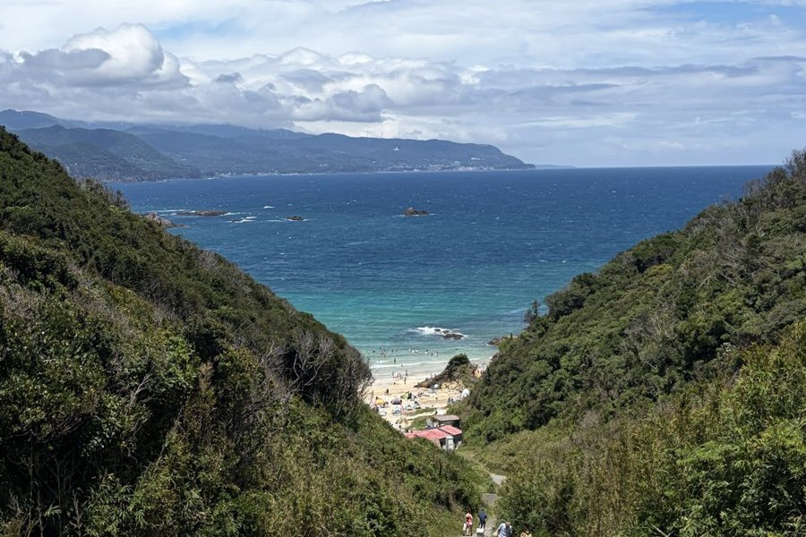
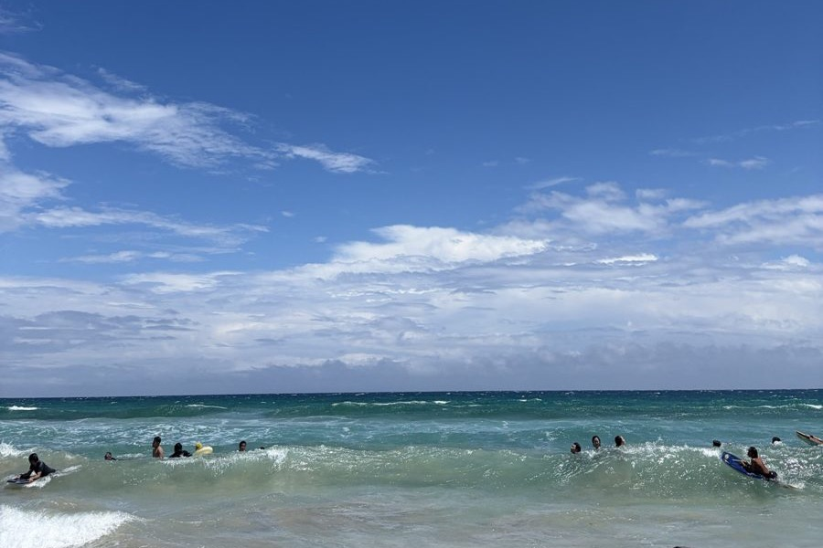
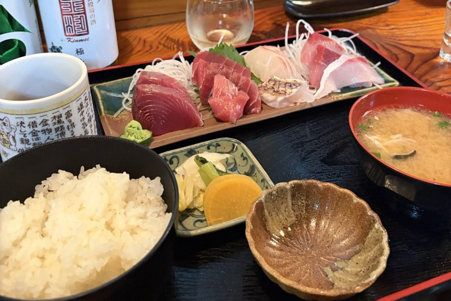
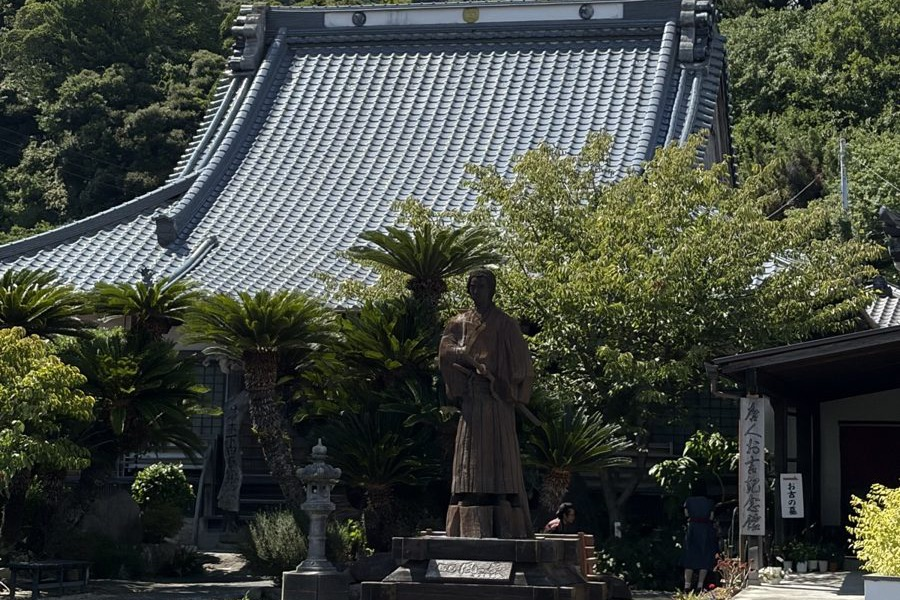

<!-- theme: 現場から(自社発信レーン) 伊豆下田 2026-08-13 実体験 × 静岡県観光交流の動向 令和6年度(下田市 2,028,794人) × 国交省 駐車場データ活用事例集 令和7年5月(s-park 約25,000件中約9,000件に満空情報)／資源ではなく情報で選ばれなくなる -->

# 海も宿も飯もあった。探すのが大変だった｜伊豆下田で気づいた「情報がない」の重さ

お盆の平日に、当社のエンジニアと伊豆下田へ行きました。写真はその日に撮ったものです。

海は想像より澄んでいて、昼に入った店の刺身は、都内で同じ値段では出てこない質でした。仕事の話も少しして、あとはよく休みました。行ってよかった、というのが率直な感想です。

そのうえで、同じ種類の引っかかりに何度もぶつかりました。店も宿も駐車場も、行ってみるまで分からないということです。

これは観光地への愚痴ではありません。私たちが毎日話している中小企業に、まったく同じ構造があります。そこが書きたいところなので、感想だけで終わらせずに、公的な統計を2つ突き合わせて確かめました。

---

## 資源は減っていない。客だけ減っている

まず現在地を数字で確かめます。静岡県が公表している「令和6年度 静岡県観光交流の動向」から、下田市の数字です。

- 下田市の観光交流客数（令和6年度）: 2,028,794人（令和5年度は 2,089,670人）
- うち宿泊客数: 913,718人（令和5年度は 912,422人）
- うち日帰りにあたる観光レクリエーション客数: 1,115,076人（令和5年度は 1,177,248人）
- 静岡県全体の観光交流客数（令和6年度）: 140,336,929人。前年度比100.5%で微増

県全体は前年度から増えています。その中で下田市は減っていて、減った分はほぼ日帰り客です。宿泊はほぼ横ばいで、日帰りは約5.3%減。この差の計算はこちらで行いました。

同じ統計の平成17年度の下田市は 3,507,890人でした。いまは当時の6割弱です。

海はきれいなままでした。魚も、温泉も、黒船の歴史も、そこにあります。資源は減っていないのに、来る人だけが減っている状態です。

お盆の平日の海です。混雑とは無縁でした。

## 探すのに苦労した3つのこと

引っかかったのは、次の3つです。どれも贅沢な要求ではありません。

1つめは、店が今日やっているかどうか。個人でやっている店は、そもそも検索に出てくる情報が少なく、出てきても定休日や臨時休業が書かれていません。海の近くの店は、天気や仕入れで閉める判断が当日に出ます。昼どきに電話しても、忙しくて出ないのが普通です。結果として、開いている店に当たるまで車で回ることになります。

2つめは、宿の条件と空き。予約サイトに載っている宿は分かります。ただ、載っていない小さな旅館の空きと値段は電話でしか分かりません。駐車場が何台あるか、素泊まりができるか、チェックインの締め切りが何時か。こうした判断材料も、書いてある宿と書いていない宿の差が大きいです。

3つめは、駐車場。これがいちばん分かりませんでした。料金がいくらか、いま空いているか、そもそも観光地の入口に何台あるか。着いてみて初めて分かる、が基本でした。空いていなければ、次を探して走ります。

当たった店の昼です。この満足度は都内ではなかなかありません。見つけたのは、人に聞いた情報でした。

## 駐車場が「行ってみないと分からない」のは、下田だけの話ではない

駐車場については、国が現状をまとめた資料があります。国土交通省 都市局街路交通施設課が令和7年5月に出した「自治体等と連携した駐車場データ活用事例集」です。

載っているのは5例。岡崎市、東京都、金沢市、横浜市、京都府・滋賀県です。参考にできる先進事例が、全国で5つ挙げられる段階だということでもあります。そして5つとも、都市部や県庁所在地級の街です。

そのうち、いちばん整備が進んでいる東京都の s-park（東京都道路整備保全公社が運営）の記述がはっきりしています。掲載している約25,000件の駐車場のうち、満空情報があるのは約9,000件。残りは、載ってはいても空いているかどうかは分かりません。情報の取り方も、API連携のほか、事業者からの随時提供、そして委託業者による現地調査は年に1度と書かれています。

日本でいちばんデータが揃っている東京で、この状態です。観光地の駐車場が「行ってみないと分からない」のは、下田の怠慢ではありません。誰も整備していない領域が、まだそのまま残っているということです。

## これは観光地の話ではなく、うちのお客さんの話

ここからが本題です。

これまでは、情報が置かれていなくても大きな損はしませんでした。人は地図アプリと勘で探し、電話をかけ、それでも見つけてくれたからです。

ただ、出かける前にAIに聞いて予定を決める人が増えていくと、話が変わります。AIは、置かれていない情報を答えられません。営業時間が書かれていない店、料金が書かれていない駐車場、条件が書かれていない宿は、候補に入る前に落ちます。ここは私たちの見立てですが、方向はもう変わらないと思っています。

そして、これはAIを買う話ではありません。まず、費用がほとんどかからない3つがあります。

- 今日やっているかを書く。営業時間、定休日、臨時休業。地図アプリの情報を最新にするだけで、探している人の第一関門を通せます。
- 値段と条件を文字で書く。写真の中の文字や、画像1枚だけのお知らせは機械には読めません。テキストで書きます。
- 駐車場のことを書く。台数、料金、混みやすい時間帯。「近隣にコインパーキングあり」の1行でも、行くかどうかの判断は変わります。

そのうえで、それでも取りこぼすのが、電話に出られない時間の問い合わせです。昼の営業中、仕込み中、繁忙期。ここは人を増やさずに埋められる部分で、私たちが実際に引き受けている仕事も、派手な自動化ではなく、この地味な取りこぼしの回収です。

歩いていて出会った寺です。事前に調べていて見つけたものではありませんでした。

## 選ばれ方が変わっただけ

下田が力を失ったとは思いません。当たった店の満足度は都内より高かったし、人が少ないぶん、海も道も静かでした。

ただ、当たるまでに使った時間の分だけ、次に来ない人が出ます。減った日帰り客の中には、探すのを面倒がってやめた人が、いくらか含まれているはずです。

エンジニアと羽を伸ばせたのは、探し終わったあとの時間でした。店を探して車で回った時間は、楽しくありません。魅力にたどり着いたあとの時間だけが、楽しい時間でした。

楽じゃなく、楽しいを考える。私たちがそう言っているのは、まさにこの部分です。

資源があっても、情報が置かれていなければ選ばれない。逆に言えば、情報を置くだけで戻ってくる客がいる。旅の帰りに、そこだけは持ち帰りました。

自社サイトにも同じ内容を記事にしています。

▼海も宿も飯もあった。探すのが大変だった（AIdollargame）
https://aidollargame.com/articles/shimoda-joho-2026.html?utm_source=note&utm_medium=referral&utm_campaign=2026-08-17

---

## 出典

- 静岡県スポーツ・文化観光部観光政策課「令和6年度 静岡県観光交流の動向」（下田市および静岡県全体の観光交流客数・宿泊客数・観光レクリエーション客数は同資料の市町別統計より）
  https://www.pref.shizuoka.jp/_res/projects/default_project/_page_/001/050/979/r6.pdf
- 国土交通省 都市局街路交通施設課「自治体等と連携した駐車場データ活用事例集」令和7年5月（掲載5事例、東京都 s-park の約25,000件中約9,000件に満空情報あり・現地調査は年に1度の記述は同資料より）
  https://www.mlit.go.jp/toshi/content/001890434.pdf
- 国土交通省「駐車場におけるデジタル技術の活用」
  https://www.mlit.go.jp/toshi/toshi_gairo_tk_000105.html

前年度からの増減率、平成17年度との比較は当社の計算です。それ以外の数値は出典元の公表値をそのまま引用しています。将来の見通しに関する記述は当社の見立てと明記しています。

写真: 2026年8月13日に伊豆下田で当社が撮影

---

## 私たちについて

株式会社AIdollargameは、「楽じゃなく、楽しいを考える」をテーマに、AIプロダクトを自社開発しているAI会社です。

▼AI導入支援・コンサルティング
https://aidollargame.com/ai-consulting.html?utm_source=note&utm_medium=referral&utm_campaign=2026-08-17

▼AIエージェント：問い合わせ・予約対応を24時間自動化
https://aidollargame.com/line-ai-agent.html?utm_source=note&utm_medium=referral&utm_campaign=2026-08-17

▼AIside：経営者の"もう一人の自分"になる付き人AI
https://aidollargame.com/aiside.html?utm_source=note&utm_medium=referral&utm_campaign=2026-08-17

▼AIwill／社長クローンAI：経営者の判断軸をAIに学習させる
https://aidollargame.com/human-clone-ai.html?utm_source=note&utm_medium=referral&utm_campaign=2026-08-17

「うちの仕事でAIに何ができる？」は、無料のAI活用度診断から。
▼無料AI活用度診断（3分）
https://aidollargame.com/shindan.html?utm_source=note&utm_medium=referral&utm_campaign=2026-08-17

▼公式サイト
https://aidollargame.com/?utm_source=note&utm_medium=referral&utm_campaign=2026-08-17

ご相談：nosuke@aidollargame.com

このnoteでは、AI活用のリアルや時事の読み解きを、過程まで含めて正直に発信しています。フォローしてもらえると嬉しいです。

---

#中小企業のAI活用 #観光 #伊豆下田 #生成AI #オープンデータ

---

サムネ文言案:
- 案1：海も宿も飯もあった。探すのが大変だった｜伊豆下田で気づいたこと
- 案2：東京でも満空が分かる駐車場は約9,000件／25,000件。情報がない土地で失われるもの
