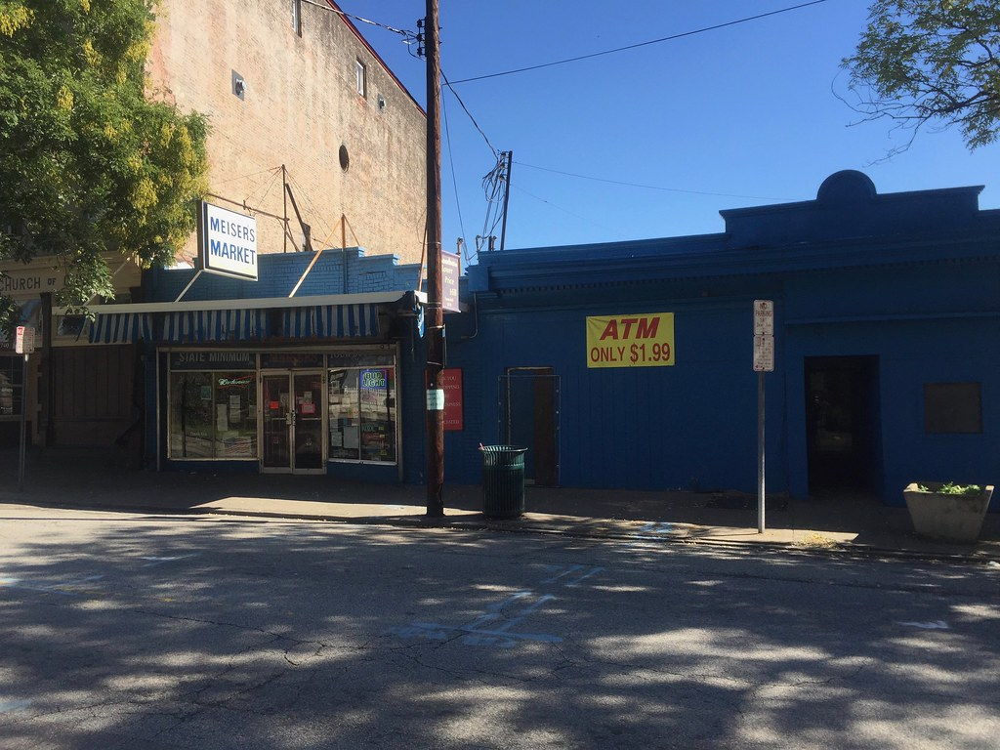

<!-- theme: 研究・実験結果レーン(Seer Interactive 53ブランド・547万通りの検索キーワード・24億3,000万表示 2025年1月〜2026年2月 × Amsive 70万キーワード × SparkToro Similarwebクリックストリーム 2026年1〜4月 × Pew Research 68,879検索／AI概要でクリックはいくら減ったのか、数字が15%減から67%減までぶれる理由) / 研究レーン(3-0) -->

# 検索のクリックは67%減った。でも社名で探された検索だけは18%増えていた｜24億回の表示を調べた実測データ

「サイトのアクセスが去年より減った」。ここ数か月、社長さんからこの話を聞くことが本当に増えました。原因としてまず名前が挙がるのが、Googleの検索結果の一番上に出るAIの要約（AI概要）です。

ただ、数字がまったく揃っていません。同じ問いへの公表値が15%減から67%減まで、4倍以上の幅で散らばっています。Google自身は「減っていない」と言っています。

この記事では、その実測データを並べて、なぜここまでぶれるのかを整理します。読み終わると、自分の会社のアクセスが本当に減っているのかどうかを考える材料が手に入ります。

---

## 数えた規模：24億3,000万回の表示

何を何件調べた話なのかを先に出します。持ち帰って使えるように、調べた量と期間と出た数字をひとまとめにしておきます。

Seer Interactive（2026年更新版）
- 調べた量：53ブランド、547万通りの検索キーワード、自然検索での表示24億3,000万回、広告での表示2億9,690万回
- 期間：2025年1月から2026年2月
- 出た数字：AI概要が出た検索でのクリック率が年間で約67%低下、その後回復
- どこまで信用できるか：SEO会社が自分の顧客のデータを集計したもので、外部のチェックは受けていません。報告書自身が「AI概要のせいで減ったとは言い切れない」と書いています

Amsive
- 調べた量：70万キーワード、10サイト、5業種（金融・教育・SaaS・医療・ペット）
- 出た数字：平均15.49%減。ただし指名検索だけは18.68%増
- どこまで信用できるか：これもSEO会社が自分の顧客のデータを集計したもの

SparkToro
- 調べた量：Similarwebが集めた米国Google検索の閲覧履歴データ
- 期間：2026年1月から4月
- 出た数字：クリックが1回も起きない検索が68.01%（2024年は60.45%）
- どこまで信用できるか：分析会社の集計。年ごとにデータの入手先が違うので年どうしを並べるときは注意、と書いた本人が断っています

Pew Research Center
- 調べた量：米国の大人900人超が「記録していい」と同意したうえで残された、68,879件の実際の検索
- 期間：2025年3月実施、2025年7月公表
- 出た数字：AI要約ありでクリック8%、なしで15%
- どこまで信用できるか：どこの会社の売上にも関係しない調査機関。この4本で唯一

まとめると、利害のない調査機関はPewだけで、残る3本は商売にしている会社が自分の手元のデータで測ったものです。件数の多さは信用していいですが、「AI概要のせいでこうなった」と原因を決めつけるには足りません。

---

## 数字がばらばらなのは、どんな検索を数えたかが違うから

4本を並べると、数字がばらばらになる理由が見えてきます。

Seerのデータでは、AI概要が表示された検索で、自然検索（広告ではない、通常の検索結果）のクリック率が2025年1月の3.19%から12月に1.31%まで落ちました。年間で約67%の低下です。ところが同じ期間、AI概要が表示されなかった検索は2.75%から3.82%へ、逆に上がっています。つまり、検索全部でクリックが減ったのではありません。AI概要が出るような検索だけが減っていました。

Amsiveの70万キーワードは、その「種類」をもっと細かく割っています。平均は15.49%減。内訳は、社名や商品名を含まない検索が19.98%減、検索結果の一番上に出る抜粋（強調スニペット）と重なると37.04%減、順位が3位より下だと27.04%減。

一方、会社名や商品名で探された検索は違いました。そもそもAI概要が出たのは4.79%だけで、出た場合もクリック率は18.68%上がっていました。

減った検索と増えた検索が、同じ調査の中に一緒に入っています。だから調査ごとに平均が15%減にも67%減にもなります。

---

## AIの要約に自分のサイトが載るかどうかで、クリックが2.2倍違う

AI概要は、答えの下に「この情報はここから取りました」という参照先のサイトを何本か並べます。そこに自分のサイトが載るかどうかで、クリック数が大きく変わっていました。載った場合は、載らなかった場合の2.2倍です。

情報を調べる系の検索で、100万回表示あたりのクリック数に直すとこうなります。

- AI概要が出ない検索：約33,500クリック
- AI概要が出て、参照先に自分のサイトが載った：約20,743クリック
- AI概要が出て、載らなかった：約9,445クリック

載っても、AI概要が出ない場合と比べれば38%少ない。それでも、載らないよりははるかにましです。ここが今、手を打てる場所です。

なお、お金を払って出す検索連動の広告は、この期間ずっとクリック率13.99%から17.95%のままで、下がっていません。減っているのは、広告費をかけずに集めていたアクセスだけです。

---

## Google自身は「サイトに届くアクセスは減っていない」と言っている

ここまでの調査と、Googleの言い分は食い違っています。Googleで検索を統括するリズ・レイド氏は2025年8月6日のブログで、検索からサイトに送っているクリックの合計数は去年とだいたい変わっていない、むしろ買う気のある人が来るようになった、と書いています。ただし、その根拠になる数字は公開していません。

外から測った側はどうか。Pewの68,879件では、AI要約が出た検索でどこかのサイトがクリックされたのは8%、出なかった検索では15%でした。要約の中に並んだリンクが押されたのは、全体のたった1%です。SparkToroの2026年1月から4月の集計では、どこもクリックせずに終わる検索が68.01%（2024年は60.45%）でした。

私はこう考えています。Googleの言い分も、調査会社の数字も、たぶん両方本当です。

人がGoogleを使う回数そのものが増えています。だから1回の検索あたりのクリック率が落ちても、サイトに届くクリックの合計は減らない。ただし、その合計の中身が入れ替わっています。会社名を知られている会社には今までどおり人が来る。「◯◯とは」のような調べもので人を集めていたページから、人がいなくなる。合計だけ見ていると、この入れ替わりは見えません。

日本のデータも一つ。博報堂DYONEが2026年3月に公表した調査（各業界の上位500キーワードを自社で選んで調べたもので、件数は少なめです）では、AI概要の表示率はクレジットカード・保険・コスメ・賃貸で増加し、通信・キャリア・転職・アパレルでは減少していました。同じ「AI概要のせいでアクセスが減った」でも、業種によって状況がまるで違います。

---

## 4本を通して一貫していたこと

調査ごとに数字はばらばらでしたが、4本すべてで同じ向きに出ていたものが3つあります。

- 会社名や商品名で探された検索は、減っていない
- 「調べたいだけ」の検索は減っていて、検索順位が下のサイトほど大きく減る
- AIの要約の参照先に載っているかどうかで、クリックは2.2倍違う

減った会社と減らなかった会社の差は、サイトの作り方の巧拙ではありませんでした。そもそも何をきっかけに見つけてもらっている会社なのか、という違いです。

---

## まとめ

- AI概要が出た検索のクリック率は、2025年に約67%落ちて、2026年2月には2.36%まで戻した
- 減っているのは「調べたいだけ」の検索。会社名や商品名で探された検索は、逆に18.68%増えた例もある
- AI概要の参照先に自分のサイトが載るかどうかで、クリックは2.2倍違う
- お金を払って出す広告のクリック率は落ちていない。減っているのは、広告費をかけずに集めていたアクセスだけ
- ただし4本中3本はSEO・分析会社の自前データ。原因の決めつけには使えない

---

## アクセスが減っているかどうかを調べる仕事をしています

ここまでの数字はアメリカの平均です。会社によって事情はまるで違うので、平均を見ても自分の会社に当てはまるかは分かりません。

そこで私たちは、その会社が実際にどんな言葉で検索されていて、そこからのアクセスが去年より減っているのかどうかを、1件ずつ数えて出しています。あわせて、AIの要約の参照先に載るようサイトを直す作業もしています。

自分たちのサイトでも、23日間毎日AIに質問して記録を取りました。AIの答えが変わったのは、サイトを直した日ではありませんでした。

「うちのアクセスは本当に減っているのか」を1回だけ調べてほしい、でも構いません。今回のように公開データを集めて調べる仕事も、業界を指定してお受けしています。

ご相談は nosuke@aidollargame.com へ。AI導入支援のページ（https://aidollargame.com/ai-consulting.html）からでも届きます。

---

## 出典

- Seer Interactive「AIO Impact on Google CTR: 2026 Update」（53ブランド・547万通りの検索キーワード・自然検索での表示24億3,000万回、2025年1月〜2026年2月／SEO会社の自前データ。報告書内で「原因とは言い切れない」と明記） https://www.seerinteractive.com/insights/aio-impact-on-google-ctr-2026-update
- Amsive「Google AI Overviews: New CTR Study」（70万キーワード・10サイト・5業種／SEO会社の自前データ） https://www.amsive.com/insights/seo/google-ai-overviews-new-research-reveals-how-to-navigate-click-drop-off/
- SparkToro「In 2026, Less than One Third of Google Searches Still Send a Click」（Similarwebの閲覧履歴データ、米国、2026年1〜4月／年どうしの比較はデータの入手先が違うため注意、と著者が明記） https://sparktoro.com/blog/in-2026-less-than-one-third-of-google-searches-still-send-a-click/
- Pew Research Center「Google users are less likely to click on links when an AI summary appears」（米国成人900人超・68,879検索、2025年3月実施／利害のない調査機関、2025年7月公表） https://www.pewresearch.org/short-reads/2025/07/22/google-users-are-less-likely-to-click-on-links-when-an-ai-summary-appears-in-the-results/
- Google「AI in Search is driving more queries and higher quality clicks」（リズ・レイド氏、2025年8月6日／公式見解、裏づけ数値は非公開） https://blog.google/products-and-platforms/products/search/ai-search-driving-more-queries-higher-quality-clicks/
- 博報堂DYONE「AI検索エンジンのトラフィック推移と動向（2026年2月）」（各業界の流入上位500キーワードを自社選定して調査、2026年3月31日公開。調べた件数は少なめ） https://oneder.hakuhodody-one.co.jp/blog/ai-search-engine-202602

写真: Openverse（CC0）

---

## 私たちについて

株式会社AIdollargameは、「楽じゃなく、楽しいを考える」をテーマに、AIプロダクトを自社開発しているAI会社です。

- AI導入支援・コンサルティング（https://aidollargame.com/ai-consulting.html）
- AIエージェント（https://aidollargame.com/line-ai-agent.html）：問い合わせ・予約対応を24時間自動化
- AIside（https://aidollargame.com/aiside.html）：経営者の"もう一人の自分"になる付き人AI
- AIwill／社長クローンAI（https://aidollargame.com/human-clone-ai.html）：経営者の判断軸をAIに学習させる

「うちの仕事でAIに何ができる？」は、無料のAI活用度診断（https://aidollargame.com/shindan.html）から。

- 🔗 公式サイト：https://aidollargame.com/
- 📩 ご相談：nosuke@aidollargame.com

このnoteでは、AI活用のリアルや時事の読み解きを、過程まで含めて正直に発信しています。フォローしてもらえると嬉しいです。

---

## ハッシュタグ案

#生成AI #中小企業 #検索対策 #AI概要 #ゼロクリック

## サムネ文言案

1. 67%減った検索と、18%増えた検索｜24億回の表示を調べた
2. 引用されると2.2倍｜AI概要の内側と外側で起きたこと
