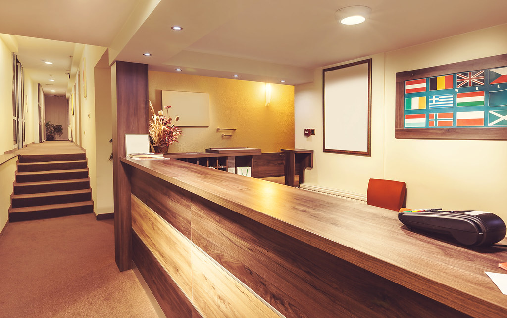

<!-- theme: 研究・実験結果レーン(越境EC 7業務のランダム化比較実験 延べ2,060万人＋124万商品 arXiv:2510.12049 v4 2026年6月改訂 × 対抗材料 Wine Access 購読者27,500人のRCT3本 QME 2026年1月 査読済み／AIの効果は賢さではなく「入れる前の空白の大きさ」で決まる) / 研究レーン(3-0) -->
# AIを入れて売上が16.3%伸びた業務と、まったく動かなかった業務があった｜同じ会社が7つの業務で試した結果

「AIを入れたのに、思ったほど変わらなかった」という声を、この一年で何度も聞きました。

同じ会社が同じ時期に、同じAIを7つの業務へ入れて効果を測った実験があります。売上が16.3%伸びた業務から、統計的にはまったく動かなかった業務まで、結果はきれいに分かれました。

分かれ目はAIの性能ではありませんでした。その基準を数字で追います。

---

## 延べ2,060万人を7つの業務に振り分けた実験

読んだのはコロンビア大学などの研究者による論文です（arXiv:2510.12049、2026年6月改訂版）。査読前のプレプリントである点は先に書いておきます。

舞台は、ある越境ECプラットフォーム。2023年から2024年にかけて7つの業務に生成AIを入れ、それぞれをランダム化比較実験として測りました。

対象は購入前チャットの44,614人から、プッシュ通知の1,371万5,528人まで。足すと延べ2,060万人、これに広告の124万4,016商品が加わります。

比較の相手（対照群）は、AIを入れる前のその会社のやり方そのものです。ここが今回の肝になります。

## 業務ごとの結果を並べる

売上への効果は、次のとおりでした。

- 購入前のチャット窓口：プラス16.3%（統計的に有意、p<0.01）
- 検索キーワードの言い換え：プラス2.9%（有意、p<0.05）
- 商品説明文の自動生成：プラス2.1%（有意、p<0.05）
- アプリのプッシュ通知：プラス1.6%（統計的に有意ではない）
- Google広告のタイトル：マイナス4.5%（統計的に有意ではない）

残る2つ、返金請求（チャージバック）への反論と有人チャットの翻訳は、成功率がプラス15%、顧客満足がプラス5.2%と報告されています。ただしこの2つだけは研究者ではなくプラットフォーム社内のデータチームの集計で、細かいデータが開示されていません。証拠の格が一段落ちるものとして読んでいます。

## 分かれ目は「入れる前が空白だったか」

なぜ16.3%と0%が同居するのか。論文の答えは、AIの賢さではなく入れる前の状態でした。

一番伸びた購入前チャットの対照群は、「ただいま対応できません」という自動返信だけでした。人手を購入後の問い合わせに回していたため、購入前の質問には事実上、誰も答えていなかったのです。空白にAIを置いたので差が大きく出ました。

一方、Google広告のタイトルには、すでに出品者が作り込んだ文言がありました。そこへ広告用の調整をしていないAIを当てた結果、表示回数もクリックも人間のタイトルを下回りました。

検索と商品説明が2%台にとどまったのも同じ理屈です。もともと機械学習が動いていた場所なので、AIの上積みぶんだけが効果になります。

効果の大きさは、AIの実力ではなく、AIが埋めた空白の広さで決まっていました。

## 効いた相手は、常連ではなく不慣れな客だった

もう一つ、実務に効く発見があります。

研究チームは実験前30日間の購入額でお客さんを二つに分けました。すると購入経験が少ない層では効果がはっきり出て、購入経験が多い層では効果は小さく、統計的に有意ではありませんでした。

AIが助けたのは、勝手がわかっていない人です。何を聞けばいいかわからない、言葉が通じない、探し方を知らない。そういう詰まりをAIが外していました。すでに買い方を知っている常連には、足せるものが少なかったわけです。

## AIか人か、ではなかった

チャット窓口では追加の比較も行われています。

AIだけの対応は、人間のオペレーターと同等の品質でした。そして、AIが受けて詰まったら人に引き継ぐ形にすると、無対応と比べて売上はプラス25%（p<0.01）。人間だけの対応と比べても、お客さんの支出は11.5%多くなりました（p<0.1）。

置き換えではなく、受付をAIに広げて、難しいところを人に渡す。この形が一番強かったということです。

## 逆の見え方をする研究も並べる

「空白がない場所ではAIは無意味なのか」というと、そうではありません。

シカゴ大学のDubé氏らは、オンラインワイン販売のWine Accessで、購読者27,500人を対象に2週間のRCTを3回行いました（Quantitative Marketing and Economics、2026年1月、査読済み）。

販促メールを、社員のライターが書く／AIが書く／AIが書いて人が直す、の3通りで比較。3通りの反応の差は小さく、どれもメールを送らない場合に比べて注文からの粗利がおよそ2倍になりました。

売上では差がつかない。けれどAIで作ったほうが制作コストははるかに低い。ここでのAIの価値は、売上ではなく原価のほうに出ています。

2本を並べると整理がつきます。空白があるところに入れれば売上が動く。空白がないところに入れても売上は動かないが、同じ結果をより安く出せる。どちらを狙うのかを、入れる前に決めておく必要があります。

---

## 明日からできること

ここまでを、中小企業の現場に翻訳します。

1. 「今できていないこと」から探す

今の作業の置き換えではなく、人手が足りずに落としている対応を先に洗い出してください。営業時間外の電話、返信できていない問い合わせ、書かれていない商品説明、放置している見積依頼。実験で一番伸びたのはここでした。

2. 効果を測るなら、新規と既存を分ける

全体の平均で見ると効果は薄まります。初めて接触した相手と、常連客を分けて数字を取ってください。効果は前者に出ます。

3. AIで完結させず、引き継ぐ線を先に決める

どの条件で人に回すかを導入前に文章にしておきます。AIと人をつないだ形が一番良かったのは、AIが全部やったからではなく、詰まりが放置されなくなったからです。

4. 「安くする」目的なら、売上が動かなくても失敗ではない

すでに人ができている仕事にAIを入れる場合、売上は動かない前提で入れてください。見るべきはかかった時間と費用です。

---

## まとめ

- 同じ会社の7業務で、AIの効果はプラス16.3%からマイナス4.5%まで分かれた
- 分かれ目はAIの性能ではなく、入れる前にそこが空白だったかどうか
- 効いた相手は常連ではなく、勝手がわかっていない不慣れな客だった
- AI単独より、AIが受けて人に引き継ぐ形のほうが数字が良かった
- 空白がない場所に入れる場合、売上ではなく原価で効果を見る

AIで楽になること自体は入口にすぎません。空いた時間を、これまで手が回らず落としていた仕事に回せたとき、はじめて数字が動きます。どこが空白なのかを一緒に探すところから始めるのが、遠回りに見えて一番早いはずです。

---

### 出典

- Fang, Yuan, Zhang, Donati, Sarvary「Generative AI and Sales Productivity: Field Experiments in Online Retail」arXiv:2510.12049 v4（2026年6月改訂／プレプリント、査読前）https://arxiv.org/abs/2510.12049
- 同論文Table 4（業務別の売上効果と観測数）および4.1節（購入経験別の効果の違い）
- Dubé, Xu「Large Language Models and Creative Content Design: a case study of email marketing at Wine Access」Quantitative Marketing and Economics、2026年1月（査読済み）https://link.springer.com/article/10.1007/s11129-025-09303-9
- 上記の解説記事：Chicago Booth Review、2026年8月11日（二次情報）https://www.chicagobooth.edu/review/is-email-marketing-about-be-automated

写真：Openverse（CC0）

---

## 私たちについて

株式会社AIdollargameは、「楽じゃなく、楽しいを考える」をテーマに、AIプロダクトを自社開発しているAI会社です。

- AI導入支援・コンサルティング（https://aidollargame.com/ai-consulting.html）
- AIエージェント（https://aidollargame.com/line-ai-agent.html）：問い合わせ・予約対応を24時間自動化
- AIside（https://aidollargame.com/aiside.html）：経営者の"もう一人の自分"になる付き人AI
- AIwill／社長クローンAI（https://aidollargame.com/human-clone-ai.html）：経営者の判断軸をAIに学習させる

「うちの仕事でAIに何ができる？」は、無料のAI活用度診断（https://aidollargame.com/shindan.html）から。

- 🔗 公式サイト：https://aidollargame.com/
- 📩 ご相談：nosuke@aidollargame.com

このnoteでは、AI活用のリアルや時事の読み解きを、過程まで含めて正直に発信しています。フォローしてもらえると嬉しいです。

---

### ハッシュタグ案

#生成AI #AI導入 #中小企業 #業務効率化 #実験結果

### サムネ文言案

- 案1：16.3%伸びた業務と、動かなかった業務
- 案2：AIの効果を決めるのは、賢さではなく空白
