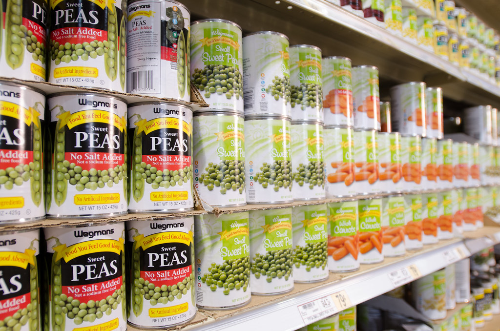

<!-- theme: 防災の日(9月1日)・家庭向け／内閣府「防災に関する世論調査」令和7年8月調査(有効回収1,707人) × 総務省 令和6年版情報通信白書(能登半島地震・最大839基地局停波) / AIでできる家庭の防災と、AIに任せてはいけないこと -->

# 家族の安否確認の方法を決めている人は15.1%だった。今日、AIと30分で決める

今日は9月1日、防災の日です。

そして今日は、災害用伝言ダイヤル「171」を無料で練習できる日でもあります。防災週間として、8月30日9時から9月5日17時まで、本番と同じ手順を試せます。

この記事は、家族と暮らしている人にも、一人で暮らしている人にも向けて書きました。AIを使って家の防災でできることと、AIに絶対に任せてはいけないことを分けて書きます。所要30分です。

---

## やらない理由は、知識でも予算でもなかった

内閣府が「防災に関する世論調査」の結果を公表しています。2025年8月21日から9月28日にかけて全国の18歳以上に郵送で行い、1,707人が回答したものです。

そこに、少し意外な数字がありました。

大地震に備えてとっている対策のうち、「家族の安否確認の方法などを決めている」と答えた人は15.1%。7人に1人です。避難場所・避難経路を決めている人は37.0%、食料・飲料水などを準備している人は46.1%なので、連絡手段だけが極端に低い。

やらない理由も聞いています。

家族や身近な人と災害の話をしたことが「ない」人は35.1%。その理由の1位は「話し合うきっかけがなかったから」で56.7%でした。家具を固定していない人にその理由を聞くと、1位は「やろうと思っているが先延ばしにしてしまっているから」で38.2%、次いで「面倒だから」20.7%。

足りていないのは知識でも予算でもありません。きっかけと、最初の面倒を越える力です。

AIが役に立つのは、まさにそこです。

## 水は7割、携帯トイレは3割

同じ調査で、3日分以上を備蓄しているものを聞いています。

- 飲料水 69.8%
- 食料品 59.8%
- 衛生用品 38.4%
- 食品加熱用熱源 27.7%
- 携帯トイレ・簡易トイレ 27.2%
- 暑さ・寒さ対策の消耗品 18.6%

水と食料は思いつくのです。トイレは思いつかない。断水すれば水洗トイレは使えなくなるのに、用意している人は4人に1人です。

この差がそのまま、「自分では思いつかなかったもの」の量です。そしてAIがいちばん得意なのが、この思いつかなかったものを並べることです。

そのまま使えます。

> 大人2人、5歳の子ども1人、猫1匹の家庭です。マンションの8階に住んでいます。7日分の備蓄をそろえたい。水と食料は用意済みなので、それ以外で忘れられがちなものを優先して、買い物リストにしてください。数量も入れてください。子どもは卵アレルギーです。

自分の家族構成に置き換えて投げるだけです。ペット、持病、粉ミルク、介護、住んでいる階。条件を足すほど、自分用のリストに寄っていきます。

## AIに任せていいこと、任せてはいけないこと

任せていいのは、こういうことです。

- 家族構成に合わせた備蓄リストを作る
- 非常持ち出し袋の中身を写真で見せて、足りないものを指摘してもらう
- 家族のルールを、印刷できる文章に整える
- 賞味期限の管理表を作る
- 高齢の親や外国籍の家族に向けて、やさしい言葉に書き直す

任せてはいけないのは、次の2つです。

1つめは、自宅がどの災害の危険区域にあたるかと、いちばん近い避難所がどこかです。ここはAIに聞かないでください。国土交通省の「重ねるハザードマップ」と、お住まいの自治体のサイトで確かめる。AIは知らないことを、それらしい文章で埋めてしまうことがあります。避難先の間違いは命に直結します。

2つめは、備蓄の必要量の計算です。東京都の「東京備蓄ナビ」のように、人数と年代と住まいの種類を入れると必要量が出る公式ツールがあります。戸建てなら3日分、マンションなら7日分で計算されます。数量はこちらが正確です。

AIは、公式が出した答えを自分の家の事情に翻訳する係。役割をここで切ると、間違いが減ります。

家族のルールは、こう頼むと一枚にまとまります。

> 災害で家族とはぐれた時のルールを、A4一枚に印刷できる形で作ってください。項目は、集合場所の第1候補と第2候補、災害用伝言ダイヤル171の使い方、家族全員の携帯番号を書き込む欄、勤務先と学校の連絡先の欄。文字は大きく、小学生でも読める言葉でお願いします。

## その日、AIは使えません

ここがいちばん大事なところです。

2024年の能登半島地震で何が起きたか、総務省の情報通信白書に記録があります。1月3日時点で、携帯4社を合計して最大839の基地局が停波しました。うち799局が石川県です。NTTドコモは能登半島北部で、支障のあったエリアが最大70%に達しています。

応急復旧がおおむね終わったのは、KDDI・ソフトバンク・楽天モバイルが1月15日、NTTドコモが1月17日。発災から2週間です。

その2週間、スマートフォンは検索窓ではありませんでした。

だからAIにやらせるべきなのは、当日その場で助けてもらうことではありません。その日に使うものを、今日のうちに紙にすることです。

作った家族ルールは印刷して冷蔵庫に貼る。同じものを財布とランドセルに1枚ずつ。備蓄リストは印刷して押し入れの扉の内側に貼る。画面の中に置いたままにしない。

## 今日やること

1. 171を練習する。9月5日17時までは無料で試せます。171にかけて、案内に従って録音は1、再生は2。相手の電話番号を市外局番から入れます。1件30秒。家族全員でやると、当日に迷いません
2. 上のプロンプトで家族ルールを作り、印刷して冷蔵庫に貼る
3. 非常持ち出し袋の中身を床に広げて写真を撮り、AIに見せて足りないものを聞く
4. ハザードマップと避難所は公式サイトで確かめる。備蓄の数量も公式ツールで出す

## まとめ

- 家族の安否確認の方法を決めている人は15.1%。話し合わない理由の1位は「きっかけがなかったから」56.7%
- 3日分以上の備蓄は、飲料水69.8%に対して携帯トイレは27.2%。思いつかないものが抜ける
- AIは、思いつかなかったものを並べる係。避難所とハザードは公式サイト、備蓄量は公式ツールが正
- 能登半島地震では最大839基地局が停波し、応急復旧まで2週間かかった。当日、AIは使えない
- だから今日、紙に出す

AIで浮くのは、調べる時間と、書き出す時間です。防災でいえば、いちばん面倒でいちばん後回しになる部分がそこにあたります。

その30分を越えた先にあるのは、家族と少し話をして、紙を一枚冷蔵庫に貼る、という何でもない時間です。今日はそこまでやれます。

---

### 出典

- 内閣府「防災に関する世論調査（令和7年8月調査）」（調査時期 2025年8月21日〜9月28日／郵送法・層化2段無作為抽出／標本3,000人・有効回収1,707人・回収率56.9%／概略版 2025年10月17日、確報 2025年12月24日掲載）

https://survey.gov-online.go.jp/public_safety/202510/r07/r07-bousai/

- 総務省「令和6年版 情報通信白書」第1章第2節（能登半島地震の通信インフラ被害。基地局停波数は総務省「令和6年能登半島地震に係る被害状況等について（第13報）」2024年1月3日による）

https://www.soumu.go.jp/johotsusintokei/whitepaper/ja/r06/pdf/n1120000.pdf

- NTT東日本「災害用伝言ダイヤル（171）体験利用のご案内」（防災週間は8月30日9時〜9月5日17時）

https://www.ntt-east.co.jp/saigai/voice171s/howto.html

- 国土交通省「重ねるハザードマップ」

https://disaportal.gsi.go.jp/hazardmap/maps/index.html

- 東京都「東京備蓄ナビ」

https://www.bichiku.metro.tokyo.lg.jp/

- 農林水産省「災害時に備えた食品ストックガイド」（最低3日分、できれば1週間分の家庭備蓄を推奨）

https://www.maff.go.jp/j/zyukyu/foodstock/guidebook.html

写真：Openverse（パブリックドメイン）

---

## 私たちについて

株式会社AIdollargameは、「楽じゃなく、楽しいを考える」をテーマに、AIプロダクトを自社開発しているAI会社です。

- AI導入支援・コンサルティング（https://aidollargame.com/ai-consulting.html）
- AIエージェント（https://aidollargame.com/line-ai-agent.html）：問い合わせ・予約対応を24時間自動化
- AIside（https://aidollargame.com/aiside.html）：経営者の"もう一人の自分"になる付き人AI
- AIwill／社長クローンAI（https://aidollargame.com/human-clone-ai.html）：経営者の判断軸をAIに学習させる

「うちの仕事でAIに何ができる？」は、無料のAI活用度診断（https://aidollargame.com/shindan.html）から。

- 🔗 公式サイト：https://aidollargame.com/
- 📩 ご相談：nosuke@aidollargame.com

このnoteでは、AI活用のリアルや時事の読み解きを、過程まで含めて正直に発信しています。フォローしてもらえると嬉しいです。

---

### ハッシュタグ案

#防災の日 #防災 #AI活用 #備蓄 #災害への備え

### サムネ文言案

1. 安否確認を決めている人、15.1%
2. AIで備えて、紙に出す。今日30分
