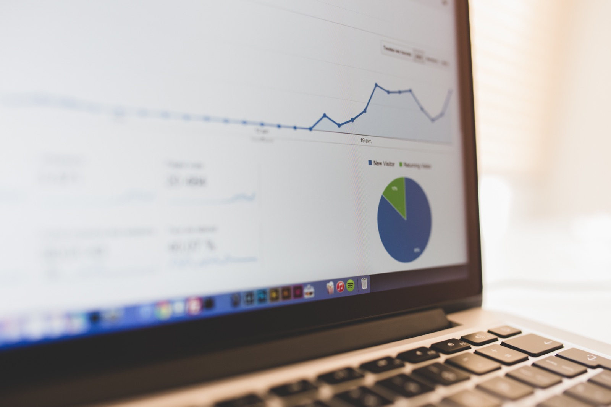

<!-- theme: 研究・実験結果レーン（3-0） -->

# AIの使い道を調べた地図が3枚ある。見る地図を変えると、答えが1.9倍ずれた

「AIは実際、どの仕事に使われているのか」。この質問に対して、いま巨大な答えが3枚そろっています。Anthropicが400万件超の会話を、Googleが1,500万件のやりとりを、OpenAIが1,764社・1,744万通の社内利用を、それぞれ職業や作業に対応づけて地図にしました。

ところが、3枚を並べると指している場所が違います。さらに「どのAIのログを見たか」を変えるだけで結論が1.9倍動く、と指摘する研究まで出ています。

この記事は、自社でAIをどこに使うか決めかねている経営者に向けたものです。3枚の中身、食い違いの理由、そして他社の統計に頼らず自社で決めるための手順を書きます。

## 1枚目：Claudeの会話400万件

いちばん引用されているのがこれです。Anthropicが2025年2月に公表した研究で、400万件を超えるClaudeの会話を、米労働省のO*NETという職業・作業のデータベースに突き合わせました。

出た結論は、ソフトウェア開発と文章作成の2つで全体のほぼ半分を占めるというもの。ただしAIの利用は経済全体に広がっており、約36%の職業が、その職業に紐づく作業の4分の1以上でAIを使っていました。

使い方の内訳は、57%が人間の作業を補助する形（教わる、出てきたものを直す）、43%が任せきる形でした。

なお、この地図は公表から1年半以上が経っています。いまだに「AIの用途の代表的な数字」として引かれますが、測られたのは2025年初めまでの利用です。

## 2枚目：Geminiのやりとり1,500万件

2026年7月に公表されたのが、Googleの「AI & Economy ATLAS」。Geminiアプリ、Google AI Mode、Gemini APIから1,500万件のやりとりを取り、800を超える職業、4,000の作業、150か国、140言語に対応づけました。

ここで出た数字が、経営判断にいちばん効きます。

AIの利用が観測された職業は、米国の雇用の88%超をカバーしていました。つまり、ほぼどんな仕事にも入っている。ところが深さがまるで足りません。利用がある職業の中央値で見ると、AIが使われているのはその職業の作業全体の21%だけ。作業の75%超でAIが使われている職業は、全体のわずか3%でした。

もうひとつ。会話型AIとのやりとりの86%超は、仕事の外で起きていました。仕事に関わる利用は14%にすぎません。

## 3枚目：企業1,764社・メッセージ1,744万通

2026年8月に公表されたのが、OpenAIのChatGPT Enterpriseの利用記録を使った研究です。2026年3月までのデータで、導入から6か月時点のサンプルが1,764社・1,744万6,551通。作業の分類までかけたものは973社・869万通です。

ここから見えたのは、はっきりした偏りでした。

まず伸び方。出力トークン量は2025年6月から2026年3月で7倍になりました。すでに入れていた企業だけに絞っても約4倍です。入れた会社ほど、使う量が増えていく。

次に、誰が入れているか。導入企業の売上の中央値は約22億7,500万ドル、導入していない企業は約2億1,000万ドル。10倍以上の開きがあります。売上上位4分の1の企業は、平均より6.9ポイント導入しやすい。

そして、社内で誰が使っているか。若手や研修中の社員は、社内の平均的な利用者より週に8〜9通多く送っていました。逆に役員・創業者・パートナーは平均より少ない。決める人ほど、使っていない。

用途は、半数超が文書の作成や技術文書、半数近くが技術的なデジタル作業でした。

## 3枚が食い違う理由

1枚目は「ソフトウェアと文章に集中」、2枚目は「ほぼ全職業に広がっているが浅い」、3枚目は「大企業に偏っている」。同じ問いへの答えとして、方向がそろっていません。

この食い違いを正面から扱った研究が、2026年5月に出ています。Michelle YinとBurhan Ogutによる論文です。

主張はこうです。AIのログから作った「この職業はAIにどれだけさらされているか」というスコアには、2つのものが混ざっている。その作業に本当にAIが使えるかどうかと、そのサービスをどんな職業の人が使っているかという利用者の構成です。後者は測りたいものではないのに、必ず混ざります。

数字で見ると深刻です。分析の設計は一切変えず、入力するプラットフォームだけ差し替えると、ChatGPT登場後の雇用への係数が1.9倍動きました。同じ会社の中でも、個人向けサービスと法人向けサービスで、影響の符号（プラスかマイナスか）が逆になった例もあります。

さらに、米労働統計局の雇用構成に合わせて重みを付け直すと、推定値は42〜93%も縮みました。

言い換えると、ログに映っているのは「そのAIを使った人」であって、「働いている人」ではない。当たり前のようですが、ランキング形式で並べられると、つい後者だと思ってしまいます。

## それでも3枚が同じことを言っている部分

食い違いばかりではありません。共通点が2つあります。

ひとつは、広いが浅いこと。職業の面では8割以上に届いているのに、ひとつの職業の中で使われている作業は2割程度。全部を置き換える話ではなく、業務の一部に刺さっている段階です。

もうひとつは、用途が「書く・調べる・まとめる」に寄っていること。3枚とも文書作成、情報の整理、技術的な下書きが上位に来ます。派手な自動化ではありません。

そして、少し立ち止まりたい共通点がもうひとつ。3枚とも査読前のプレプリントで、しかも3枚とも、データを持っている会社自身（Anthropic、Google、OpenAI）が書いています。数字が嘘だという意味ではありません。ただ、自社に不都合な切り口は最初から選ばれにくい、ということは頭に入れておく必要があります。

## 中小企業が明日からやれること

研究の紹介で終わらせず、実際に何をするかに落とします。

1つ目。他社の利用率ランキングから自社の用途を決めないこと。あの表は「その道具を選んだ人たち」の分布であって、貴社の業務の分布ではありません。代わりに、自社で毎週繰り返している書き物を1つ数えてください。日報、見積の説明文、問い合わせへの返信、議事録。何本作っているかを数えるだけで、どんな統計より正確な出発点になります。

2つ目。2割を狙うこと。いちばん進んでいる測定でも、職業あたりの利用は作業の21%です。全業務のAI化を目標に置くと、半年で必ず止まります。業務の2割、それも繰り返し発生する2割に絞ってください。

3つ目。若手に聞くこと。ChatGPT Enterpriseの記録では、若手のほうが役員より明確に多く使っていました。会話型AIの利用の86%超は仕事の外で起きています。つまり、社員は会社の外ですでに使っていて、会社はそれを見えていない可能性が高い。禁止のルールを作る前に、まず「もう何に使っているか」を棚卸ししたほうが早いです。

## まとめ

- AIの使われ方を測った巨大な地図が3枚ある（400万件、1,500万件、1,764社・1,744万通）
- 3枚は方向が食い違う。プラットフォームを差し替えるだけで結論が1.9倍動くという指摘もある
- 共通しているのは「広いが浅い」こと。職業の8割以上に届いているが、作業の2割程度にとどまる
- 用途は書く・調べる・まとめるに寄っている
- 自社の一手は、他社の統計ではなく、自社で毎週繰り返している書き物を数えることから決める

AIで作業が楽になるのは入口にすぎません。数えた結果、週に何時間かが浮いたとして、その時間を何に使うか。そこを一緒に考えるのが、私たちの仕事だと思っています。

## 出典

- Which Economic Tasks are Performed with AI? Evidence from Millions of Claude Conversations（arXiv:2503.04761、2025年2月公表／プレプリント。Anthropicによる研究。会話400万件、ソフトウェア開発と文章作成でほぼ半分、36%の職業、補助57%対自動化43%）
  https://arxiv.org/abs/2503.04761

- Google's AI & Economy ATLAS v1.0: Mapping Gemini Usage in the Economy（arXiv:2608.00038、2026年7月公表／プレプリント。Googleによる研究。1,500万件、米国雇用の88%超、中央値の職業で作業の21%、3%の職業だけが75%超、仕事外86%超）
  https://arxiv.org/abs/2608.00038

- How Organizations Use AI: Evidence from ChatGPT（arXiv:2608.12236、2026年8月公表／プレプリント。OpenAIのデータを使い、同社チーフエコノミストのAaron Chatterji氏らが共著。1,764社・1,744万6,551通、出力トークン7倍、売上中央値の差、若手が週8〜9通多い）
  https://arxiv.org/abs/2608.12236

- Who Uses AI? Platform Selection and the Measurement of Occupational AI Exposure（arXiv:2605.21743、2026年5月公表／プレプリント。プラットフォーム差し替えで係数1.9倍、雇用構成で重み付けすると42〜93%縮小）
  https://arxiv.org/abs/2605.21743

---

## 私たちについて

株式会社AIdollargameは、「楽じゃなく、楽しいを考える」をテーマに、AIプロダクトを自社開発しているAI会社です。

- AI導入支援・コンサルティング（https://aidollargame.com/ai-consulting.html）
- AIエージェント（https://aidollargame.com/line-ai-agent.html）：問い合わせ・予約対応を24時間自動化
- AIside（https://aidollargame.com/aiside.html）：経営者の"もう一人の自分"になる付き人AI
- AIwill／社長クローンAI（https://aidollargame.com/human-clone-ai.html）：経営者の判断軸をAIに学習させる

「うちの仕事でAIに何ができる？」は、無料のAI活用度診断（https://aidollargame.com/shindan.html）から。

- 🔗 公式サイト：https://aidollargame.com/
- 📩 ご相談：nosuke@aidollargame.com

このnoteでは、AI活用のリアルや時事の読み解きを、過程まで含めて正直に発信しています。フォローしてもらえると嬉しいです。

---

ハッシュタグ案：#生成AI #AI活用 #中小企業 #DX #経営

サムネ文言案：
1. AIの地図が3枚。全部ちがう場所を指していた
2. 職業の88%に届いて、作業の21%で止まっている
