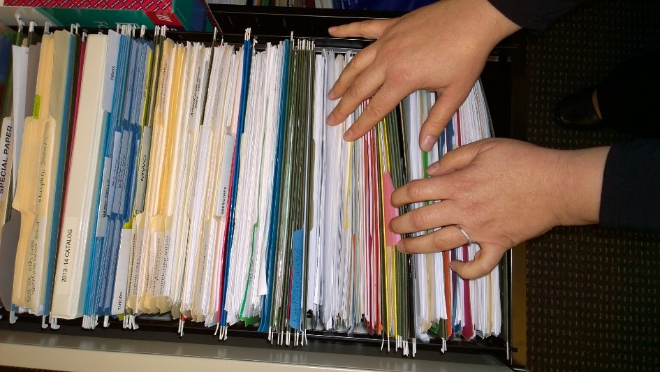

<!-- theme: 研究・実験結果レーン(arXiv:2608.27391 CorporateBench 文書263,466件×5モデル 2026年8月27日公開 × INSEAD WP2026/01/STR 316人42チームのランダム化実験／社内文書は増やすほど当たらなくなる。範囲を狭く切る) / 研究レーン(3-0) -->

# 社内の書類が増えるほど、AIは当てられなくなった。354件と23万件で比べた結果

社内のマニュアルや過去のメールをAIに読ませて、「あれ、どこにある？」を代わりに探させたい。この記事は、それをやろうとしている会社に向けて書いています。

読み終わるころには、社内の書類をAIに渡すとき、何を渡して何を渡さないかの線引きが決まるはずです。

材料は8月末に公開されたばかりの検証と、欧州の会社で3か月かけて実際にやってみた実験の2本です。結論を先に書くと、渡す書類の量を増やすほど成績は落ちました。うちが日ごろお客さまに「全部入れましょう」と言わない理由も、この数字で説明できます。

## 26万件の書類でAIを試した検証が、8月末に出た

コーネル大学とEpiq AI Labsの研究チームが公開した、CorporateBenchという検証です。2026年8月27日にarXivへ出た査読前のプレプリントで、企業所属の著者が入っている点は差し引いて読む必要があります。

社内文書の検証がこれまで難しかったのは、どの会社も自社のメールを外に出したがらないからです。そこで研究チームは、架空の会社を4つ丸ごと作りました。誰が誰の部下で、どの案件を担当し、いつ何をやり取りしたか。その関係と時間の流れが矛盾しないように文書を生成しています。

出来上がった4社の規模はこうです。

- 一番小さい会社（従業員12人）：文書354件
- 2番目：文書3,926件
- 3番目：文書26,493件
- 一番大きい会社（従業員10,210人）：文書232,693件

合計263,466件。質問は1社1タスクあたり250問で固定なので、会社が大きくなるほど1問あたりに探す文書が増えます。小さい会社では1問につきおよそ1.4件、一番大きい会社ではおよそ931件でした。

試したAIは、Claude Haiku 4.5、Claude Sonnet 4.5、GPT-5 Nano、GPT-5.1、Gemini 2.5 Flash Liteの5つです。

## 書類が増えると、成績はおよそ半分になった

成績はF1という指標で出ています。1.0が満点、0が全外しです。

下の表は、実務に一番近い条件の数字です。文書をそのまま検索させて答えさせるやり方（いわゆるRAG）に、「この案件の担当は誰か」「この件はいつ決まったか」という台帳を引くタイプの質問を投げています。

| AI | 354件 | 3,926件 | 26,493件 | 232,693件 |
|---|---|---|---|---|
| Claude Haiku 4.5 | 0.265 | 0.273 | 0.189 | 0.164 |
| Claude Sonnet 4.5 | 0.322 | 0.311 | 0.198 | 0.215 |
| GPT-5 Nano | 0.527 | 0.501 | 0.312 | 0.244 |
| GPT-5.1 | 0.470 | 0.440 | 0.276 | 0.269 |
| Gemini 2.5 Flash Lite | 0.230 | 0.200 | 0.199 | 0.147 |

一番よかった数字で見ると、354件の会社では0.527、232,693件の会社では0.269。5つのAIすべてで、書類が増えるほど落ちました。

整理済みの台帳に直接問い合わせられる条件だと、Claude Sonnet 4.5は0.767から0.642。文書を探させるより、はじめから整理されたものを引かせるほうが、どの規模でも強い。しかもその差は会社が大きくなるほど広がり、小さいほうで0.24、大きいほうで0.37の開きでした。

著者たちは、書類の少ない会社ならRAGで足りるが、規模が大きくなると知識を取り出すところで問題が起きる、と書いています。

## 崩れ方は、質問の種類でまるで違った

ここが実務で一番効きます。同じAI・同じ書類でも、質問の型で落ち方が違いました。

崩れたのは、事実の関係を引く質問です。誰が誰の担当か、どの案件がどれにつながっているか。文書から関係を取り出す精度は、小さい会社でF1が0.419から0.845だったのが、一番大きい会社では0.205から0.494。とくにひどいのが時間に関わる関係で、0.142から0.470が0.062から0.173になりました。いつ何が起きたかの前後関係は、書類が増えるとほぼ拾えていません。

粘ったのは内容を要約させる質問です。「この話題について社内で何が語られたか」を聞くタイプは、小さい会社で0.572から0.672、一番大きい会社でも0.376から0.492。落ちてはいますが崩壊していません。誰が登場したかを拾うだけの作業も、規模によらず0.715から0.824で安定していました。

AIは、書いてあることをまとめるのは規模が大きくてもそこそこできて、関係と時系列を組み立てるのが苦手ということです。

## 逆に、現場で入れたら成果が28.3%増えた実験もある

ベンチマークの数字だけ並べると「社内AIは無理」に見えるので、逆の結果も出します。

INSEADと独マンハイム大学の研究チームが、欧州のテクノロジーサービス企業で3か月のランダム化実験をしました。42チーム316人を、自社の知識を仕込んだAIアシスタントを使うグループと使わないグループに分けています。

- 協働のつながりの数は、使ったグループで7.77増えた。使わなかったグループは1.12（差は6.65）
- 知識のやり取りのつながりは、5.21増加に対して0.84（差は4.37）
- 担当した案件数は、幅広く動く職種で12.7件から16.30件へ（28.3%増）、専門職で4.29件から5.42件へ（26.4%増）

ただし正直に書いておくと、この実験は316人と規模が小さく、案件数の比較は導入前後の比較です。職種の違いもランダムに割り振られたものではないと、著者自身が断っています。それでも、ちゃんと効いている現場は実在します。

## 分かれ目は「範囲」だった

2本を並べると、境目が見えます。

うまくいかなかったほうは、会社まるごとの文書を渡して事実関係を引かせていました。うまくいったほうは、業務に合わせて仕込んだアシスタントを、決まった仕事の中で使わせていました。

差はAIの賢さではなく、渡した範囲です。

## 中小企業が明日からできること

- 全部入れない。1つの業務、1つのマニュアルから始める。「社内文書を全部入れれば何でも答えます」は、この検証の数字とかみ合いません。範囲を狭く切るのは手抜きではなく設計です。

- 「誰が担当か」「いつ決まったか」は、文書に探させず台帳に持たせる。整理済みのデータを引く条件が、どの規模でも一貫して強かったからです。担当者一覧、案件一覧、決定の履歴。スプレッドシート1枚で構いません。

- 答えだけ受け取らず、出典を出させる。関係と時系列が崩れやすい以上、どの文書のどこに書いてあったかまで返させて、そこだけ人が見る。全文を読み直すより速く終わります。

## まとめ

- 8月末に出た検証で、社内文書26万件を使ってAIを試したところ、書類が増えるほど成績が落ちた
- 台帳を引くタイプの質問では、最良の数字が354件で0.527、232,693件で0.269
- 整理済みのデータを直接引かせるほうが常に強く、その差は会社が大きいほど開いた
- 内容の要約は規模が大きくても粘り、関係と時系列の組み立ては崩れた
- 一方、業務を絞って導入した316人の実験では、担当案件が26から28%増えている
- 分かれ目はAIの性能ではなく、渡した範囲

社内のAIは、書類を全部積んだ瞬間に賢くなるものではありませんでした。まず1業務。効いたら次の1業務。地味ですが、数字はそちらを向いています。

探す時間が減ったあとに何をするかを決めていないと、浮いた時間は別の探しものに吸われます。うちが一緒に考えたいのは、その先のほうです。

## 出典

Hamilton, Sun, Romero, Henneking, Mimno, Yang, Labutov「CorporateBench: Large-Scale Q&A Benchmarking with Temporal Knowledge Bases」（arXiv:2608.27391、2026年8月27日公開／査読前のプレプリント。Epiq AI Labsとコーネル大学。架空の4社・文書263,466件、評価モデル5つ）

https://arxiv.org/abs/2608.27391

The Impact of Generative AI Adoption on Organizational Networks: Evidence From A Field Experiment（INSEAD Working Paper 2026/01/STR、Büchsenschuss, Koch-Bayram, Biemann, Puranam／査読前のワーキングペーパー。欧州のテクノロジーサービス企業で316人・42チーム・3か月のランダム化実験）

https://ssrn.com/abstract=6028034

写真: Openverse（パブリックドメイン）

---

## 私たちについて

株式会社AIdollargameは、「楽じゃなく、楽しいを考える」をテーマに、AIプロダクトを自社開発しているAI会社です。

- AI導入支援・コンサルティング（https://aidollargame.com/ai-consulting.html）
- AIエージェント（https://aidollargame.com/line-ai-agent.html）：問い合わせ・予約対応を24時間自動化
- AIside（https://aidollargame.com/aiside.html）：経営者の"もう一人の自分"になる付き人AI
- AIwill／社長クローンAI（https://aidollargame.com/human-clone-ai.html）：経営者の判断軸をAIに学習させる

「うちの仕事でAIに何ができる？」は、無料のAI活用度診断（https://aidollargame.com/shindan.html）から。

- 🔗 公式サイト：https://aidollargame.com/
- 📩 ご相談：nosuke@aidollargame.com

このnoteでは、AI活用のリアルや時事の読み解きを、過程まで含めて正直に発信しています。フォローしてもらえると嬉しいです。

---

#社内ナレッジ #生成AI #中小企業のDX #RAG #AI導入

サムネ文言案

1. 354件で0.527、23万件で0.269
2. 書類を増やすほど、AIは外した
