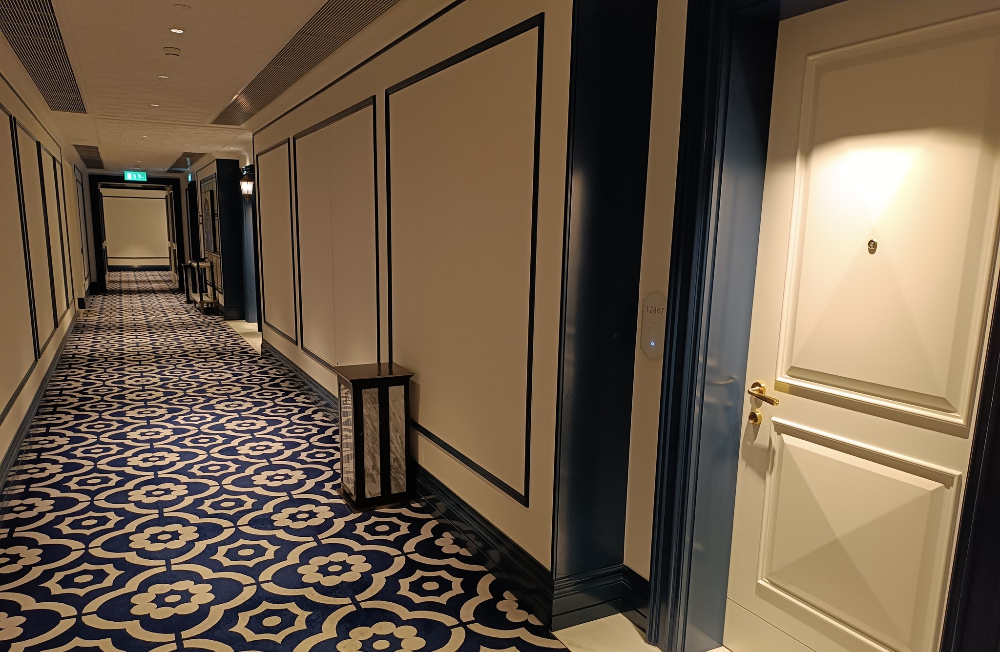

<!-- theme: 研究・実験結果レーン(arXiv:2608.22697 Wadi & Ma／100件のホテル一覧を無作為に並べ替えたAIエージェント5,000セッション × 人間はUrsu(2018)のExpedia実地データ166,036件 × arXiv:2606.17443 Chu & Hou のブランド偏り実験／AIに探させると順位の効きは4〜10分の1になり、効いたのは一覧に表示される中身) / 研究レーン(3-0) -->

# AIが代わりに探すと、掲載順位の効きは人間の4〜10分の1だった。5,000回のホテル検索実験

検索で上に出るために、毎月お金を払っている会社に向けた記事です。

その前提が、買い手がAIに探させるようになると崩れます。何が代わりに効くのかを、100件の並び順を無作為に入れ替えた5,000回の実験から見ていきます。

先に結論を書きます。順位より、一覧に出ている中身のほうが効きました。

---

## 100件の並び順をくじ引きで入れ替え、AIに5,000回探させた

主役にするのは、2026年8月24日にarXivで公開された論文です（9月8日に改訂）。学術誌の査読はまだ通っていない、いわゆるプレプリントの段階です。

やったことは単純です。ホテル100件の一覧を用意し、その並び順を毎回くじ引きで入れ替えて、AIエージェントに「泊まる宿を選んで」と探させる。これを5,000回繰り返しました。主要4モデルで2,000回、指示文や考える時間の長さを変えた条件で3,000回。別に、公開されている重みのモデルでも2,000回の追試をしています。

比較する人間側のデータは、Expediaのホテル検索を分析した2018年の研究で、166,036件の閲覧記録が入っています。

つまり「人間がどう探すか」と「AIがどう探すか」を、同じ土俵で並べた研究です。

---

## 人間は1件しか見ない。AIは最後まで見て、必ず買う

まず、人間の探し方から。

1回の検索で人間が中身まで見るホテルは、平均1.12件でした。93%のセッションでは、開いたのはちょうど1件です。

しかも人間は、34%の確率で何も買わずに検索をやめています。予約まで行くのは66%です。

AIはまったく違いました。

1回あたり1.63件から5.83件を見ています。モデルによって差はありますが、どれも人間より深く見ています。

そして、すべてのAIエージェントが100%のセッションで予約しました。「今回はやめておく」が一度も起きていません。

ここだけでも商売の前提が変わります。人間相手の一覧は「1件しか見てもらえない椅子取りゲーム」でした。AI相手の一覧は「全部見られるが、必ず誰かが選ばれる」場になります。

---

## 10位下げても、AIの閲覧確率は0.2〜0.5ポイントしか落ちなかった

肝心の順位です。

人間の場合、ある宿を10位ぶん下に動かすと、中身を見てもらえる確率が1.9ポイント下がりました。

同じことをAIにやると、下がり幅は0.2ポイントから0.5ポイント。人間の4分の1から10分の1です。

さらに奇妙なのは、下がり方の形です。

人間は上から下へきれいに落ちていきますが、AIは違いました。上から下がっていって、68位から74位あたりで見られる確率が最低になり、そこからまた上がります。一覧の真ん中がいちばん不利で、最下位のほうがまだ見られる。

人間の目の動きを前提に組み立てられた「1ページ目に入る」という発想が、そのままでは通じない形です。

---

## 予約の78.2%が1軒に集中した。その1軒は何にも負けていなかった

では何で決まったのか。

5,000回の実験で、予約の78.2%がたった1軒に集中しました。ニューヨークのcitizenM Times Squareです。

この宿には、はっきりした特徴がありました。一覧の中で評価が最高の4.7で、しかもその評価帯では1泊220ドルと最安だったのです。

値段でも評価でも、他のどれにも負けていない。論文はこれをundominated（どこにも劣らない）と呼んでいます。

AIは一覧を上から順に拾うのではなく、表に並んだ数字を突き合わせて、負けていない1件を選びました。並び順ではなく、並んでいる中身です。

論文の結論もそこに置かれています。AIに探させる検索では、一覧のどこに置かれるかより、一覧に表示される項目のほうが効く。

---

## ただし逆の結果もある。条件が同じなら、有名ブランドが100%取った

ここで終わらせると、中小企業に都合のよい話だけになります。反対向きの結果も出ています。

スキンケア商品で、3つのAI（GPT-4o-mini、Claude Sonnet、Gemini 3 Flash）に商品を推薦させた実験です。2026年6月公開、8月改訂。こちらもプレプリントで、商品は1カテゴリ、規模は先の実験よりずっと小さい検証です。

結果はこうでした。

- 全商品の仕様をそろえると、有名ブランドが100%推薦された
- ただしその独占は、競合の評価が星0.1未満の差で上回るだけで崩れた
- 権威っぽい言い回し（捏造された臨床データ風の表現を含む）には、星0.17点ぶんに相当する押し上げ効果があった
- 全ブランドが同じ最適化をやり合うと、1社あたりの取り分は+0.802から+0.007まで落ちた。何もしなかったブランドの推薦はゼロだった

読み方は2つです。

差がないならAIは知っている名前を選ぶ。けれど、星0.1の差がつけばひっくり返る。

そして、全員が同じ小細工を始めたら取り分は消える。掲載順位対策と同じ道をたどります。

---

## AIに聞いて探す人は、若い人だけではない

「そうは言っても、うちのお客さんはAIで探さない」と思われるかもしれません。

中国最大の旅行予約サイトの3,100万人分のデータを分析した研究では、サイト内のAIアシスタントを先に使い始めたのは、年齢の高い層、女性、もともとよく使っている既存客でした。若い男性が中心という一般的なAI利用の傾向とは逆です。

使われ方も検索の代わりではなく、人は検索とAIチャットを行き来しながら探していました。買う直前ではなく、探している最中に使われています。

私たちも毎月1日に、自社が生成AIの答えにどれだけ出てくるかを12問の決まった質問で測っています。測り始めた時点では12問中1問でした。数えられる数字なので、まず数えるところからで十分です。

---

## 明日からやれること

研究の話で終わらせないために、3つに絞ります。

1. 一覧に出る欄を、空欄なしで埋める。価格を「要問合せ」にしない
　AIは電話をかけません。比較できない項目は、比較の土俵から外れるだけです。ホットペッパー、Googleビジネスプロフィール、求人票、比較サイトの自社欄を開いて、空欄を探してください。

2. 何か1本の軸で「負けていない」状態を作る
　全項目で1位になる必要はありません。同じ価格帯なら評価が一番、同じ評価なら一番安い。どちらか1つで十分です。勝った1軒がやっていたのはそれだけです。

3. 星0.1のために、口コミを頼む
　順位を買う費用と比べて、ここはまだ安く動かせます。星0.1で指名が入れ替わる、という数字が出ています。

逆に、やらないこと。実績のない権威づけや、根拠のない効能表現は、実験上は効いてしまいますが手を出さない。景品表示法の問題であり、なにより一度の炎上で全部飛びます。

---

## まとめ

- 100件の並び順をくじ引きで入れ替えた5,000回の実験で、AIの閲覧確率に対する順位の影響は人間の4〜10分の1だった
- 人間は平均1.12件しか見ず34%は何も買わない。AIは1.63〜5.83件を見て100%買う
- 予約の78.2%を取った1軒は、評価が最高でその評価帯では最安、つまりどこにも負けていない1軒だった
- 別の実験では、条件が同じなら有名ブランドが100%取る。ただし星0.1の差で崩れる
- どちらの研究もプレプリントで、対象はホテルとスキンケアに限られる

次の一手は、順位を上げる相談ではなく、自社の掲載情報を開いて空欄を数えることです。

AIで面倒な作業を減らせたら、その時間で何をするのか。私たちが一緒に考えたいのはそちらです。掲載情報の棚卸しは、その入口として悪くありません。

---

## 出典

- Davood Wadi, Yu Ma「Does Rank Still Matter? Position Bias When AI Agents Shop on Our Behalf」（arXiv:2608.22697、2026年8月24日公開、9月8日改訂。査読前のプレプリント。AIエージェント5,000セッション、ホテル100件）

https://arxiv.org/abs/2608.22697

- Xi Chu, Yupeng Hou「Incumbent Advantage: Brand Bias and Cognitive Manipulation Dynamics in LLM Recommendation Systems」（arXiv:2606.17443、2026年6月16日公開、8月21日改訂。査読前のプレプリント。スキンケア1カテゴリ、3モデル）

https://arxiv.org/abs/2606.17443

- Se Yan, Han Zhong, Zemin Zhong, Wenyu Zhou「Shopping with a Platform AI Assistant: Who Adopts, When in the Journey, and What For」（arXiv:2603.24947、2026年3月26日公開。査読前のプレプリント。利用者3,100万人分のデータ）

https://arxiv.org/abs/2603.24947

写真: Openverse（CC0）

---

## 私たちについて

株式会社AIdollargameは、「楽じゃなく、楽しいを考える」をテーマに、AIプロダクトを自社開発しているAI会社です。

- AI導入支援・コンサルティング（https://aidollargame.com/ai-consulting.html）
- AIエージェント（https://aidollargame.com/line-ai-agent.html）：問い合わせ・予約対応を24時間自動化
- AIside（https://aidollargame.com/aiside.html）：経営者の"もう一人の自分"になる付き人AI
- AIwill／社長クローンAI（https://aidollargame.com/human-clone-ai.html）：経営者の判断軸をAIに学習させる

「うちの仕事でAIに何ができる？」は、無料のAI活用度診断（https://aidollargame.com/shindan.html）から。

- 🔗 公式サイト：https://aidollargame.com/
- 📩 ご相談：nosuke@aidollargame.com

このnoteでは、AI活用のリアルや時事の読み解きを、過程まで含めて正直に発信しています。フォローしてもらえると嬉しいです。

---

#AI #生成AI #中小企業 #集客 #検索対策

サムネ文言案

1. 順位より、一覧に出ている中身だった
2. 予約の78.2%を取った1軒がやっていたこと
