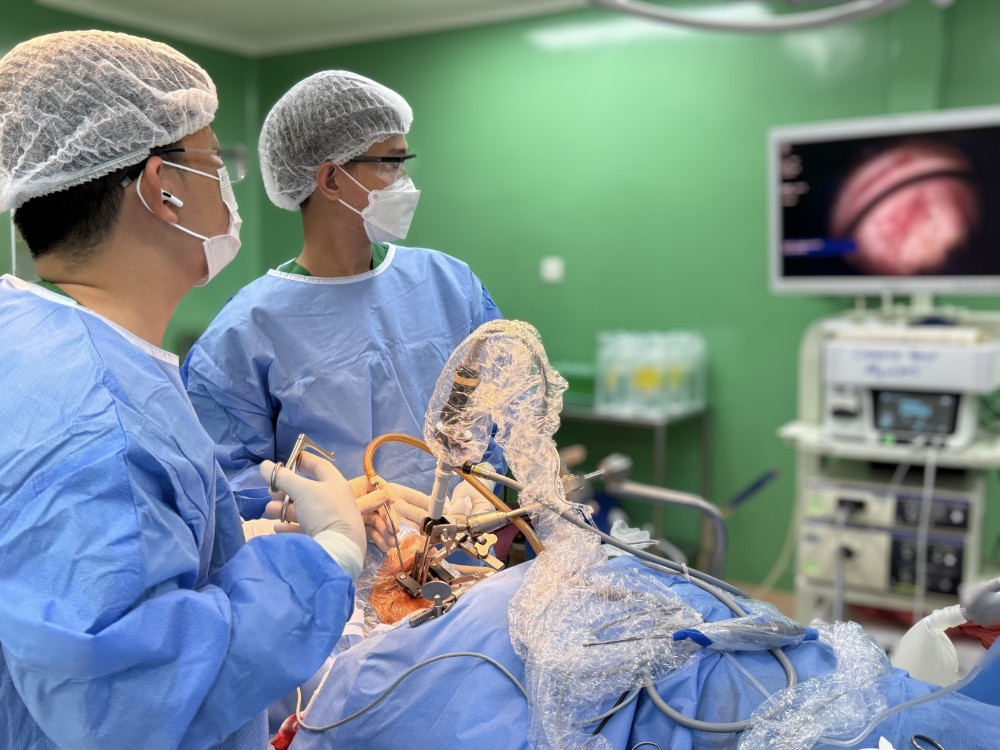

<!-- theme: 研究・実験結果レーン(Lancet Gastro Hepatol 2025 内視鏡1,443件・査読済み × arXiv:2604.04721 1,222人RCT × arXiv:2410.03017 Tutor CoPilot 900人×1,800人 × arXiv:2608.23543 124人・小規模 × arXiv:2606.12585 放射線科68人11,420件／AIを外したときの腕は落ちるのか、落ちなかった現場との分かれ目) / 研究レーン(3-0) -->
# AIを外した検査だけ、発見率が6ポイント落ちていた

AIを現場に入れたあと、社員の腕はどうなるのか。それを気にしている経営者に向けて書きました。

「AIに任せたら人が育たなくなる」という心配は、これまで感覚の話でした。ここ1年で、実際に測った研究がいくつか出ています。しかも結果は片側に揃っていません。腕が落ちた現場と、逆に上がった現場があります。

今日はその両方を並べて、分かれ目がどこにあったかまで書きます。

---

## AI導入後に「AIなしでやった検査」だけ、発見率が落ちた

ポーランドの4施設で行われた観察研究です。2025年8月12日、The Lancet Gastroenterology & Hepatology に掲載された査読済みの論文です。

- 対象：大腸内視鏡を行う医師19人。全員、それまでに2,000件以上を経験したベテラン
- 期間：2021年9月8日から2022年3月9日
- 数えたもの：AIを使わずに行った大腸内視鏡 1,443件（施設にAIが入る前 795件、入った後 648件）
- 指標：腺腫発見率（ADR）。がんの手前の病変をどれだけ見つけられたか

結果はこうでした。

- AIが施設に入る前、AIなしの検査での発見率：28.4%（795件中226件）
- AIが施設に入った後、AIなしの検査での発見率：22.4%（648件中145件）
- 差：マイナス6.0ポイント

同じ医師たちが、同じ機材で、AIを使わずにやった検査です。それでも、施設にAIが入ったあとのほうが見つけられていませんでした。

先に断っておくと、これは観察研究です。論文の著者自身が「AI導入以外の要因が影響した可能性は排除できない」と明記しています。因果が確定した話ではありません。

それでも、2,000件以上をこなしたベテランが相手で、1,443件という数の裏付けがあります。「慣れの問題」で片付けにくい数字です。

---

## 1,222人にやらせたら、10分で同じことが起きた

実験室で条件を揃えて調べた研究もあります。2026年4月6日に公開され、8月5日に改訂されたプレプリント（査読前）です。

- 対象：1,222人
- 課題：数学の推論と、文章の読解
- 設計：AIを使える群と使えない群に無作為に割り振り、そのあとAIなしで解かせる

結果は二段構えでした。AIを使っている間の成績は上がります。ところがAIを取り上げると、AIを使っていた群のほうが成績が悪く、しかも早く諦めました。

著者が強調しているのは時間の短さです。この差は、およそ10分AIに触れただけで出ています。数か月の話ではありません。

著者は理由を「自力で詰まって抜け出す経験そのものを奪ってしまうから」と説明しています。粘りは学習の伸びをよく予測する要素です。そこが削られると、成績は後から効いてきます。

---

## 逆に、腕が上がった現場がある

ここで終わると片側だけの話になるので、逆の結果も並べます。スタンフォード大学のチームが行った Tutor CoPilot の無作為化比較試験です。2024年10月公開、2025年1月改訂のワーキングペーパーです。

- 対象：オンライン家庭教師900人と、その生徒である小中高生1,800人
- 設計：家庭教師にだけAIの助言ツールを渡すかどうかを無作為に割り振る
- 結果：AIを使えた家庭教師に教わった生徒は、単元の習得率が4ポイント高い
- 評価の低かった家庭教師に限ると、その差は9ポイント
- 費用：家庭教師1人あたり年20ドル

注目したいのは、AIが誰に向かって話しているかです。AIは生徒に答えを出していません。教える側の人間に「こう聞き返してみては」と助言するだけで、生徒に向かう言葉は人間が選んでいます。論文は、AIを使った家庭教師のほうが良い聞き方に寄っていったと報告しています。道具を使った人間の振る舞いが、良い方向に変わったわけです。

もうひとつ。2026年6月10日公開のプレプリントに、放射線科医68人・胸部X線11,420件の照合データを使った追試があります。AIの上積みがいちばん大きいのは、もともとの腕が高い人ではなく、低い人でした。

---

## 分かれ目は「人の判断が残っているか」だった

ここまでの研究を並べると、線がだいたい見えます。

腕が落ちた現場では、AIが答えを画面に出していました。内視鏡のAIは病変らしき場所を枠で囲って教えてくれます。人間の仕事は「囲まれた場所を見る」に寄り、自分で画面を隅まで探す回数が減る。その回数が、腕の中身でした。

腕が上がった現場では、AIは人間に助言しただけでした。最終的に生徒に投げる言葉は、家庭教師が自分で選んでいます。判断の回数は減っていません。

もうひとつ、呼び出しやすさの話があります。2026年8月24日に公開されたプレプリントで、論理パズルを使った実験です。参加者124人と小さい研究なので、これ単独では結論にしませんが、中身は示唆的でした。

AIを呼ぶのに小さなコスト（点数の減点）を設定し、その高さを変えたところ、安い群は平均6.67回呼び、高い群は3.33回でした。そしてAIをまったく使わなかった参加者は、序盤の1分あたり2.03問から、終盤には3.86問まで伸びていました。

この研究には、評価の話に直結する数字もあります。AIありのときの成績から「この人はこれくらいできる」と見積もると、AIを使わなかった人の実力は0.15ぶん低く見積もられ、AIを使った人の実力は0.22ぶん高く見積もられていました。

AIありの成績を見て人の力量を判断すると、使い込んでいる人ほど高く誤解する。そういう結果です。

---

## 明日からやれること

### 1. 月に1回、AIなしで同じ作業をやる日を作る

内視鏡の研究が測れたのは、「AIなしでやった検査」の記録が残っていたからです。多くの会社にはこの記録がありません。見積もりでも、問い合わせ返信でも、月に1件でいいので、AIを開かずに作って所要時間と出来を残しておく。半年後に比べられます。

### 2. 力量チェックをAIありの成果で代用しない

124人の実験の数字がそのまま当てはまるとは言いませんが、方向は覚えておく価値があります。AIありの出来だけを見て「この人はもう任せられる」と判断すると、実力を高く見積もりすぎる側に転びます。新人の引き継ぎ判定や、外注の切り替え判断では、AIなしで一度やらせたほうが安全です。

### 3. AIの出力を「答え」でなく「候補」の欄に置く

書式を変えるだけでできます。AIの文面をそのまま送る運用をやめて、「AI案」と「最終」の2欄にする。最終欄は人が書く。新人には、先に自分の答えを書かせてからAIを見せる。判断の回数を減らさないための、いちばん安い工夫です。

---

## まとめ

- ポーランド4施設・1,443件の大腸内視鏡で、施設にAIが入ったあと、AIなしの検査の発見率が28.4%から22.4%に下がっていた（査読済み。ただし観察研究で因果は未確定）
- 1,222人の無作為化実験でも、AIを取り上げた後の成績が落ち、諦めが早くなった。約10分の接触で出た
- 一方、AIが人間の側に助言する設計では、家庭教師900人・生徒1,800人の試験で習得率が4ポイント、腕の低い層では9ポイント上がった
- 分かれ目は「人の判断の回数が残っているか」。AIが答えを出す設計は回数を削り、AIが人に助言する設計は削らない
- 次にやること：AIなしで作業する日を月1回作る、力量チェックをAIありの成果で代用しない、AIの出力を「答え」でなく「候補」の欄に置く

AIを入れる目的は、面倒な作業を手放して、その先の仕事に時間を回すことです。手放していいのは作業で、判断ではありません。どこまでを渡してどこから自分で持つのか。その線を現場ごとに引くところが、いちばん面白い仕事だと思っています。

---

## 出典

- Krzysztof Budzyń ほか「Endoscopist deskilling risk after exposure to artificial intelligence in colonoscopy: a multicentre, observational study」（The Lancet Gastroenterology & Hepatology、2025年8月12日公開。査読済み。ポーランド4施設、内視鏡医19人、AIなしの大腸内視鏡1,443件）

https://pubmed.ncbi.nlm.nih.gov/40816301/

- Grace Liu, Brian Christian, Tsvetomira Dumbalska, Michiel A. Bakker, Rachit Dubey「AI Assistance Reduces Persistence and Hurts Independent Performance」（arXiv:2604.04721、2026年4月6日公開、8月5日改訂。査読前のプレプリント。参加者1,222人の無作為化比較試験）

https://arxiv.org/abs/2604.04721

- Rose E. Wang, Ana T. Ribeiro, Carly D. Robinson, Susanna Loeb, Dora Demszky「Tutor CoPilot: A Human-AI Approach for Scaling Real-Time Expertise」（arXiv:2410.03017、2024年10月3日公開、2025年1月26日改訂。査読前のワーキングペーパー。家庭教師900人、小中高生1,800人の無作為化比較試験）

https://arxiv.org/abs/2410.03017

- Shang Wu, Catarina G. Belem, Shuyuan Fu, Mark Steyvers, Padhraic Smyth「How AI Assistance Affects Human Skill Development: A Study of Learning with Logic Puzzles」（arXiv:2608.23543、2026年8月24日公開。査読前のプレプリント。参加者124人と小規模なため、本文では補強として扱っています）

https://arxiv.org/abs/2608.23543

- Daniel Martin「Revisiting the ABCs of Working with AI: A Replication with Radiologists」（arXiv:2606.12585、2026年6月10日公開。査読前のプレプリント。放射線科医68人、照合データ11,420件）

https://arxiv.org/abs/2606.12585

写真: Openverse（CC0）

---

## 私たちについて

株式会社AIdollargameは、「楽じゃなく、楽しいを考える」をテーマに、AIプロダクトを自社開発しているAI会社です。

- AI導入支援・コンサルティング（https://aidollargame.com/ai-consulting.html）
- AIエージェント（https://aidollargame.com/line-ai-agent.html）：問い合わせ・予約対応を24時間自動化
- AIside（https://aidollargame.com/aiside.html）：経営者の"もう一人の自分"になる付き人AI
- AIwill／社長クローンAI（https://aidollargame.com/human-clone-ai.html）：経営者の判断軸をAIに学習させる

「うちの仕事でAIに何ができる？」は、無料のAI活用度診断（https://aidollargame.com/shindan.html）から。

- 🔗 公式サイト：https://aidollargame.com/
- 📩 ご相談：nosuke@aidollargame.com

このnoteでは、AI活用のリアルや時事の読み解きを、過程まで含めて正直に発信しています。フォローしてもらえると嬉しいです。

---

#AI #生成AI #中小企業 #人材育成 #DX

サムネ文言案

1. AIを外した検査だけ、6ポイント落ちた
2. 腕が落ちた現場と、上がった現場の違い
