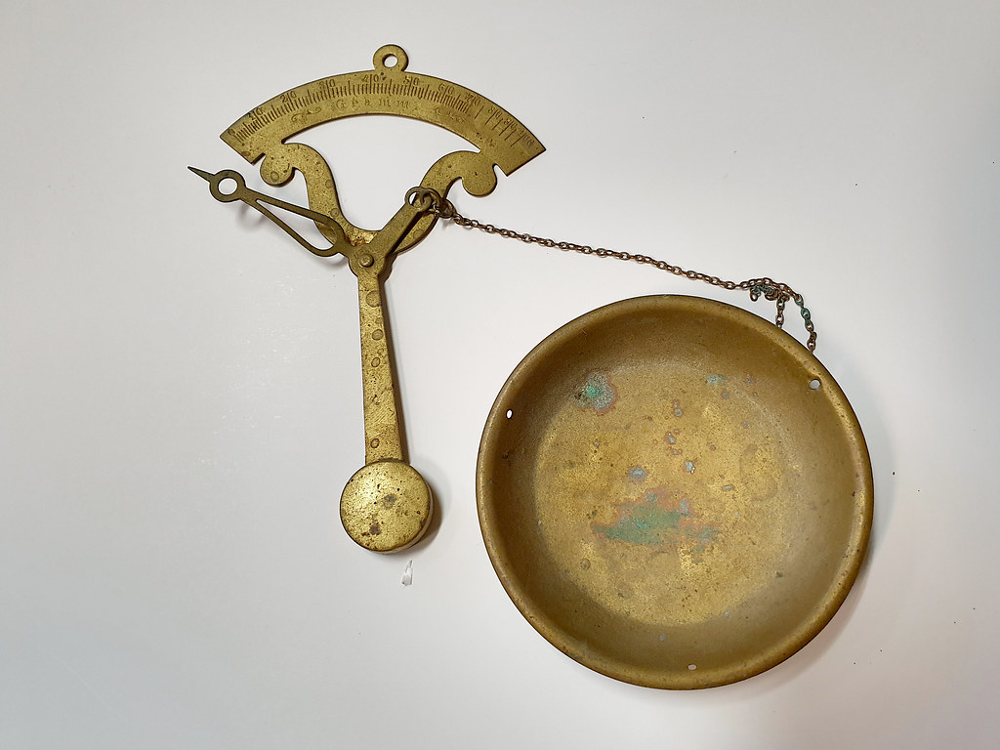

<!-- theme: 研究・実験結果レーン(arXiv:2607.08706 Chen, Li, Meng, Qiu, Yang／中国の大病院で外来1万1,666件を無作為割り付けした事前登録RCT × Shah & Levy 2026 米連邦民事460万件・PACER 4,600万件の本人訴訟分析／AIの答えに入っている偏りが専門家の判断に乗り移る) / 研究レーン(3-0) -->

# AIに相談してから来た患者は、処方される率が4.6ポイント低かった

お客さんが問い合わせてくる前に、もうAIに聞いている。そういう場面が増えてきた会社の方に向けた記事です。

主役にするのは、中国の大きな公立病院で行われた実験です。受診の前にAIに相談できる人とできない人を、くじ引きで分けました。外来1万1,666件が対象です。

先に結論を書きます。AIの答えに入っていた「薬には慎重、検査には前向き」という偏りが、そのまま医師の処方に乗り移っていました。

---

## 1万1,666件の受診を、くじ引きで分けた

2026年7月9日にarXivで公開された論文です。北京大学、スタンフォード大学、香港大学、復旦大学の5人による研究で、学術誌の査読はまだ通っていないプレプリントの段階です。

ただし、実験の手続きは事前登録されています。AEAのRCT登録簿に計画を先に出してから実施した、いわゆる事前登録済みの無作為化比較試験です。あとから都合のいい結果を選んで書いた、という形にはなっていません。

やったことを整理します。

- 舞台は中国の大きな公立病院。期間は1か月。外来を担当した医師は179人
- 予約者1万2,498件をくじ引きで半分に割り、半分には受診前にチャットボットを無料で使えるようにする
- 分析対象は、実際に受診が完了した1万1,666件

同じ医師にかかった患者どうしで比べられる設計です。医師の腕や性格の差は、比較から消えます。

なお、渡された人が全員使ったわけではありません。使ったのは5,828件中998件、17.1%でした。

---

## AIは薬に慎重で、検査には前向きだった

研究チームは、患者とチャットボットの会話ログを全部分類しています。ここがこの論文でいちばん面白いところです。

薬の話題が出たとき、AIの答えに注意書きが付く割合は次のとおりでした。

- 薬全般の言及：69.7%に注意書きが付く
- 漢方薬：90.8%
- 抗生物質：87.6%

逆に、迷いなく勧めた割合は、漢方薬で3.8%、抗生物質で7.8%しかありません。

検査はまったく違う扱いでした。診断のための検査については、94.5%の確率で、注意書きなしにはっきり勧めています。

論文は、これを賢さの問題ではなく責任の問題だと書いています。

特定の薬を名指しで勧めて健康被害が出れば、AIを作った側に法的な責任が向かいます。検査を勧めても、作った側は何も失いません。不要な検査の費用を払うのは、患者と医療制度のほうです。この非対称が、そのまま答えの向きになっています。

---

## その向きが、診察室の判断に乗り移った

同じ医師のなかで比べた結果です。AIを渡されたかどうかで割り付けた、意図した処置の効果として報告されています。

- 何かしら処方される確率：4.6ポイント低下（もとの水準は87%）
- 検査を含む受診の確率：2.7ポイント上昇（もとの水準は23%）
- 薬の支出は下がり、検査の支出は少し上がり、合計の医療費は変わらず

下がったのは、AIがとくに強く注意書きを付けていた漢方薬と抗生物質でした。効果の向きが、AIの助言の向きと1つずつ一致しています。

実際にチャットボットを使った人だけに絞ると、数字はもっと大きくなります。処方は27ポイント低下、検査は16ポイント上昇、2週間以内の再受診は7.0ポイント低下。使ったのが17%だけなので、およそ5倍に出る計算です。

効きやすかった相手もはっきりしています。「患者の話を取り入れるほうだ」と自分で答えた医師では効果が出て、「医師の判断が優先だ」と答えた医師ではほとんど出ていません。もともと薬をよく出す医師ほど、下がり幅が大きくなりました。

AIが医師を説得したわけではありません。患者が持ち込む要望が変わり、それを受け取る余地のある医師のところでだけ結果が動いた、という構図です。

---

## 逆の結果も、同じ論文に載っている

片側だけ見ると危ないので、動かなかったものも並べます。

まず、患者の行動そのものは変わっていません。予約した診察に来る割合、処方された薬を実際に買う割合、指示された検査を受ける割合。どれも差がありませんでした。

次に、医師の側も変わっていません。実験が終わると、医師どうしの差は即座に消えました。AIに詳しい患者が続けて来ても、診療スタイルは書き換わらなかった、ということです。

医師へのアンケートでは、むしろ良い評価が出ています。179人中171人が回答し、回答率は95.5%。AIを見てきた患者は、症状の説明が明確で、自分の状態をよく理解していて、話しやすい、と答えています。使った患者自身も、84%が「とても役に立った」と回答しています。

そして論文自身、これが良いことか悪いことかを決めていません。減った処方に本当に必要だったものが混じっている可能性も、増えた検査が費用だけ生んでいる可能性も、どちらも否定できないと書いています。

---

## 下がったのは、納得感のほうだった

もう1つ、見逃せない結果があります。

受診後の患者アンケートは2,247件、回答率13%です。回答した人は全体の一部なので、ここは慎重に扱う必要があります。論文もそう断っています。

そのうえで、数字はこうでした。

- 「とても満足」と答えた割合：AI群83.3%、他の2群は約86%
- 「とてもスムーズに話せた」と答える確率：2ポイント低下
- 「医師の指示に完全に従うつもり」：他の2群の90%に対し、AI群は84.5%

AIそのものには84%が満足しています。なのに、そのあとの人間との会話の満足度は下がる。

論文が挙げている説明は2つです。1つは、詳しくなった患者に対して医師の応対が素っ気なくなる。もう1つは、事前に情報を得たぶん期待値が上がり、聞きたいことが増え、そこに届かないと物足りなくなる。

情報の持ち主が誰かが動いた、という言い方をしています。

---

## 量のほうでも、同じことが起きている

もう1本、別の角度から並べます。米連邦民事裁判所の記録を使った研究です。

MITとUSCの2人が、2005年度から2026年度までの連邦民事訴訟460万件の行政記録と、それに紐づく4,600万件のPACER記録を分析しました。2026年3月の公表です。

- 弁護士を立てない本人訴訟の割合が、長年の11%前後から、2025年度に16.8%へ上昇
- 増えたのは、事実関係を整った文書にまとめる仕事が中心の類型。公民権、消費者信用、差し押さえなど
- 逆に、特許侵害や証券詐欺のような、専門性が長く要る類型ではほとんど増えていない
- 訴え出てから最初の180日に生まれる記録の件数が、AI登場前の平均から158%増
- 訴状1,600件を抜き取って検査すると、AIが書いた文章が混じる割合は2023年の1.0%から2026年初めの18.0%へ

ただしこれは因果を特定した研究ではありません。全員が同時にAIを使えるようになったので、比べる相手がいない。著者自身が記述的な研究だと明記しています。

それでも、入口が広がった一方で処理する側の仕事は減っていない、という形は読み取れます。裁判官の数は増えません。

---

## うちの仕事に翻訳すると

3つ書きます。

1つ目。問い合わせの一次対応を、説明から確認に組み替える。相手はもう調べて来ています。最初に聞くべきは「どこまで調べましたか」で、そこからずれている部分だけを直す。何も知らない人向けの説明を頭から流すと、病院で起きたのと同じ物足りなさが出ます。

2つ目。自社で使っているAIに、主力商品について3回ほど聞いてみる。何を勧め、何に注意書きを付けるかを自分の目で見る。その傾きは、社員の判断にもお客さんの要望にも乗ります。

3つ目。入口だけを自動化すると、詰まる場所が後ろへ移る。受け取ったあとを誰がどれだけの時間で処理するか。そこを先に決めてから入口を開ける。

---

## まとめ

- 外来1万1,666件のくじ引き実験で、受診前にAIを使えた患者は、処方される確率が4.6ポイント低く、検査を受ける確率が2.7ポイント高かった
- 理由はAIの賢さではなく、作り手の責任の置き方。薬には69.7%から90.8%の割合で注意書きが付き、検査は94.5%がそのまま推奨されていた
- 一方で、患者の実際の行動も、医師の診療スタイルも変わっていない。変わったのは患者が持ち込む要望と、診察への納得感のほう
- 米連邦裁判所では、本人訴訟が11%から16.8%へ増え、最初の180日の書類量は158%増えた。入口は広がり、処理側の負担は残った
- 自分の会社で今日できることは、使っているAIに主力商品を3回聞いて、何に慎重で何に前向きかを確かめること

AIで楽になるのは入口です。その先で何が動いたかは、自分で見に行かないと分かりません。

---

## 出典

- Yuyu Chen, Hongbin Li, Lingsheng Meng, Xinyao Qiu, Qingxu Yang「Directional AI Advice: Experimental Evidence from Healthcare」（arXiv:2607.08706、2026年7月9日公開。査読前のプレプリント。ただしAEA RCT登録簿に事前登録済み（AEARCTR-0015851）。分析対象は外来1万1,666件、医師179人）

https://arxiv.org/abs/2607.08706

- Anand V. Shah, Joshua Y. Levy「Access to Justice in the Age of AI: Evidence from U.S. Federal Courts」（2026年3月公表のワーキングペーパー。査読前。連邦民事460万件の行政記録とPACER記録4,600万件。著者自身が記述的な分析と明記）

https://papers.ssrn.com/sol3/papers.cfm?abstract_id=6766859

写真: Openverse（CC0）

---

## 私たちについて

株式会社AIdollargameは、「楽じゃなく、楽しいを考える」をテーマに、AIプロダクトを自社開発しているAI会社です。

- AI導入支援・コンサルティング（https://aidollargame.com/ai-consulting.html）
- AIエージェント（https://aidollargame.com/line-ai-agent.html）：問い合わせ・予約対応を24時間自動化
- AIside（https://aidollargame.com/aiside.html）：経営者の"もう一人の自分"になる付き人AI
- AIwill／社長クローンAI（https://aidollargame.com/human-clone-ai.html）：経営者の判断軸をAIに学習させる

「うちの仕事でAIに何ができる？」は、無料のAI活用度診断（https://aidollargame.com/shindan.html）から。

- 公式サイト：https://aidollargame.com/
- ご相談：nosuke@aidollargame.com

このnoteでは、AI活用のリアルや時事の読み解きを、過程まで含めて正直に発信しています。フォローしてもらえると嬉しいです。

---

#AI #生成AI #中小企業 #顧客対応 #経営

サムネ文言案

1. AIは薬に慎重で、検査に前向きだった
2. その偏りが、診察室の判断に乗り移った
