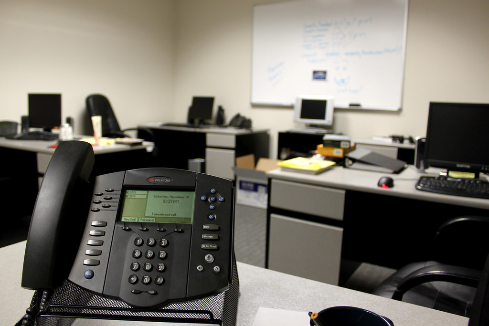

<!-- theme: 研究・実験結果レーン(ECB消費者期待調査 約2万人・11か国 ECBブログ2026/8/26 × コンスタンツ大学KI-Studie 2026 1,105人 2026年9月 × NBER w34995 米欧7か国 1か国約3,000人／会社に勧められた人47%・勧められていない人10%。小さい会社は研修11%・ルール10%) / 研究レーン(3-0)・余り1 -->

# 会社に勧められた社員は47%がAIを使い、勧められていない社員は10%だった

社員がAIを使うかどうかは、本人のやる気や若さで決まると思われがちです。ところが米国と欧州6か国の働く人を調べた研究では、いちばん強く効いていたのは「会社が使うよう勧めたかどうか」でした。

社員10〜50人ほどの会社の経営者に向けて、欧州の約2万人調査、ドイツの1,105人調査、米欧7か国の調査の3本から、会社側が用意すべきものと、まだ分かっていないことを整理します。

---

## 欧州では、働く人の半分がもうAIを使っている

1本目は、ECB(欧州中央銀行)が8月26日に公式ブログで出した集計です。ユーロ圏11か国の約2万人に毎月聞いている調査を使っています。論文ではなく、ECBの職員による分析記事です。

- 仕事でAIを使う人は、2024年26%、2025年41%、2026年52%
- 使っている人は、週に平均3日ほど使う
- 時間の節約は、中央値で週3時間。働く時間の7.7%にあたる

一方で、使っていない人も約半分います。理由でいちばん多いのは「今の仕事に関係ない」で3分の1。ほかに、昔のやり方のほうがいい、正確さが心配、そして「会社が用意していない」が挙がっています。

何があれば使い始めるかを聞くと、約半分が「使い方の研修」と「何に役立つのかが分かること」を挙げました。

---

## 小さい会社ほど、研修もルールも用意されていない

2本目は、ドイツのコンスタンツ大学が9月に出した報告書です。2026年5月に1,105人へ聞いた、3年目の調査です。人数は1本目の20分の1ほどなので、傾向を見る材料として扱います。

社員49人以下の会社で働く人のうち、会社が用意しているものがあると答えた割合はこうでした。

- AIの研修:11%(250〜1,000人の会社は約26%、1,000人超は約29%)
- AIを使うときのルール:10%(50〜249人の会社は24%)
- 社内向けのAIツール:11%(1,000人超は36%)
- AIについて会社から定期的に情報が来る:約12%(ほかの規模は22〜25%)

もう1つ気になる数字があります。AIを使っている人のうち、いちばんよく使うツールを会社が正式に入れたと答えたのは55%でした。残りの人は、自分で見つけたツールを仕事に使っていることになります。

---

## 研修より「使って」の一言が効いていた

3本目は、米国と欧州6か国(ドイツ・英国・フランス・イタリア・スウェーデン・オランダ)で働く人を調べた研究です。2026年1〜2月の調査は1か国あたり約3,000人。NBER(全米経済研究所)の論文集で3月に出た、査読前の論文です。

会社がしていることを3つに分けて、AIを使う割合との関係を見ています。

- 研修もツールも無い人のうち、会社に勧められた人は47%が使い、勧められていない人は10%
- 勧めも研修も無い人のうち、ツールを渡された人は21%が使い、渡されていない人は10%
- 勧めとツールをそろえて比べると、研修は使う割合をそれ以上押し上げていなかった

47%と10%は、使う割合そのものの差です。年齢・学歴・業種・職種・会社の規模をそろえた比較でも、会社が勧めたかどうかがいちばん強く効いていました。米国と欧州の差も、8割はこの「勧めたかどうか」の違いで説明がつくとしています。

1本目で社員が「研修がほしい」と答えていたのと、ずれて見えるところです。著者たちは、勧めることで役に立つ使い道が伝わる、という見方を挙げています。1本目で研修と並んで多かった答えが「何に役立つのかが分かること」だったのと、話は合います。

注意点として、これは調査データの比較で、勧めたから使い始めたという因果までは確かめていません。

---

## 使い始めても、会社の稼ぎにはまだつながっていない

いい話だけ並べると誤解を招くので、逆の数字も書いておきます。

ドイツの調査では、AIが会社の稼ぎにはっきり役立っていると感じている人は23%にとどまりました。

ECBも、週3時間の節約がそのまま成果になるわけではないと書いています。実際に使って時間が浮いたと答えたのは働く人の48.8%なので、全体で見ると節約は3.8%ほどです。さらに、浮いた時間を別の仕事に回せるかどうかは、会社の側にかかっているとしています。

正直に言うと、私はここがいちばん大事だと思いました。「使っていい」と言うだけでは、浮いた時間は何となく消えます。

---

## 明日からできること

1. 仕事の名前を挙げて「これに使っていい」と伝える。「AIを活用しよう」ではなく「議事録の下書き」「見積もりメールの一次案」のように具体的に。3本目の研究でいちばん効いていたのは、この勧めでした
2. 会社の契約でツールを1つ渡す。社員が自分で見つけたツールを使っているなら、入れた情報がどこへ行くかを会社が把握できていない状態です
3. 浮いた時間の行き先を先に決めておく。お客さんと話す、後回しにしていた改善に手を付ける、など1つでいいので

---

## まとめ

- 欧州の約2万人調査では、仕事でAIを使う人は2年で26%から52%へ。節約は中央値で週3時間(ECBの分析記事)
- ドイツの1,105人調査では、社員49人以下の会社で研修があるのは11%、ルールがあるのは10%
- 米欧7か国の調査では、会社に勧められた人は47%、勧められていない人は10%が使っていた(査読前・因果は未確認)
- ただ、会社の稼ぎに役立っていると感じる人は23%。浮いた時間の使い道まで決めて初めて差になる

社員数が少ない会社は、研修の仕組みを作る余裕はなくても、社長が一言で決められるのが強みです。どの仕事で使っていいか、浮いた時間で何をするか。その2つを決めるところまでなら、今週のうちにできます。浮いた時間を、社員がやってみたかった仕事に回せたら、AIを入れた意味は楽の先にある楽しさの側に出てくると思っています。

---

## 出典

- António Dias da Silva, Laura Lebastard, David Sondermann「AI adoption and the productivity promise: what workers report」(The ECB Blog、2026年8月26日／ECB職員による分析記事。査読論文ではない。ECB消費者期待調査、ユーロ圏11か国・毎月約2万人)
https://www.ecb.europa.eu/press/blog/date/2026/html/ecb.blog20260826~e1c1a89999.en.html
- Florian Kunze, Carolina Opitz, Elena Gerdiken「Konstanzer KI-Studie 2026」(コンスタンツ大学 Future of Work Lab、2026年9月／大学の調査報告書。査読なし。2026年5月、ドイツの働く人1,105人のオンライン調査)
https://kops.uni-konstanz.de/handle/123456789/78019
- Alexander Bick, Adam Blandin, David J. Deming, Nicola Fuchs-Schündeln, Jonas Jessen「Mind the Gap: AI Adoption in Europe and the U.S.」(NBER Working Paper No. 34995、2026年3月／査読前の論文。Brookings Papers on Economic Activity 2026年春号に掲載予定。米国と欧州6か国、2026年調査は1か国約3,000人)
https://www.nber.org/papers/w34995

---

## 私たちについて

株式会社AIdollargameは、「楽じゃなく、楽しいを考える」をテーマに、AIプロダクトを自社開発しているAI会社です。

- AI導入支援・コンサルティング（https://aidollargame.com/ai-consulting.html）
- AIエージェント（https://aidollargame.com/line-ai-agent.html）：問い合わせ・予約対応を24時間自動化
- AIside（https://aidollargame.com/aiside.html）：経営者の"もう一人の自分"になる付き人AI
- AIwill／社長クローンAI（https://aidollargame.com/human-clone-ai.html）：経営者の判断軸をAIに学習させる

「うちの仕事でAIに何ができる？」は、無料のAI活用度診断（https://aidollargame.com/shindan.html）から。

- 公式サイト：https://aidollargame.com/
- ご相談：nosuke@aidollargame.com

このnoteでは、AI活用のリアルや時事の読み解きを、過程まで含めて正直に発信しています。フォローしてもらえると嬉しいです。

---

ハッシュタグ案：#生成AI #AI活用 #中小企業経営 #社員教育 #業務効率化

サムネ文言案：
1. 「使って」と言われた社員は47%、言われない社員は10%
2. 小さい会社のAI研修は11%。先に要るのは社長の一言
