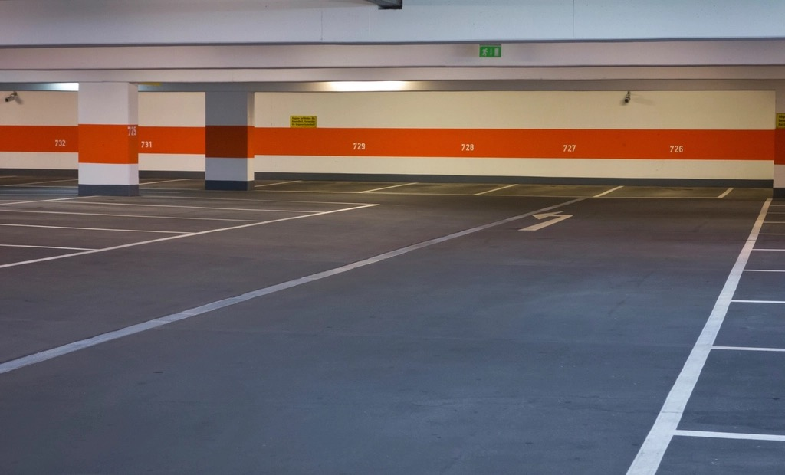

<!-- theme: 時事(How-to型・toC)／タイムズカー660万件(パーク24 第2報 9/28)の当事者として。代表自身が会員で対象。セイコーマート57万件(9/29)も併記。やること5つ=パスワード/連携ID/免許証と信用情報の本人申告/なりすまし連絡/退会者も対象。【要記入】を埋めてから確定 -->

# 私もタイムズカーの会員だった。660万件に入った人が、今日やる5つ

9月28日、カーシェアのタイムズカーを運営するパーク24が、不正アクセスで約660万件の個人情報が漏えいしたと発表しました。私もタイムズカーの会員で、対象の一人です。

翌29日には、北海道のコンビニ、セイコーマートがアプリ経由で約57万アカウントの会員情報が漏れた可能性を発表しました。

この記事は、経営者向けでも技術者向けでもありません。タイムズカーやセイコーマートを使っていた人、使っていた人に向けて、発表文の事実と、今日できることだけを書きます。

---

## 何が漏れたのか

パーク24の第2報(9月28日)によると、漏れたのは約660万件。氏名、住所、生年月日、電話番号、メールアドレス、運転免許情報、本人確認書類の情報(免許証の画像を含む)、パスワード、連携サービスのID、法人会員の所属部署名です。クレジットカード情報は含まれていません。

対象は今の会員だけではありません。退会した人、入会を申し込んで完了しなかった人、法人向けサービスの会員と退会者も入っています。

セイコーマートの方は、氏名、性別、生年月日、住所、電話番号、メールアドレス、クラブカードの入会年月日と退会年月日。パスワードは漏れておらず、カード情報は持っていなかったとのことです。

重いのはタイムズカーです。免許証の画像とパスワードが同時に出ているからです。

---

## 1つ目。パスワードを変える。使い回している先が先

タイムズカーのパスワードは漏れています。まずタイムズカーのパスワードを変えます。

ただ、本当に急ぐのはそこではありません。同じパスワードを他のサービスでも使っていたら、そちらが先です。メール、通販、銀行、SNS。漏れたメールアドレスとパスワードの組み合わせで、片っ端からログインを試す攻撃は珍しくありません。

私は【要記入: 使い回していた先の有無と、変えた先】。

---

## 2つ目。連携していたサービスを見る

漏れた項目に「連携サービスID」があります。タイムズカーに他のサービスのアカウントをつないでいた人は、そのサービス側で連携の一覧を開き、身に覚えのない連携が増えていないかを見ます。不要な連携は切ります。

---

## 3つ目。免許証の画像が漏れた人は、信用情報機関に本人申告をする

免許証の画像は、ネットで口座やクレジットカードを申し込む時の本人確認に使われます。画像が第三者の手にあると、自分の名前で契約を作られるおそれがあります。

これに対して、信用情報機関に「本人確認書類が漏れたので、申込があったら慎重に確認してほしい」と登録できる仕組みがあります。本人申告といいます。CIC、JICC、全国銀行個人信用情報センターの3つの機関にあり、手数料は機関ごとに500〜1,000円ほど、登録は5年間有効です。ネットか郵送で申し込めます。

免許証の再交付は、紛失や盗難の時の手続きで、画像が漏れただけでは通常の対象になりません。今回のように画像だけが出た場合は、本人申告の方が先です。

私は【要記入: 本人申告をしたか、どの機関にしたか】。

---

## 4つ目。会社を名乗る連絡を疑う

パーク24は発表文で、会社を装ったメール、SMS、電話に注意するよう呼びかけています。会社側からメールや電話でパスワード、認証コード、クレジットカード情報を聞くことはない、と明記しています。

セイコーマートも同じで、パスワードやペコマカードのPIN、クレジットカードや預金の情報をメールで聞くことは絶対にない、としています。

漏れたのは氏名と電話番号とメールアドレスです。つまり、あなたの名前を呼び、あなたの番号にかけてくる、本物そっくりの連絡が来る条件がそろっています。リンクは開かず、電話は折り返さず、確認したい時は公式の窓口に自分からかけます。

- パーク24(タイムズカー): 0120-25-8924(24時間)
- セイコーマート お客様相談室: 0120-89-8551(月〜土 9:00〜17:00)

---

## 5つ目。退会した人も、自分は対象だと思う

タイムズカーは退会した人と入会未完了の人まで対象です。セイコーマートも退会年月日が項目に入っているので、退会した人の情報が残っていたことになります。

「もう使っていないから関係ない」は今回は通用しません。退会した人ほど、会社からの案内が届く連絡先が古くなっていて、気づくのが遅れます。使った覚えがあるなら、自分は対象だと思って1つ目から順にやります。

---

## まとめ

- パスワードを変える。使い回している先から先に
- 連携していたサービスの一覧を見て、不要な連携を切る
- 免許証の画像が漏れた人は、信用情報機関に本人申告をする(500〜1,000円、5年有効)
- 会社を名乗るメール、SMS、電話を疑う。確認は公式の窓口に自分からかける
- 退会した人も対象。自分は入っていると思って動く

会社の側で言えば、退会した人の免許証画像を持ち続けていたことが、今回いちばん重い点です。うちの会社もお客さんの情報を預かる側なので、持っている情報を数えるところから見直しています。会社側でやることは、別の記事に書きます。

---

出典

- パーク24株式会社「タイムズカーWebシステムへの不正アクセスに関する調査結果および今後の対応について(第2報)」(2026年9月28日／一次情報)
https://www.park24.co.jp/news/2026/09/20260928-1.html
- 株式会社セイコーマート「『セイコーマートアプリ』への不正アクセスによる個人情報流出の可能性に関するお詫びとお知らせ」(2026年9月29日／一次情報)
https://www.seicomart.co.jp/info/pdf/202609290017.pdf
- ITmedia NEWS「『タイムズカー』会員情報約660万件漏えい 運転免許画像など 不正アクセスで」(2026年9月28日)
https://www.itmedia.co.jp/news/article/2609/28/2000001808/
- CIC「本人申告とは」
https://www.cic.co.jp/mydata/declaration/index.html
- JICC「不正利用防止の届け出(本人申告コメント)」
https://www.jicc.co.jp/comment
- 警視庁「遺失、盗難、汚損、破損、表示内容の変更による再交付・再記録手続」
https://www.keishicho.metro.tokyo.lg.jp/menkyo/koshin/saikofu01.html

---

## 私たちについて

株式会社AIdollargameは、「楽じゃなく、楽しいを考える」をテーマに、AIプロダクトを自社開発しているAI会社です。

- AI導入支援・コンサルティング（https://aidollargame.com/ai-consulting.html?utm_source=note&utm_medium=referral&utm_campaign=2026-09-29-2）
- AIエージェント（https://aidollargame.com/line-ai-agent.html?utm_source=note&utm_medium=referral&utm_campaign=2026-09-29-2）：問い合わせ・予約対応を24時間自動化
- AIside（https://aidollargame.com/aiside.html?utm_source=note&utm_medium=referral&utm_campaign=2026-09-29-2）：経営者の"もう一人の自分"になる付き人AI
- AIwill／社長クローンAI（https://aidollargame.com/human-clone-ai.html?utm_source=note&utm_medium=referral&utm_campaign=2026-09-29-2）：経営者の判断軸をAIに学習させる

「うちの仕事でAIに何ができる？」は、無料のAI活用度診断（https://aidollargame.com/shindan.html?utm_source=note&utm_medium=referral&utm_campaign=2026-09-29-2）から。

- 公式サイト：https://aidollargame.com/?utm_source=note&utm_medium=referral&utm_campaign=2026-09-29-2
- ご相談：nosuke@aidollargame.com

このnoteでは、AI活用のリアルや時事の読み解きを、過程まで含めて正直に発信しています。フォローしてもらえると嬉しいです。

---

ハッシュタグ案：#タイムズカー #個人情報漏えい #セイコーマート #情報セキュリティ #パスワード

サムネ文言案：
1. 私も対象だった。660万件に入った人が今日やる5つ
2. 免許証の画像が漏れたら、再交付より先に本人申告
