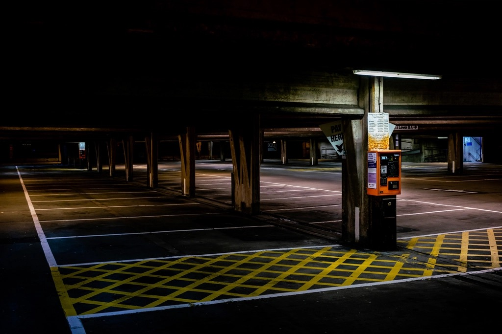

<!-- theme: 時事(問題解決型)／タイムズカー不正アクセス 約660万件(パーク24 第2報 2026-09-28) × セイコーマートアプリ 約57万件(公式PDF 2026-09-29) × 個人情報保護法の報告義務(1,000人超・速報3〜5日) × 経産省SCS評価制度(2026年度末開始)。大企業の事故を「小さい会社が今週やる3つ」に翻訳。生成AIとの因果は書かない(不正アクセス事案) / 時事レーン -->

# 退会した人の免許証画像まで漏れた。660万件と57万件が2日で続いた後に、社員10人の会社が今週やる3つ

9月28日、カーシェアのタイムズカーを運営するパーク24が、不正アクセスで約660万件の個人情報が漏えいしたと発表しました。氏名や住所だけでなく、運転免許証の画像まで含まれています。翌29日には、北海道のコンビニ、セイコーマートがアプリ経由の不正アクセスで約57万アカウントの会員情報が漏れた可能性を発表しました。

大企業の話に見えます。でも発表文には、社員10人ほどの会社にそのまま当てはまる点が3つありました。うちもお客さんの情報を預かる側なので、他人事にはできません。

個人情報を預かっているすべての会社に向けて、発表文の事実と、今週できることをまとめます。

---

## 何が起きたのか。発表文の事実だけ

パーク24の第2報(9月28日)によると、9月25日の朝9時7分に不正アクセスを検知し、翌26日の朝7時25分までに侵入経路を遮断しました。

漏えいしたのは約660万件。氏名、住所、生年月日、電話番号、メールアドレス、運転免許情報、本人確認書類の情報(免許証画像を含む)、パスワード、連携サービスのID、法人会員の所属部署名です。クレジットカード情報は含まれていません。

見落としがちなのが対象者の範囲です。今の会員だけでなく、退会した人、入会を申し込んで完了しなかった人、法人向けサービスの退会者まで入っています。

つまり、もう取引のない人の免許証画像が、会社の中に残っていました。

セイコーマートの発表(9月29日)も並べます。9月24日の夜に不正な退会処理が1件見つかり、そこから調べて9月28日の夕方に会員サーバーへの不正アクセスの可能性が判明、同日20時にサーバーを止めました。閲覧された可能性があるのは氏名、性別、生年月日、住所、電話番号、メールアドレス、クラブカードの入会年月日と退会年月日。パスワードは漏れておらず、カード情報は持っていなかったとのことです。

こちらも「退会年月日」が項目に入っている。退会した人の情報が残っていた点は、2社とも同じです。

---

## 1つ目。持っている個人情報を数える

660万件や57万件という数字より、退会した人の情報が2社とも残っていたことの方が、小さい会社には重い話です。

うちの会社にも、もう付き合いのない人のデータが残っていないか。名刺の写真、応募者の履歴書、終わった案件の顧客リスト、退職者の口座情報。個人情報は持っている分だけ漏えいの量になります。

今週やることは、消すことより数えることです。どこに、誰の、何が、いつから残っているかを1枚に書き出す。書き出せない項目が、次の事故の中身になります。

---

## 2つ目。漏れたら3日で報告する体制を決めておく

2022年4月から、1,000人を超える個人データの漏えい(またはそのおそれ)が起きた会社は、個人情報保護委員会への報告と本人への通知が義務になっています。速報は発覚からおおむね3〜5日以内、確報は30日以内が目安です。

パーク24は検知の翌日に遮断し、3日後に第2報を出しました。この速さは、事前に手順があったからできることです。

セイコーマートの方は、最初の異変が「不正な退会処理が1件」でした。そこから本体のサーバーに入られた可能性が分かるまで4日。1件の小さな異変を「変だな」で流さずに調べ続けたから、止められました。小さい会社なら、この1件はたぶん誰も見ていません。

社員10人の会社で、金曜の夜に「顧客リストが見えなくなっている」と気づいた時、誰が、何を、どこに報告するか。決まっていなければ、月曜まで動けません。3日はそこで消えます。

紙1枚でいいので、報告先の電話番号と、社内の第一報を受ける人の名前を書いて貼っておく。それだけで速報の期限は守れます。

---

## 3つ目。「うちは大丈夫」を保険会社の質問で確かめる

サイバー保険に入る時、保険会社の質問書に答えます。実物を見ると、聞かれるのは技術の話だけではありません。

従業員へのセキュリティ教育を定期的にやっているか。事故からの復旧の手順を文書にしているか。入社と退職の時にIDを必ず発行・削除しているか。誰がどのデータにアクセスできるか制限しているか。

入るかどうかは別として、この質問書は無料で使える点検表です。自分の会社で答えてみると、何が足りないかが見えます。

経済産業省は2026年度末から、取引先のセキュリティ対策を星の数で見える化する評価制度を始める予定です。星3が最低限の目安で、中小企業もそこを求められる流れになっています。保険会社の質問と、国の評価項目は、重なる部分が多い。両方に一度で答えられる状態を作るのが、遠回りに見えて近道です。

---

## まとめ

- タイムズカーは約660万件で退会者の免許証画像まで、セイコーマートは約57万件で退会年月日まで。退会した人の情報が2社とも残っていた
- 1つ目は、うちの会社に残っている個人情報を数える。消す前に数える
- 2つ目は、漏れた時に3日で報告できる体制を紙1枚で決めておく
- 3つ目は、保険会社の質問書を無料の点検表として使う。国の評価制度と項目が重なる
- AIを入れる会社は、線引きの教育と事故の備えを、導入と一緒に済ませる

---

## AIを入れる会社は、もう1つ口が増える

今回の事故は不正アクセスで、AIとは別の話です。ただ、AIを入れる会社には、社員がAIに顧客情報を貼ってしまうという新しい漏えいの口が増えます。数える、報告する、点検するの3つは、どちらにも同じように効きます。

先日、保険の仕事を長くしている方と話していて、こう言われました。「新しい車を買ったのに、保険もかけず、安全運転も教えずに走らせているようなものだ」。AIを入れる会社の今の姿は、まさにそれだと思いました。

だからうちでは、AIを納品する時の中身を変えました。使い方のレクチャーに「入れていい情報と入れてはいけない情報の線引き」を必ず入れる。そして、事故が起きた時の金の備えは、個人情報保護の協会を運営している保険代理店の方と組んで、一緒に見直す。うちが保険を扱うのではなく、保険会社の質問書に「はい」と答えられる状態をうちが作り、保険そのものは専門の人に見てもらう分担です。

AIの導入と、情報の持ち方と、事故の時の備えを、別々の業者に頼まなくていいようにする。それがこの1か月で決めたことです。自社の情報の持ち方から見直したい方は、ご相談ください。

---

出典

- パーク24株式会社「タイムズカーWebシステムへの不正アクセスに関する調査結果および今後の対応について(第2報)」(2026年9月28日／一次情報)
https://www.park24.co.jp/news/2026/09/20260928-1.html
- ITmedia NEWS「『タイムズカー』会員情報約660万件漏えい 運転免許画像など 不正アクセスで」(2026年9月28日)
https://www.itmedia.co.jp/news/article/2609/28/2000001808/
- 株式会社セイコーマート「『セイコーマートアプリ』への不正アクセスによる個人情報流出の可能性に関するお詫びとお知らせ」(2026年9月29日／一次情報)
https://www.seicomart.co.jp/info/pdf/202609290017.pdf
- ITmedia NEWS「セイコーマート、57万アカウントの会員情報漏えいか スマホアプリ経由で不正アクセス」(2026年9月29日)
https://www.itmedia.co.jp/news/article/2609/29/2000001830/
- 個人情報保護委員会「漏えい等報告・本人への通知の義務化について」(2022年4月施行の改正法の解説)
https://www.ppc.go.jp/news/kaiseihou_feature/roueitouhoukoku_gimuka/
- 経済産業省「サプライチェーン強化に向けたセキュリティ対策評価制度(SCS評価制度)」
https://www.meti.go.jp/policy/netsecurity/scs.html
- 東京海上日動火災保険「サイバーリスク保険」(補償内容の公開ページ。質問書の項目は加入手続きで示される実物による)
https://www.tokiomarine-nichido.co.jp/hojin/baiseki/cyber/

---

## 私たちについて

株式会社AIdollargameは、「楽じゃなく、楽しいを考える」をテーマに、AIプロダクトを自社開発しているAI会社です。

- AI導入支援・コンサルティング（https://aidollargame.com/ai-consulting.html?utm_source=note&utm_medium=referral&utm_campaign=2026-09-29）
- AIエージェント（https://aidollargame.com/line-ai-agent.html?utm_source=note&utm_medium=referral&utm_campaign=2026-09-29）：問い合わせ・予約対応を24時間自動化
- AIside（https://aidollargame.com/aiside.html?utm_source=note&utm_medium=referral&utm_campaign=2026-09-29）：経営者の"もう一人の自分"になる付き人AI
- AIwill／社長クローンAI（https://aidollargame.com/human-clone-ai.html?utm_source=note&utm_medium=referral&utm_campaign=2026-09-29）：経営者の判断軸をAIに学習させる

「うちの仕事でAIに何ができる？」は、無料のAI活用度診断（https://aidollargame.com/shindan.html?utm_source=note&utm_medium=referral&utm_campaign=2026-09-29）から。

- 公式サイト：https://aidollargame.com/?utm_source=note&utm_medium=referral&utm_campaign=2026-09-29
- ご相談：nosuke@aidollargame.com

このnoteでは、AI活用のリアルや時事の読み解きを、過程まで含めて正直に発信しています。フォローしてもらえると嬉しいです。

---

ハッシュタグ案：#個人情報保護 #情報セキュリティ #中小企業経営 #サイバー保険 #生成AI

サムネ文言案：
1. 2日で660万件と57万件。退会した人の情報まで漏れた
2. 車を買って無保険で走らせない。AI導入も同じ
