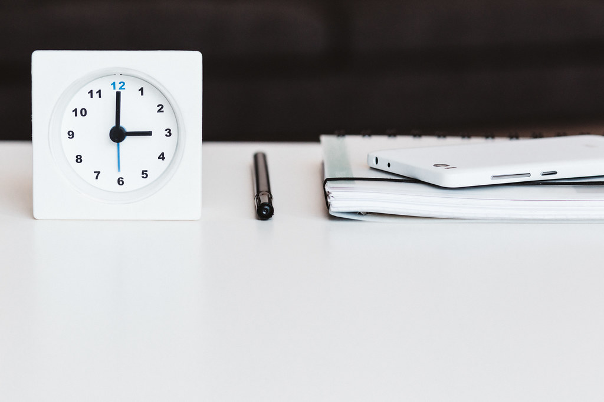

<!-- theme: 研究・実験結果レーン（3-0優先。日付余り1の通常ローテは不使用） -->
# AIが一日の中心だった日は5%。5万人の2か月分、6億6,700万件の操作を数えた研究

AIを入れたいけれど、どの仕事に入れるか決まらない。中小企業の経営者から一番よく聞く迷いです。

その判断材料になる研究が、2026年9月に公開されました。業務ソフトの操作ログを6億6,700万件集めて、人の一日がどんな形をしているかを分類したものです。結論から言うと、AIを中心に回っていた一日は全体の5%でした。残りの95%がどこに使われていたのかが、入れ先を決めるヒントになります。

この記事では、その数字の中身と、逆の結果が出たもう1本の研究、そして自社で明日できることを3つ書きます。

---

## 何を数えた研究なのか

カギになる数字を先に出します。

- 対象の操作ログ：6億6,700万件（人がやったと判定されたもの）
- 対象者：5万人
- 対象組織：100社
- 期間：2か月、合計182万人日
- 発表：2026年9月3日、arXiv（プレプリント。査読はまだ通っていません）

著者はLin Ai氏とScott Counts氏。大手の業務ソフト（製品名は論文に書かれていません）の利用ログを使い、クリック単位の細かい操作を、作業のまとまり、一日の形、という順に大きくまとめ直しています。

人数が5万人、しかも実際の仕事の記録なので、アンケートの自己申告ではありません。「使っていると思う」ではなく「実際にこう動いていた」の数字です。

## 一日の形は5種類に分かれた

182万人日を分類した結果、一日の形は次の5つに落ち着きました。

- 人とのやりとりが一日の軸：48%
- 短い確認を何度もはさむ日：31%
- 会議で区切られる日：13%
- AI付きの文書作業が中心の日：5%
- 長時間の共同作業が続く日：3%

ここで数字のかかり先を正確に書いておきます。「AI付きの文書作業が中心の日が5%」は、AIを使った人が5%という意味ではありません。その日一日を通して一番目立っていた活動がAI付きの文書作業だった日が、182万人日のうち5%だった、という意味です。ちょっとAIに下書きさせた日は、他の形に数えられています。

それでも、この分布は入れ先を考えるうえで使えます。一日の約8割（48%+31%）は、人とのやりとりと、短い確認の繰り返しでできている。多くの会社がAI導入でまず思い浮かべる「資料づくり」は、一日の形としては主役ではなかったわけです。

研究チームはもう2つ検証をしています。別の2,000人のデータで同じ手順を回しても同じ分類が出てくること、そして次に何をするかの予測精度が上がることを確認しました。予測精度は、細かい操作だけを並べた場合の0.199から0.232へ（指標はmacro-F1）。論文はこれを「相対で17%の改善」と書いています。実数で見ると0.03ほどの差なので、劇的に当たるようになったという話ではありません。上位3件に正解が入る率は0.566から0.623でした。

## 「覚えさせれば賢くなる」のほうは、はっきりしなかった

ここで逆向きの結果も並べます。AIに自分のことを覚えさせれば仕事が良くなる、という前提を調べた研究です。

Canfer Akbulut氏らが2026年9月17日に公開した実験（arXiv、こちらもプレプリント）は、992人に5日間、毎日AIへ相談してもらいました。3つの条件を比べています。

1. 何も覚えさせない
2. 前の会話の履歴を覚えさせる
3. 事前アンケートで集めた情報を渡しておく

結果、5日間で起きた変化の多くは、個人に合わせたことではなく、単に繰り返し使ったこと自体で説明がつきました。そのうえで差が出たのは2点です。履歴を覚えている相手には利用者がより多くを打ち明け、「気味が悪い」という評価が下がった。一方、事前アンケートで情報を渡しておいた条件では、個人情報を渡したことへの後悔を報告する人が増えました。

ただしこちらは992人、期間は5日です。前半の5万人の研究と比べると規模はかなり小さく、相談ごとという限られた場面の話でもあります。これ単独で結論を出すべきものではありません。

2本を並べると、分かれ目が見えてきます。どちらも言っているのは、AIの賢さより、人の側の使い方のほうが結果を左右するということです。前半の研究は「同じログでも、知りたいことによって見るべき粒度が違う」と結論していますし、後半は「個人最適化より、使う回数のほうが変化を生んだ」と読めます。

## 明日からできること

この2本を自社の判断に落とすなら、次の3つです。

1. 入れ先を資料づくりから動かしてみる

一日の約8割は、人とのやりとりと短い確認でできていました。問い合わせ対応、社内の「これどうなってる?」の確認、申し送り。この辺りを1つ選んで試すほうが、触れる回数が増えます。

2. まず1週間、自分の一日を時間帯で記録する

5万人の研究がやったことを、規模をうんと小さくして自社でやるイメージです。30分単位で何をしていたかを1週間メモするだけで、会議なのか確認なのか作業なのかが見えます。感覚で決めるより外しにくくなります。

3. 個人情報を先に集める設計は、後回しにする

「AIに社員の情報を覚えさせてから使う」という順番は、992人の実験では後悔を増やしました。先にやるべきは、使う回数が増える場所に置くことです。覚えさせるのはその後で構いません。

---

## まとめ

- 5万人・100社・2か月・6億6,700万件の操作を分類したところ、一日の形は5種類に分かれた
- AI付きの文書作業が一日の中心だった日は5%。人とのやりとり48%、短い確認31%で約8割を占めた
- 992人の別実験では、個人に合わせること自体より、繰り返し使ったことのほうが変化を説明した。事前アンケートで情報を集める形は後悔を増やした
- どちらもプレプリントで、査読はこれから。数字は目安として扱うのが妥当
- 次の一手は、資料づくり以外の場所を1つ選んで試し、まず自社の一日を1週間記録してみること

AIで作業が楽になるのは入口にすぎません。空いた時間を何に向けるかを決めるには、そもそも自分たちの一日がどんな形をしているかを知る必要があります。今回の研究が示したのは、その形は思っているのとは違うかもしれない、ということでした。

### 出典

- Lin Ai, Scott Counts「Rhythms of Work: Multi-Scale Interpretation of Human Behavioral Traces for Workplace Agents」arXiv:2609.04556（2026年9月3日／プレプリント・査読前）https://arxiv.org/abs/2609.04556
- Canfer Akbulut ほか「Tailored to you: longitudinal effects of personalising language models」arXiv:2609.20077（2026年9月17日／プレプリント・査読前）https://arxiv.org/abs/2609.20077

---

## 私たちについて

株式会社AIdollargameは、「楽じゃなく、楽しいを考える」をテーマに、AIプロダクトを自社開発しているAI会社です。

- AI導入支援・コンサルティング（https://aidollargame.com/ai-consulting.html）
- AIエージェント（https://aidollargame.com/line-ai-agent.html）：問い合わせ・予約対応を24時間自動化
- AIside（https://aidollargame.com/aiside.html）：経営者の"もう一人の自分"になる付き人AI
- AIwill／社長クローンAI（https://aidollargame.com/human-clone-ai.html）：経営者の判断軸をAIに学習させる

「うちの仕事でAIに何ができる？」は、無料のAI活用度診断（https://aidollargame.com/shindan.html）から。

- 公式サイト：https://aidollargame.com/
- ご相談：nosuke@aidollargame.com

このnoteでは、AI活用のリアルや時事の読み解きを、過程まで含めて正直に発信しています。フォローしてもらえると嬉しいです。

---

ハッシュタグ案：#AI導入 #中小企業 #業務改善 #生成AI #働き方

サムネ文言案
1. AIが中心の一日は、5%だった
2. 5万人の2か月を数えたら、一日は5種類に分かれた
