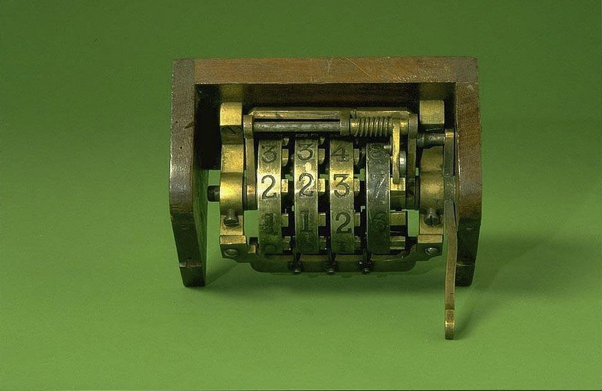

<!-- theme: 研究・実験結果レーン / AI導入のノルマ設計 -->
# 「AIを月200回使え」のノルマを100回に下げたら、営業の売上が7%増えた

社内にAIを入れたのに誰も使わない。だから「月◯回は使うこと」と決める。
よくある流れだと思います。私も相談を受けるときに、まずこの話が出ます。

その「月◯回」を実際にやった会社の記録が、9月末に公開されました。
従業員およそ5,000人の医療機器メーカーです。回数を半分に減らしたあと、営業社員の月の売上が7%増えています。

もう1本、逆向きに見える研究も並べます。開発者802人・プルリクエスト196,212件を2年4か月追った記録で、こちらはノルマどおりに生産量が2.09倍になりました。
数字の向きが違うのに、2本が指している結論は同じです。今日はそこまで書きます。

---

## ノルマは「使い始めさせる」のには働いた

香港大学のJie Gongらが調べたのは、社内向けAIアシスタントを入れた医療機器メーカーです。技術文書、顧客記録、規制関連の資料を検索できる仕組みでした。

自発的な利用は伸びませんでした。ノルマを出す前の時点で、一度でも質問を投げたことがある従業員は14.8%だけです。

そこで会社は「月200回以上」を義務にします。未達には金銭的なペナルティまで付けました。

ここは成功しています。導入月の4月に31.2%が初めてAIを触り、5月にさらに9.1%が続きました。
使ったことのない人を使う側に動かす、という一点では、ノルマははっきり働いています。

## ただし、数字は200でぴたりと止まった

問題はその先でした。

使った人のうち12%が、ちょうど200回で止めています。95%は220回以下。
グラフにすると、200のところに人が固まります。

質問の中身を1件ずつ見ると、31%が「同じ質問の繰り返し」か「仕事と関係ない質問」でした。
ノルマを満たすための空打ちです。

数えられているものが「回数」だと分かった瞬間に、回数だけが増える。
管理する側が一番よく知っているはずの話が、そのまま起きました。

## 100回に下げたら、減ったのは空打ちだけだった

3か月後、「要求が重すぎる」という声を受けて、会社は目標を100回に下げます。

この引き下げが支店ごとに違う時期に実施されたため、研究者は同じ会社の中で「まだ200回の支店」と「もう100回の支店」を比べられました。

結果はこうです。

- 質問の総数は30%減った
- 減った分の約90%は、繰り返しと業務外の質問だった
- 繰り返しでない、仕事に関係する質問の変化は小さく、統計的に意味のある差ではなかった
- 営業社員の月の売上は7%増えた

仕事に使われる質問は減っていません。消えたのは空打ちのほうです。
そして、空打ちに取られていた時間が戻ったぶん、営業の数字が上がりました。

ノルマを下げたら成果が上がった、という素直に逆向きの結果です。

（arXiv:2609.32859、2026年9月26日投稿のプレプリント。査読前です。ランダム割り当ての実験ではなく、支店ごとの実施時期のずれを使った推定です）

## 逆の結果：ノルマどおり2倍になった会社もある

片側だけ出すと話が雑になるので、ノルマがうまくいった記録も並べます。

カーネギーメロン大学とスタンフォード大学のHao Heらが調べたのは、中規模のB2Bソフトウェア会社です。2025年の半ばから「1人あたりのマージ済みプルリクエストを2倍にする」という目標を掲げていました。

開発者802人、プルリクエスト196,212件、2024年1月から2026年4月までの記録です。

2026年4月時点で、1人あたりの生産量はノルマ前の2.09倍に達しました。
AIコーディングツールの現場導入で報告されている中では、かなり大きい数字です。

ただし、著者らの読み方は慎重です。

ノルマは触媒であって、直接の原因ではない。伸びは「AIを使い始めたこと」と「使い続けて貯まった量」に結びついていた、と書いています。
ランダムに割り当てた実験ではないので、因果の大きさは幅を持った推定にとどまる、とも明記しています。

2本の会社を分けているのは、何を数えたかです。
200回のほうは「質問した回数」を数えました。2倍のほうは「マージされたプルリクエスト」、つまり出来上がった物を数えています。

出来上がった物は空打ちできません。

## ただし、増えた分を受け取る側が詰まった

2倍の会社にも、別の代償が出ています。

プルリクエストの生の量は3.1倍になりました。一方、レビューする側の人数は1.5倍にしか増えていません。
1人あたりのレビュー負荷は2.0倍です。

組織はこの差を自動化で埋めました。

- 人のレビューを1回以上受けたプルリクエストは89%から68%へ、21ポイント減った
- AIのレビューを受けたものは約19%から約84%へ増えた
- 書かれたコメントのある、中身のあるレビューは約39%から約21%に減った
- 承認だけして何も書かない「黙って通す」レビューは約50%のまま横ばい

残った人のレビューが、承認を押すだけの作業に寄っていったということです。

マージ率と差し戻し率は、この間ほぼ横ばいでした。短い期間の粗い指標では品質は落ちていません。
ただし著者らも、これは短期間の荒い目安だと断っています。

（arXiv:2607.01904、2026年7月投稿のプレプリント。査読前。1社の事例研究です）

## 2本が同じことを言っている

数字の向きは逆ですが、重なっている部分があります。

1つ目。使ったことがない人を動かすには、上からの一押しが必要でした。どちらの会社も、自発的な利用は伸びていません。

2つ目。何を数えるかで、出てくるものが変わりました。回数を数えた会社では空打ちが31%出て、出来上がった物を数えた会社では本物の生産量が増えました。

3つ目。増えた分を受け取る側を用意しないと、どこかが薄くなります。2倍の会社では、人のレビューが承認だけに痩せていきました。

## 中小企業が明日からやれること

ここからは現場の話です。

1. 数える対象を、回数から出来上がった物に変える。
「AIに月何回聞いたか」ではなく、「下書きが何本できたか」「返信が何件出たか」を数えます。空打ちできないものだけが、数える価値のある数字です。

2. 最初の1か月だけは回数を見る。そのあと外す。
使ったことがない人を動かす段階では、回数のノルマは働きました。ただし3か月も続けると200回で止まる人が出ます。初動と定着で、見る数字を切り替えてください。

3. 増えた分を誰が受け取るかを先に決める。
AIが下書きを3倍出すなら、確認する人の負担も3倍です。確認を増やす人員がいないなら、確認が要らない仕事から渡します。ここを決めずに量だけ増やすと、中身を見ない承認が増えます。

---

AIを入れると、最初に数えやすいのは使用回数です。導入した証拠になりますし、報告もしやすい。

ただ、数えやすい数字を目標にすると、その数字だけがきれいに揃っていきます。
200回のところに人が固まったグラフは、そのことをそのまま写していました。

私たちは「楽じゃなく、楽しいを考える」と言っています。
回数を埋めるための空打ちは、楽でも楽しくもありません。減らしたほうが売上が上がったのなら、なおさらです。

数えるものを変えるだけで変わる部分は、思っているより大きいと思います。

## 出典

- Jie Gong, Jiayi Hou, Jin Li, Fei Pu, Xinjue Yao「When Less Is More: Managing AI Adoption with Adaptive Incentive Design」arXiv:2609.32859（2026年9月26日投稿／プレプリント・査読前。香港大学。従業員約5,000人の医療機器メーカー、支店ごとの実施時期のずれを用いた推定）
https://arxiv.org/abs/2609.32859
- Hao He, Shyam Agarwal, Yegor Denisov-Blanch, Pavel Azaletskiy, Sanmi Koyejo, Bogdan Vasilescu「AI Writes Faster Than Humans Can Review: A Longitudinal Study of an Enterprise "2×" Mandate」arXiv:2607.01904（2026年7月投稿／プレプリント・査読前。カーネギーメロン大学・スタンフォード大学。開発者802人、プルリクエスト196,212件、2024年1月から2026年4月。1社の事例研究でランダム割り当てではない）
https://arxiv.org/abs/2607.01904

---

## 私たちについて

株式会社AIdollargameは、「楽じゃなく、楽しいを考える」をテーマに、AIプロダクトを自社開発しているAI会社です。

- AI導入支援・コンサルティング（https://aidollargame.com/ai-consulting.html）
- AIエージェント（https://aidollargame.com/line-ai-agent.html）：問い合わせ・予約対応を24時間自動化
- AIside（https://aidollargame.com/aiside.html）：経営者の"もう一人の自分"になる付き人AI
- AIwill／社長クローンAI（https://aidollargame.com/human-clone-ai.html）：経営者の判断軸をAIに学習させる

「うちの仕事でAIに何ができる？」は、無料のAI活用度診断（https://aidollargame.com/shindan.html）から。

- 公式サイト：https://aidollargame.com/
- ご相談：nosuke@aidollargame.com

このnoteでは、AI活用のリアルや時事の読み解きを、過程まで含めて正直に発信しています。フォローしてもらえると嬉しいです。

---

ハッシュタグ案
#AI導入 #中小企業 #DX #目標設定 #生産性

サムネ文言案
1. 月200回のノルマを100回にしたら売上7%増
2. AIの使用回数を数えると、31%が空打ちになる
