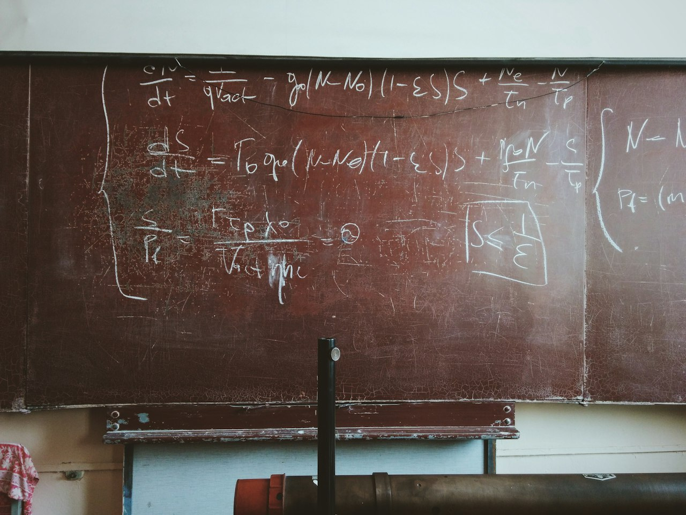

<!-- theme: 相談型+研究レーン / AIに渡していい仕事の線引き。材料=Landreman arXiv:2609.26742の謝辞 + AI in Science(arXiv:2609.28504/637人) + Faros AI 2万2,000人の稼働ログ + When More Documents Hurt RAG(arXiv:2606.11350) -->
# AIが核融合の式を見つけた。渡せたのは、答え合わせが代入1回で終わる問いだったから

AIにどこまで任せていいか。この線引きの相談をよく受けます。

答えを1つだけ書きます。任せていいかどうかは、仕事の難しさでは決まりません。出てきた答えを確かめるのに何分かかるかで決まります。

材料は、9月22日に arXiv に出た論文です。メリーランド大学の Matt Landreman が1人で書いた、核融合の磁場の論文。Journal of Plasma Physics に投稿中で、査読はまだ通っていません。

その謝辞に、こう書いてあります。

These solutions were discovered using the artificial intelligence model GPT-6 Astra Pro, which was also used to draft parts of the manuscript. All equations were confirmed manually by the author.

これらの解はGPT-6 Astra Proを使って発見した。原稿の一部もこのモデルに書かせた。すべての式は著者が手で確認した。

核融合では1億度のプラズマを磁場で閉じ込めます。その磁場を3次元の複雑な形にしたとき、きちんと閉じ込められる状態を式で書けるのか。1967年に Harold Grad が「そういう滑らかな解の一般族があるとは考えにくい」と書いて以来の問いでした。この論文は、sin や cos や多項式だけでできた式を2種類、座標に代入できる形で並べています。

## 確かめるのが一瞬だから、渡せた

この種の解は、もとの方程式に代入すれば合否がその場で決まります。モデルが嘘を混ぜても、代入の段階で落ちる。

だから1人でも全部を検算できて、謝辞に「すべて手で確認した」と書けます。難しさではなく、答え合わせの速さ。渡せた理由はそこです。

## 確かめる時間は、もう測られている

9月16日に Google と Google DeepMind、MIT FutureTech らが出した論文があります。米英の研究者637人に7〜8月に聞いた調査で、人数は千人に届きません。それでも数字ははっきりしています。

AIで浮いた時間は平均で週6.9時間。そのうえで、時間が浮いた人の46%が、浮いた分の4分の1以上をAIの出力の検証に使っていました。1割以上を検証に回している人は89%です。

浮かせた時間の相当部分が、確認に戻っています。

人数の多い記録もあります。Faros AI が4月に出した集計は、開発者2万2,000人・4,000チーム超の2年分の稼働ログです。各社でAIの利用が一番少なかった時期と比べて、コードレビューに入るまでの時間が156.6%増、レビューにかかる時間が441.5%増になりました。

作る時間は短くなり、確かめる時間が膨らんだ。アンケートと稼働ログ、測り方の違う2つが同じ方向を指しています。

## 確かめるのに同じ時間がかかるなら、渡す意味がない

AIに渡していいのは、答えが合っているかを見てすぐ分かる仕事です。計算、書式のそろえ直し、一覧からの抜き出し、長い文章の中から必要な行を探す。どれも画面を見れば数十秒で分かります。

困るのは、答えを確かめるのに、自分で最初からやるのと同じだけ時間がかかる場合です。AIが2分で返してきても、合っているか調べるのに40分かかるなら、自分で40分かけて書いたのと同じです。

分かれ目は仕事の中身ではありません。答えと一緒に、確かめるための手がかりが出てくるかどうかです。

社内の文書をAIに答えさせる場合で考えます。「資料にこう書いてあります」とだけ返ってきたら、本当かどうかは資料を端から開くまで分かりません。同じ質問でも、「就業規則の12ページにこう書いてあります」と返ってくるなら、開くのは1枚で済みます。

うちが作っている社内ナレッジAIは、まさにこの社内文書を引き出す道具です。だから、全部の文書を入れれば何でも答えます、という売り方はしないと決めています。先に片付けることが2つあります。入れる資料を1つの業務につき1本まで減らせるか。答えと一緒に、どの資料の何ページから取ってきたかを出せるか。これができていないと、確かめる時間を相手に丸ごと背負わせることになります。

入れる文書を増やすと、正答率そのものも落ちます。6月に出た研究が、米ワイオミング州の交通局の実例を載せています。対象の文書を54件から1,128件（88,907の断片）に増やしたところ、正答率は75%から40%未満まで落ちました。

入れるほど外れます。外れるほど、人が確かめる時間が増えます。

## 明日やること

AIに渡す仕事を決める前に、答えの正しさを何分で確かめられるかを書き出す。5分なら渡す。30分かかるなら、渡す前に仕事の切り方を変える。

社内の文書を読ませるなら、1業務につき資料1本に絞る。確認はその1本を開くだけで済みます。

なお、Grad の予想そのものを崩したのはAIではありません。その1日前の9月21日に、Javier Gómez-Serrano らの3人が Lean 4 で機械検証まで付けた論文を出しています。こちらにAIの記載はありません。存在するはずのものを式として名指しした部分が、AIの担当でした。

出典

- Matt Landreman「Analytic toroidal 3D MHD equilibria and steady Euler flows with invariant surfaces」2026年9月22日投稿(9月28日改訂)／プレプリント・Journal of Plasma Physics に投稿中(PDF 1ページ目に明記)、査読前。謝辞はPDF 12ページ目
https://arxiv.org/abs/2609.26742

- Mihai Codreanu ほか(Google／Google DeepMind／MIT FutureTech ほか)「AI in Science: Early Insights」2026年9月16日公開／プレプリント・調査は2026年7〜8月、米英の研究者637人
https://arxiv.org/abs/2609.28504

- Faros AI「The Acceleration Whiplash」2026年4月12日公開／企業の自社集計・開発者2万2,000人、4,000チーム超の2年分の稼働ログ
https://www.faros.ai/blog/ai-acceleration-whiplash-takeaways

- Nabaraj Subedi, Ahmed Abdelaty, Shivanand Venkanna Sheshappanavar「When More Documents Hurt RAG」2026年6月9日投稿／プレプリント
https://arxiv.org/abs/2606.11350

- Javier Gómez-Serrano, Lukas Liehr, Mitchell A. Taylor「Counterexamples to Grad's conjecture」2026年9月21日投稿／プレプリント
https://arxiv.org/abs/2609.24739

- Harold Grad「Toroidal containment of a plasma」Physics of Fluids 10(1), 137-154、1967年／査読済み

---

## 私たちについて

株式会社AIdollargameは、「楽じゃなく、楽しいを考える」をテーマに、AIプロダクトを自社開発しているAI会社です。

AI導入支援・コンサルティング
https://aidollargame.com/ai-consulting.html?utm_source=note&utm_medium=referral&utm_campaign=2026-10-05

AIチャットエージェント：問い合わせ・予約対応を24時間自動化
https://aidollargame.com/line-ai-agent.html?utm_source=note&utm_medium=referral&utm_campaign=2026-10-05

AIside：経営者の「もう一人の自分」になる付き人AI
https://aidollargame.com/aiside.html?utm_source=note&utm_medium=referral&utm_campaign=2026-10-05

AIwill／社長クローンAI：経営者の判断軸をAIに学習させる
https://aidollargame.com/human-clone-ai.html?utm_source=note&utm_medium=referral&utm_campaign=2026-10-05

「うちの仕事でAIに何ができる？」は、無料のAI活用度診断から。
https://aidollargame.com/shindan.html?utm_source=note&utm_medium=referral&utm_campaign=2026-10-05

公式サイト
https://aidollargame.com/?utm_source=note&utm_medium=referral&utm_campaign=2026-10-05

ご相談：nosuke@aidollargame.com

このnoteでは、AI活用のリアルや時事の読み解きを、過程まで含めて正直に発信しています。フォローしてもらえると嬉しいです。

ハッシュタグ案

#AI活用 #生成AI #核融合 #業務設計 #中小企業

サムネ文言案

1. AIの答えは、何分で確かめられるか
2. 60年の通説を外す式を、AIが書き出した
