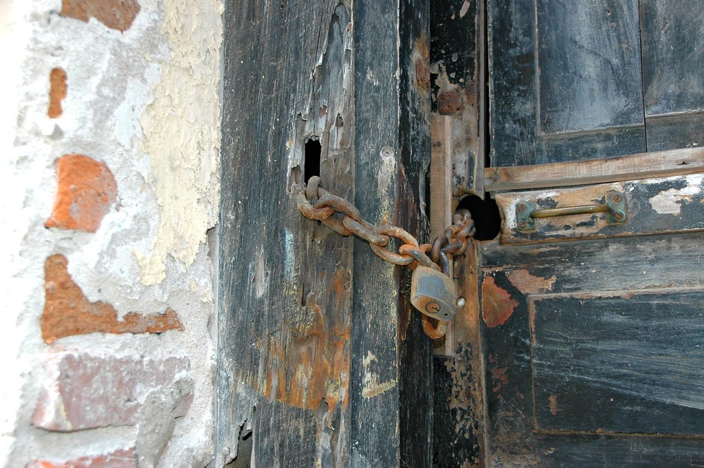

<!-- theme: 相談型(3-00・b 本人が迷っていること) / 他社が10年運用してきたサイトを引き取る案件で、現場で確かめることを順に並べたら、1番上が金額でなく「プログラムの著作権を誰が持っているか」になった話。材料=2026/10/5付の社内チェックリスト(77番)の第1章3項目。顧客名・サイト名・金額・訪問日は原稿に入れない -->

# 保守費を10年払っても、プログラムが自分のものとは限らない

外注で作ってもらったサイトやシステムを、長年そのまま使っている会社に向けて書きます。いま、他社が10年面倒を見てきたサイトを、うちが引き取る話を進めています。現場で確かめることを1枚にまとめたら、いちばん上に来たのは金額ではありませんでした。その話を書きます。

## 金額より先に決まること

1番上に書いたのは、プログラムの著作権を誰が持っているか、でした。

制作会社との契約で著作権が移っていなければ、そのプログラムは今も制作会社のものです。別のサーバーへ複製することも、中を書き換えることも、権利者の許可がいります。10年分の保守費を払ってきたかどうかは、ここには関係しません。金額を詰める前に、できるかどうかが決まってしまいます。

見る場所は、契約書の著作権の条項です。「成果物の著作権は乙に留保する」と書いてあれば相手に残っています。「甲に譲渡する」ならこちらのものです。

留保と書いてあっても、そこで終わりではありません。使用許諾の範囲に改変が入っていれば進められることがあります。ただ、これは弁護士に見てもらう話で、私が判断できるところではありません。進めている案件でも、この条項はまだ誰にも確認できていません。

## 鍵も同じところにある

同じ並びに、あと2つ書きました。サーバーに入るためのログイン情報を誰が持っているか。ドメインの管理画面に入るIDを誰が持っているか。

住所の向け先を新しいサーバーへ変える操作は、その管理画面でしか行えません。技術的に代わりの手段がありません。制作会社が握っていれば、切り替えの瞬間だけは必ず相手の手が要ります。10年動いているものだと、辞めた業者の鍵がまだ使える状態で残っていることもあります。

今日やれることは1つです。外注で作ってもらったものの契約書を開いて、著作権の条項だけ読んでください。どちらに残っているかが分かれば、いざ動かしたくなった時に何が必要かも先に分かります。

動いているあいだは、誰のものかを考えません。止めたい、別の場所へ移したい、中を直したいと思った瞬間に、初めて問題になります。AIを外に頼むときも同じで、学習させたデータと設定が自分の側に残る形かどうかは、契約を結ぶ時点で決まります。面倒な作業を任せて時間を空けるのが目的なら、その先で手が止まらない形にしておきたいところです。

---

## 私たちについて

株式会社AIdollargameは、「楽じゃなく、楽しいを考える」をテーマに、AIプロダクトを自社開発しているAI会社です。

AI導入支援・コンサルティング
https://aidollargame.com/ai-consulting.html?utm_source=note&utm_medium=referral&utm_campaign=2026-10-06

AIチャットエージェント：問い合わせ・予約対応を24時間自動化
https://aidollargame.com/line-ai-agent.html?utm_source=note&utm_medium=referral&utm_campaign=2026-10-06

AIside：経営者の「もう一人の自分」になる付き人AI
https://aidollargame.com/aiside.html?utm_source=note&utm_medium=referral&utm_campaign=2026-10-06

AIwill／社長クローンAI：経営者の判断軸をAIに学習させる
https://aidollargame.com/human-clone-ai.html?utm_source=note&utm_medium=referral&utm_campaign=2026-10-06

「うちの仕事でAIに何ができる？」は、無料のAI活用度診断から。
https://aidollargame.com/shindan.html?utm_source=note&utm_medium=referral&utm_campaign=2026-10-06

公式サイト
https://aidollargame.com/?utm_source=note&utm_medium=referral&utm_campaign=2026-10-06

ご相談：nosuke@aidollargame.com

このnoteでは、AI活用のリアルや時事の読み解きを、過程まで含めて正直に発信しています。フォローしてもらえると嬉しいです。

ハッシュタグ案

#著作権 #システム発注 #ベンダーロックイン #中小企業の経営 #AI導入

サムネ文言案

1. 保守費を10年払っても、プログラムが自分のものとは限らない
2. 契約書の著作権の条項、どちらに残っていますか
